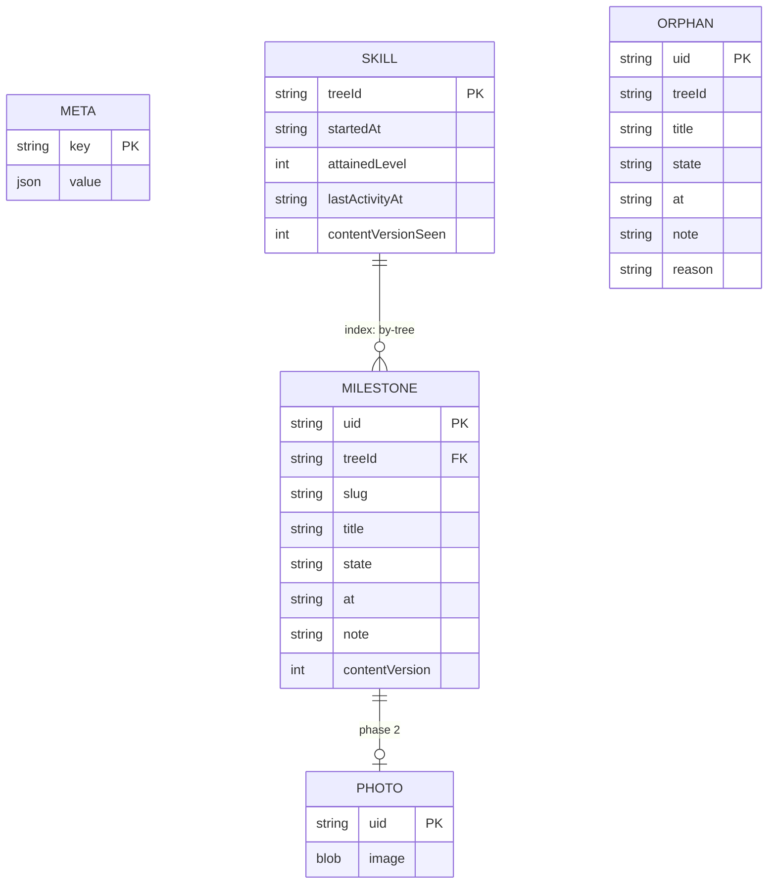

# T09 — User State Store — IndexedDB write path

| Field | Value |
|---|---|
| **Status** | pending |
| **Phase** | 0 |
| **Cluster** | runtime-io |
| **Blocked by** | T02 |
| **Blocks** | T10, T16, T17 |
| **Spec** | ARCHITECTURE §12.1, §12.2, §12.3, §12.4, §14.5 |
| **PRD** | D4, N2 |

## Goal

`app/src/lib/state/` holds the IndexedDB database — five object stores as specified in
§12.2 — and the only code in the system that writes user data. After this task a
milestone can be marked `complete`, `dismissed`, or cleared back to nothing, in one
transaction that also rewrites the denormalized `SKILL.attainedLevel` and
`lastActivityAt`; a skill can be started; the store can hydrate an in-memory mirror on
cold load; and a hydration failure latches `writable` to `false` for the rest of the
session so a transient IndexedDB error can never overwrite good data with an empty state.
The `PHOTO` store exists and is empty, reserved so that phase 2 needs no migration.

## Why this shape

§12 holds the only irreplaceable data in the system: content can always be re-fetched,
but a user's progress exists in exactly one place, with no account to recover it from and
no telemetry to notice it went missing (§16.5, **R-15**). Every decision below is weighted
by that. IndexedDB is chosen from day one (**D-09**) rather than starting on
`localStorage`, because photos are deferred and not cancelled (§12.8) and the synchronous
hydration `localStorage` would buy is worth nothing — §3.3 already issues hydration in
parallel with the manifest fetch. Eviction does not distinguish the two anyway: Safari's
ITP caps script-writable storage at seven days of non-use for both (**R-18**). The single
transaction of §12.4 exists because a crash between the milestone write and the
denormalized level write would leave a summary disagreeing with the records it summarizes,
and with no telemetry, correctness has to be structural rather than observed.

## Scope

**In scope**

- Opening the database through `idb`, with a versioned upgrade path creating **all five**
  stores of §12.2: `META`, `SKILL`, `MILESTONE`, `ORPHAN`, `PHOTO`.
- The `by-tree` index on `MILESTONE.treeId` (§12.2's ER relationship).
- **Reserving `PHOTO` now** — created empty, with no read or write path. §12.8 requires it
  reserved so that no schema migration is needed when photos land (**R-06**).
- `hydrate()`: read `META`, `SKILL`, `MILESTONE`, `ORPHAN` into the
  `lib/state/progress.svelte.ts` rune store of §13.2.
- The `writable` latch: `false` for the whole session after a hydration failure, with every
  mutator rejecting while it is false (§13.3, §14.5).
- `setMilestoneState(uid, state, opts)` implementing §12.4's three steps in **one**
  transaction, including the `null` case that deletes the record.
- Writing the frozen `slug` and `title` snapshots at completion time, and never refreshing
  them (§12.2).
- `startSkill(treeId)`: create the `SKILL` record with `startedAt`, `attainedLevel: 0`,
  `lastActivityAt`, `contentVersionSeen`.
- `SKILL.attainedLevel` maintenance: recomputed on every write to that tree, and
  **reconciled on tree open** against a from-first-principles recompute (§12.3).
- `storageStatus()` returning `{ usage, quota, lastExportAt? }`, with `lastExportAt` read
  from `META` (§12.7).
- Declaring the complete §14.5 `UserStateStore` interface as the module's exported type,
  including the three methods other tasks implement (see below).

**Out of scope**

- `applyLineage(tree)` and the `ORPHAN` **write** path — **T17** (§12.5). This task creates
  the `ORPHAN` store, hydrates from it, and exposes it read-only; nothing in this task ever
  puts a record into it.
- `export()` and `import(file, mode)` — **T16** (§12.6). This task declares the signatures
  in the interface and leaves the implementations to T16.
- `navigator.storage.persist()`, `navigator.storage.estimate()` polling, and the three
  export-prompt triggers — **T18** (§12.7). This task exposes `storageStatus()`; T18 owns
  the policy that consumes it and the first-successful-write `persist()` hook.
- Computing attained level. That is the Scoring Engine's `scoreSkill` (§14.4, **T11**).
  In phase 0 this store calls a minimal recompute; T11 replaces it with the real engine and
  T10 is the gate where that swap is checked. The store must not implement level semantics
  of its own.
- Photo capture, downscaling, encoding, and the ZIP export form — **Phase 2**, §12.8.
- Any UI. The `/data` page is T14; the milestone panel is T08/T19.
- Migration of *content* schema versions — §5.10, owned by the compiler and T04.

## Deliverables

```
app/src/lib/state/db.ts                 idb open + upgrade; the five §12.2 stores
app/src/lib/state/store.ts              the UserStateStore implementation — §14.5
app/src/lib/state/progress.svelte.ts    §13.2 in-memory mirror, written via §12.4 only
app/src/lib/state/types.ts              record shapes for META/SKILL/MILESTONE/ORPHAN
app/src/lib/state/store.test.ts         transaction atomicity, writable latch, snapshots
app/src/lib/state/db.test.ts            upgrade path, store + index existence
```

## Interface contract

Copied from ARCHITECTURE §14.5. This task implements `hydrate`, `setMilestoneState`,
`startSkill`, `storageStatus`, and `writable`; it declares the rest.

```ts
export interface UserStateStore {
  hydrate(): Promise<void>;
  setMilestoneState(uid: string, state: MilestoneState, opts?: { note?: string }): Promise<void>;
  startSkill(treeId: string): Promise<void>;
  applyLineage(tree: CompiledTree): Promise<MigrationReport>;   // §12.5
  export(): Promise<ExportFile>;
  import(file: ExportFile, mode: 'merge' | 'replace'): Promise<ImportReport>;
  storageStatus(): Promise<{ usage: number; quota: number; lastExportAt?: string }>;
  readonly writable: boolean;   // false if hydration failed — §13.3
}
```

> Contract: every mutating call is a single transaction and resolves only after the write
> is durable. `writable` is false for the whole session after a hydration failure, and
> every mutator rejects while it is false.

`MilestoneState` comes from the Scoring Engine's contract (§14.4) and is normative here:

```ts
export type MilestoneState = 'complete' | 'dismissed' | null;
```

The object stores, verbatim from §12.2:



Two properties of that diagram are load-bearing and are stated in §12.2:

> `state` is `complete` or `dismissed`. **Incomplete is the absence of a record**, not a
> record with a state — writing a row for every untouched milestone would multiply the
> store by an order of magnitude to represent nothing.

> **`slug` and `title` are frozen snapshots**, written at completion time and never
> refreshed. They exist so that a human can read an export and understand what was
> accomplished, so an orphaned record remains meaningful, and so there is a debugging
> surface in a system with no telemetry. The cost is about 60 bytes per completion. A
> snapshot that followed upstream edits would not be a record of what the user did, which
> is why it is deliberately never updated.

The write path, verbatim from §12.4:

```ts
await store.setMilestoneState(uid, 'complete' | 'dismissed' | null, { note? });
```

> 1. Write or delete the `MILESTONE` record inside a single IndexedDB transaction.
> 2. Recompute attained level for that tree from the in-memory tree bundle.
> 3. Write `SKILL.attainedLevel` and `SKILL.lastActivityAt` in the **same transaction**.
>
> One transaction, so a crash between steps cannot leave the denormalized level disagreeing
> with the records it summarizes. Reactive state updates from the transaction's completion,
> not before it — an optimistic UI that displayed a completion the write then failed to
> persist would be lying about the one thing that must not be lied about.

The denormalization rule, from §12.3: `SKILL.attainedLevel` is kept honest by recomputing
on every write to that tree and by a **reconciliation on tree open** — when a tree bundle
is loaded, the Scoring Engine recomputes attained level from first principles and writes it
back if it differs. A discrepancy is expected and benign after a content update changed a
level's requirement groups (**R-17**).

## Acceptance criteria

- [ ] `db.test.ts` opens the database and asserts all five store names —
      `META`, `SKILL`, `MILESTONE`, `ORPHAN`, `PHOTO` — exist after the upgrade, and that
      `MILESTONE` carries an index named `by-tree` on `treeId`.
- [ ] A test asserts the `PHOTO` store is created and empty, and
      `grep -rn "PHOTO" app/src/lib/state --include=*.ts` shows it referenced only in
      `db.ts` — reserved, not used (§12.8, **R-06**).
- [ ] `setMilestoneState(uid, 'complete')` writes exactly one `MILESTONE` row and updates
      `SKILL.attainedLevel` and `SKILL.lastActivityAt`; a test reads both back and asserts
      they changed together.
- [ ] A test injects a failure on the `SKILL` put and asserts the `MILESTONE` row is
      **absent** afterwards — proving both writes share one transaction, not two.
- [ ] A test asserts `setMilestoneState(uid, null)` **deletes** the row rather than writing
      a row with a null state (§12.2: "incomplete is the absence of a record").
- [ ] A test completes a milestone, mutates the in-memory tree bundle's `title` and `slug`
      for that uid, re-reads the stored record, and asserts `title` and `slug` are
      **unchanged** — the frozen snapshot of §12.2.
- [ ] A test asserts the `progress.svelte.ts` mirror is updated only after the transaction
      resolves: a rejected write leaves the mirror at its prior value (§12.4's "reactive
      state updates from the transaction's completion, not before it").
- [ ] A test forces `hydrate()` to reject, then asserts `store.writable === false` and that
      `setMilestoneState` and `startSkill` **both reject** and perform no IndexedDB write.
- [ ] A test asserts `writable` stays `false` after a subsequent successful `hydrate()`
      call within the same session — the latch is per-session, not per-attempt (§13.3).
- [ ] A test asserts `startSkill('x')` twice does not reset `startedAt`.
- [ ] A test asserts reconciliation on tree open: seed `SKILL.attainedLevel` to a wrong
      value, open the tree, and assert the stored value is corrected and written back
      (§12.3).
- [ ] A test asserts `storageStatus()` returns `lastExportAt` from `META` and `undefined`
      when the key is absent.
- [ ] `npx tsc --noEmit` passes and `app/src/lib/state/store.ts` exports a value typed as
      `UserStateStore` with the §14.5 signatures unmodified.
- [ ] `grep -rn "indexedDB\|from 'idb'" app/src --include=*.ts --include=*.svelte` matches
      only under `app/src/lib/state/` — §3.2's rule that the store is the only writer.
- [ ] The ESLint `no-restricted-imports` rule of §14.7 fails a fixture that imports
      `lib/state` from `lib/components`, and the rule is present in the app's ESLint config.

## Verification

```bash
npm run --workspace app test -- state
npx tsc --noEmit
npm run --workspace app lint            # §14.7 import rules
```

Passing looks like: the atomicity test proving a partial write is impossible, the writable
latch rejecting mutators after a forced hydration failure, the frozen-snapshot test green,
and the grep showing exactly one module touching IndexedDB.

## Notes and hazards

- **The dangerous failure is not "cannot read progress" but "read as empty, then wrote."**
  §13.3 is explicit that this is why the store refuses all writes for the session after a
  hydration error. An implementer who treats a hydration failure as "start fresh" has
  built the exact data-loss bug the architecture is shaped to prevent. Make the latch a
  private field set once, never cleared.
- **R-17 — the denormalized level can be stale.** Up to one session, for a tree the user
  has not opened since a content release changed its requirement groups. §12.3 accepts it:
  the map is an ambient display, and it exists at all because §3.3 requires the world map
  to render before any tree bundle is fetched. Do not "fix" it by fetching bundles on cold
  load — that defeats N4 for exactly the view that must be fastest.
- **R-18 — no browser storage mechanism is durable.** §12.1 says so directly, and it
  applies to IndexedDB and `localStorage` alike. Nothing in this task can mitigate it;
  §12.7's export prompting (T18) is the entire mitigation.
- **`ExportFile`, `ImportReport`, and `MigrationReport` are named in §14.5 and defined
  nowhere in the architecture.** `ExportFile` is recoverable from §12.6's example and
  `schema/export.schema.json` (T02). The two report types are genuinely unspecified — T16
  and T17 must define them and this task should import them rather than invent them. Do
  not stub them as `unknown`; a placeholder that typechecks is how a contract silently
  disappears.
- **`MILESTONE.contentVersion` has no stated consumer.** §12.2 declares the field; §12.5's
  migration keys on `SKILL.contentVersionSeen` instead. Write it (the tree bundle's
  `contentVersion` at completion time) so the record is self-describing for §12.5 and for
  a human reading an export, but expect no code to read it in v1.
- **`ORPHAN` has no `slug` field** while `MILESTONE` does. §12.2's diagram is the
  normative shape; §12.5 promises orphans keep "their frozen title, timestamp, and note",
  which matches. Follow the diagram — do not add `slug` to `ORPHAN` on the assumption it
  was an omission.
- **D-19, grandfathering.** Once a level is satisfied it stays satisfied unless the user's
  own completions change (§11.5). That is Scoring Engine behaviour, but it constrains this
  store: the recompute in step 2 of §12.4 must be over the *current* bundle and the user's
  records, never over a cached score.
- §17.3 budgets a milestone toggle at **< 100 ms to persisted** and **< 50 ms to visual
  update**. Both are met structurally by one transaction and no re-layout (§8.6); if either
  needs optimizing, something non-architectural has been added.
