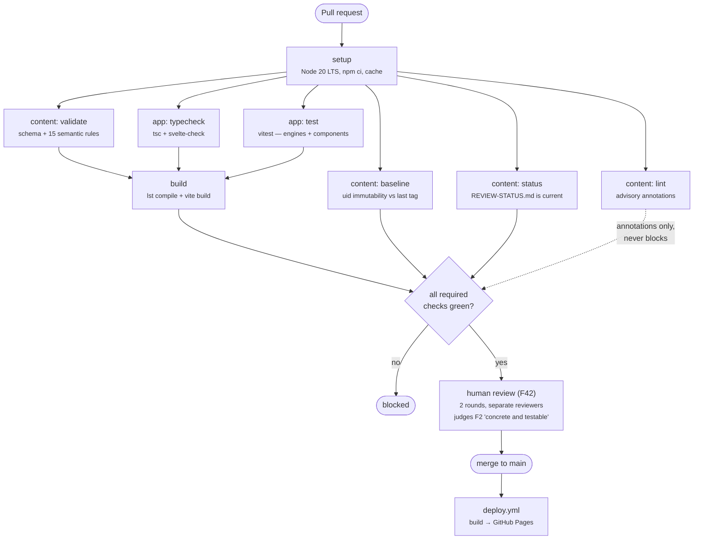

# T25 — Full CI and GitHub Pages deploy

| Field | Value |
|---|---|
| **Status** | pending |
| **Phase** | 1 |
| **Cluster** | content-gates |
| **Blocked by** | T14, T22, T23 |
| **Blocks** | — |
| **Spec** | ARCHITECTURE §6.5, §14.7, §16.1, §16.2, §17.1, §4.4 |
| **PRD** | D-12, S1, S2 |

## Goal

`.github/workflows/ci.yml` and `.github/workflows/deploy.yml` exist, implementing §6.5's
full job graph: the six gating jobs (`content: validate`, `content: baseline`,
`content: status`, `app: typecheck`, `app: test`, `build`) running in parallel from a
shared `setup`, `content: lint` running as a non-blocking annotation-only job, a path
filter that skips the two `app:` jobs on a content-only PR, and `deploy.yml` triggered on
push to `main` building and publishing to GitHub Pages. `build` additionally enforces
§14.7's five checks (import rules, the `archetype` grep gate, the layout/scoring purity
check, type-generation drift, and the monotonicity property test) and §17.1's bundle
budget, failing the PR on any regression. After this task, a PR that violates any gating
check is mechanically blocked before a human reviewer looks at it, and a merge to `main`
is, per **D-12**, the entire release process — there is no additional manual publish
step.

## Why this shape

**D-12** is why this task's shape is "wire two workflow files," not "design a release
process": GitHub Pages via Actions was chosen specifically because merge is publication
and there is no staging environment or release train, so all the rigour this task adds
has to sit in the pre-merge gates — there is nowhere else for it to sit. **§14.7's
enforcement list is what turns architectural claims in §9.1, §14.1, and §14.4 from
prose into things CI actually checks.** The `archetype` grep gate in particular is named
explicitly as "the mechanical form of S1" — without it, D-07's "no per-shape special-
casing" claim rests entirely on T05/T21's exemplar trees happening to render correctly,
which is necessary evidence but not the same as a standing guarantee that a future change
cannot quietly reintroduce an archetype branch. **The path filter is what keeps S2 real
for a Tree Author rather than merely true for the repository as a whole**: §6.5 states
that "on a content-only PR the app jobs are skipped by path filter, so a Tree Author's
feedback loop is the validate/baseline/lint trio and completes in seconds" — an outside
contributor who has to wait on a full `vite build` and `svelte-check` for a tree-only
change is exactly the friction S2's "an outside contributor authors a skill tree that
passes CI and human review and is merged" is measuring against.

## Scope

**In scope**

- `.github/workflows/ci.yml`: `setup` (Node 20 LTS, `npm ci`, cache) fanning out to the
  six gating jobs plus the advisory `content: lint` job, per §6.5's graph; a final `gate`
  step (or GitHub's built-in required-checks mechanism) that is green only when all six
  gating jobs are green, with `content: lint`'s annotations never counted against it.
- The path filter: `app: typecheck` and `app: test` conditioned on changes under `app/`
  (or `schema/`, since generated types depend on it); a content-only PR (changes only
  under `content/`) skips both, and `build` — which needs `content: validate` plus both
  app jobs per §6.5's graph — is wired so it still runs and still succeeds when the two
  app jobs report **skipped** rather than requiring them to have run.
- `build`'s own gating content, beyond running `lst compile` and `vite build`: the five
  §14.7 enforcement checks (see Interface contract) and the §17.1 bundle-budget check,
  each failing the job on violation.
- `.github/workflows/deploy.yml`: triggered on push to `main`; runs the same build (or
  reuses `ci.yml`'s `build` job's artifact) and publishes to GitHub Pages via
  `actions/deploy-pages` (or equivalent), setting `kit.paths.base` from the environment
  the way T01's `svelte.config.js` expects, so the deployed site serves correctly from
  `/<repo-name>/`.
- Verifying, as part of this task's own acceptance criteria rather than assuming T01 got
  it right in isolation, that the actual build output produced through this workflow
  carries the four §4.4 GitHub Pages constraints: base path set from the deploy
  environment, `adapter-static`'s `404.html` fallback present, `.nojekyll` emitted, and
  the content manifest excluded from aggressive asset caching (unlike content-hashed
  bundle files, which may cache forever).
- `README.md` or `docs/CONTRIBUTING.md` note (a one- or two-line addition, coordinating
  with T24 if it has landed) pointing a contributor at the CI job names so PR failures
  are self-explanatory without reading YAML.

**Out of scope**

- `svelte.config.js`'s `adapter-static` configuration itself, `paths.base`, and the
  `fallback: '404.html'` setting — T01 already built these. This task verifies the
  deployed *output* honours them; it does not re-author the config.
- The content of the six gating jobs' underlying tools (`lst validate`, `lst baseline`,
  `lst status`, `svelte-check`/`tsc`, `vitest`) — T03, T04, T22, T23, and the various
  `app/` tasks. This task wires them into workflow jobs; it does not implement them.
- `lst lint`'s rules and its always-exit-0 behaviour — T22. This task only decides how
  its structured findings become GitHub annotations in the workflow (a mechanism T22
  explicitly left unspecified, deferring it here).
- Branch-protection configuration requiring the two F42 review rounds before merge — this
  is a GitHub repository *setting*, not a file `ci.yml` or `deploy.yml` can express, and
  is a manual, one-time maintainer action documented in §16.2's release checklist rather
  than a deliverable of this task. Flagged here so it is not silently assumed to be
  covered by this task's workflow files.
- Preview deploys — explicitly out of scope per §4.4: "They would require a second
  hosting provider and are not worth the operational surface for a solo maintainer
  (N10)."
- **§6.4's baseline-ref contradiction is T26's finding F6, not this task's to resolve.**
  §6.4 opens by checking out tree files "as of the last release tag" and closes with "the
  baseline is `main`," and §6.5's own job-graph label says "vs last tag" — but §16.1 and
  §16.2 describe merge-to-`main` as the entire release process with no tagging step
  anywhere, so "last release tag" has no referent. T23 already implemented `lst baseline`
  against `main` itself, per its own documented reasoning. This task's `content: baseline`
  job invokes T23's tool as built and **labels the job to match what the tool actually
  compares against** — do not relabel it "vs last tag" to match §6.5's diagram text if
  the tool compares against `main`; that would restate the contradiction in the workflow
  file instead of resolving it. If F6 is later resolved toward real release tagging, this
  job's trigger and label are what would need to change, not before.

## Deliverables

```
.github/workflows/ci.yml         setup → 6 gating jobs + advisory lint → gate
.github/workflows/deploy.yml     build → GitHub Pages, triggered on push to main
```

## Interface contract

The job graph this task implements, copied verbatim from §6.5:



> The six gating jobs run in parallel from `setup`; on a content-only PR the app jobs are
> skipped by path filter, so a Tree Author's feedback loop is the validate/baseline/lint
> trio and completes in seconds. (§6.5)

> **Note on the "content: baseline" job's label above:** §6.5's diagram text reads "uid
> immutability vs last tag." T23 implements the comparison against `main`, per its own
> documented resolution of §6.4's ambiguity (see Out of scope, and **T26 F6**). This
> task's actual job label and behaviour must match what T23 built, not the diagram's
> literal wording.

The five §14.7 enforcement checks `build` must implement, copied verbatim:

> - **Import rules** (ESLint `no-restricted-imports`) implementing the forbidden edges in
>   §14.1.
> - **A grep gate** proving `archetype` appears nowhere under `lib/layout/`,
>   `lib/scoring/`, or `lib/components/`. This is the mechanical form of **S1**, and it
>   costs one line.
> - **Purity check**: `lib/layout` and `lib/scoring` import nothing from `svelte`,
>   `$app`, or `lib/state`.
> - **Type generation**: `lib/types` is generated from `schema/*.json`, so validator and
>   renderer cannot drift (§4.2).
> - **Property tests** for the monotonicity invariant in §14.4.

The forbidden import edges the ESLint rule enforces, copied verbatim from §14.1:

> `lib/layout` importing state would make layout depend on progress and destroy N11's
> stability guarantee. `lib/scoring` importing the loader would make scoring do I/O and
> stop it being testable as arithmetic. Components importing state directly would create
> writers outside §12.4's single path.

Concretely: `lib/layout → lib/state` forbidden, `lib/scoring → lib/content` (the loader)
forbidden, `lib/components → lib/state` forbidden. `tools/ → app/` is also forbidden per
§4.2 and belongs in the same lint configuration, though it is enforced within the
`tools/` workspace rather than `app/`.

The bundle budget `build` enforces, copied verbatim from §17.1:

| Artifact | Budget | Note |
|---|---|---|
| Svelte runtime | ~12 kB | Measured floor; not under our control |
| App JS, first route | ≤ 40 kB | Everything for the map view |
| App JS, tree route (lazy) | ≤ 25 kB | Layout Engine, TreeView, Scoring Engine |
| CSS | ≤ 15 kB | No utility framework to inflate it (§4.1) |
| **Total first paint (JS + CSS)** | **≤ 70 kB** | |

> Brotli-compressed transfer, enforced in CI by a size check that fails on regression.

The four GitHub Pages constraints `deploy.yml`'s output must satisfy, copied verbatim
from §4.4:

| Constraint | Handling |
|---|---|
| Site served from `/<repo-name>/` | `kit.paths.base` set from an env var; `/` for a future custom domain. |
| No server, so deep links 404 | `adapter-static` with `fallback: '404.html'`. |
| Jekyll strips `_`-prefixed directories | Empty `.nojekyll` emitted into the build output. Omitting it silently breaks every Vite build. |
| Aggressive asset caching | Vite's content-hashed filenames handle app assets. **The content manifest is the exception** — see §7.3. |

The release checklist items this task's CI wiring is directly responsible for, copied
verbatim from §16.2:

> - All §6.5 gating jobs green
> - Two review rounds recorded in `provenance`, for content PRs (F42)
> - `lst status` clean — the review table matches reality
> - Bundle budget within §17.1 — CI fails on regression

## Acceptance criteria

- [ ] `.github/workflows/ci.yml` defines exactly six gating jobs (`content: validate`,
      `content: baseline`, `content: status`, `app: typecheck`, `app: test`, `build`) and
      one advisory job (`content: lint`) matching §6.5's graph.
- [ ] A PR touching only `content/trees/*.yaml` triggers `content: validate`,
      `content: baseline`, `content: status`, `content: lint`, and `build`, but **not**
      `app: typecheck` or `app: test` — verified by inspecting the workflow run for such
      a PR.
- [ ] `build` still runs and can still succeed on a content-only PR where `app: typecheck`
      and `app: test` report `skipped` — verified by the same content-only PR reaching a
      green `build` job.
- [ ] A PR that fails any one of the six gating jobs shows the overall check as failing
      (blocked), while a PR with only `content: lint` findings and all six gating jobs
      green shows the overall check as passing.
- [ ] `build` fails when a fixture PR reintroduces an `archetype` string under
      `app/src/lib/layout/`, `app/src/lib/scoring/`, or `app/src/lib/components/` —
      the direct S1 regression test.
- [ ] `build` fails when a fixture PR adds an import from `lib/layout` to `lib/state`,
      from `lib/scoring` to `lib/content`, or from `lib/components` to `lib/state`.
- [ ] `build` fails when `app/src/lib/types/authored.d.ts` is stale relative to
      `schema/*.json` (i.e. `npm run gen:types` would produce a diff).
- [ ] `build` fails when a fixture PR breaks the monotonicity property test named in
      §14.4 / T11.
- [ ] `build` fails when a fixture PR inflates the first-paint bundle (App JS first
      route + CSS, Brotli-compressed) past 70 kB, and passes at or under it.
- [ ] `deploy.yml` triggers only on push to `main`, not on pull requests.
- [ ] The build artifact `deploy.yml` publishes contains a top-level `.nojekyll` file and
      an `app/build/404.html` (or equivalent adapter-static fallback) — verified by
      inspecting the artifact from a workflow run.
- [ ] The deployed site's asset requests show content-hashed tree/app files served with
      long-lived cache headers while `manifest.json` is served revalidated (not
      aggressively cached) — verified by inspecting response headers from an actual
      deployment, or, if GitHub Pages' own headers cannot be overridden directly, by
      confirming the manifest is fetched with cache-busting (e.g. a query string or
      `cache: 'no-cache'`) on the client side per §7.4's content-loading contract (T07).
- [ ] `content: baseline`'s job label and behaviour match what T23's `lst baseline`
      actually compares against (`main`), not §6.5's "vs last tag" diagram text — see
      Out of scope's note on F6.

## Verification

```bash
# local dry run of the enforcement checks build.yml wires in:
grep -rn archetype app/src/lib/layout app/src/lib/scoring app/src/lib/components   # empty
npm run gen:types && git diff --exit-code app/src/lib/types/authored.d.ts
npx eslint app/src --no-eslintrc -c .eslintrc.forbidden-imports.js                 # or equivalent
npm run --workspace app test -- --grep monotonic
npm run build:budget-check                                                         # or equivalent, per §17.1

# workflow-level (requires a PR / push in the actual repository):
gh workflow view ci.yml
gh workflow view deploy.yml
```

Passing looks like: the local dry runs of each enforcement check succeed against a clean
tree and fail against each fixture violation named in the acceptance criteria, and a real
PR / push exercises the workflows end to end with the path filter behaving as specified.

## Notes and hazards

- **The `needs:` skip-propagation problem is the single trickiest piece of this task.**
  GitHub Actions treats a job conditioned out by `if:` as `skipped`, and a downstream job
  with a plain `needs: [TC, T]` will not run at all if either is skipped — it must be
  written as something like `if: always() && (needs.TC.result == 'success' ||
  needs.TC.result == 'skipped') && (needs.T.result == 'success' || needs.T.result ==
  'skipped')`. Getting this wrong either silently skips `build` on every content PR (so
  bundle-budget and enforcement checks never run against content changes, which is fine
  since content changes cannot affect them) or blocks `build` from ever going green on a
  content-only PR (which would defeat the entire point of the path filter). Test both
  directions explicitly.
- **Do not resolve F6 here.** It is tempting, wiring the `content: baseline` job, to "fix"
  the label to say what the diagram says, or to add a tagging step to make the diagram
  literally true. Either is redesigning §16's release process, which is T26's call to
  make (or explicitly decline), not this task's. Wire the job to match what T23 actually
  built and say so in the job's own description/label if there's a mismatch worth a
  reader noticing.
- **Bundle-budget enforcement needs a real Brotli-compressed measurement, not an
  approximation.** §17.1 states the budget in Brotli-compressed terms specifically
  because that is what a real browser transfers; gzip or raw-size proxies will pass
  fixtures that fail in production and vice versa. Use whatever tool actually compresses
  with Brotli at the same quality level a production CDN/GitHub Pages would use, or the
  check is measuring the wrong number.
- **The GitHub annotation mechanism for `content: lint` was deliberately left unspecified
  by T22.** This task is where that choice actually gets made — native workflow commands
  (`::warning file=…,line=…::…`), a reviewdog-style bot posting PR comments, or GitHub's
  native `checks` API annotations are all consistent with "annotations only, never
  blocks." Pick one and make sure it is genuinely incapable of failing the job regardless
  of finding count — re-verify T22's own "always exits 0" guarantee is not accidentally
  overridden by wrapping it in a workflow step that treats nonzero *output* (as opposed
  to exit code) as failure.
- **Branch protection is a repository setting this task cannot express in a file.** Do
  not consider this task complete without explicitly telling the maintainer (in the PR
  description or a checklist note) that requiring the six gating jobs and two review
  rounds as merge requirements is a manual GitHub Settings step, separate from anything
  `ci.yml` itself can enforce.
