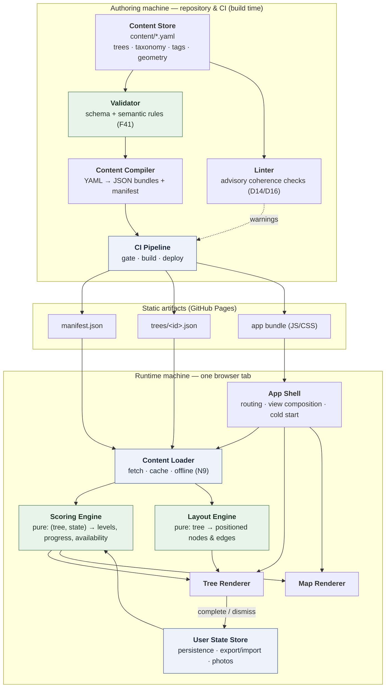
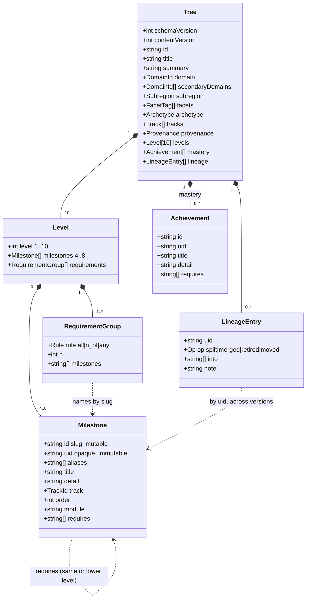
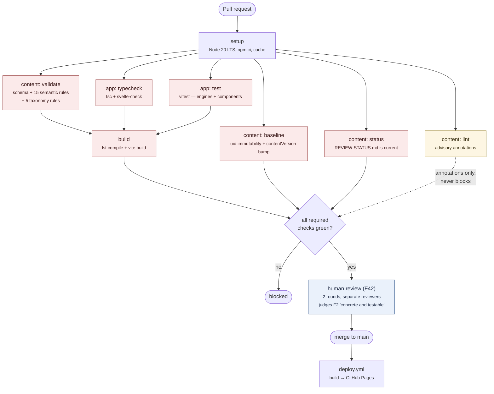
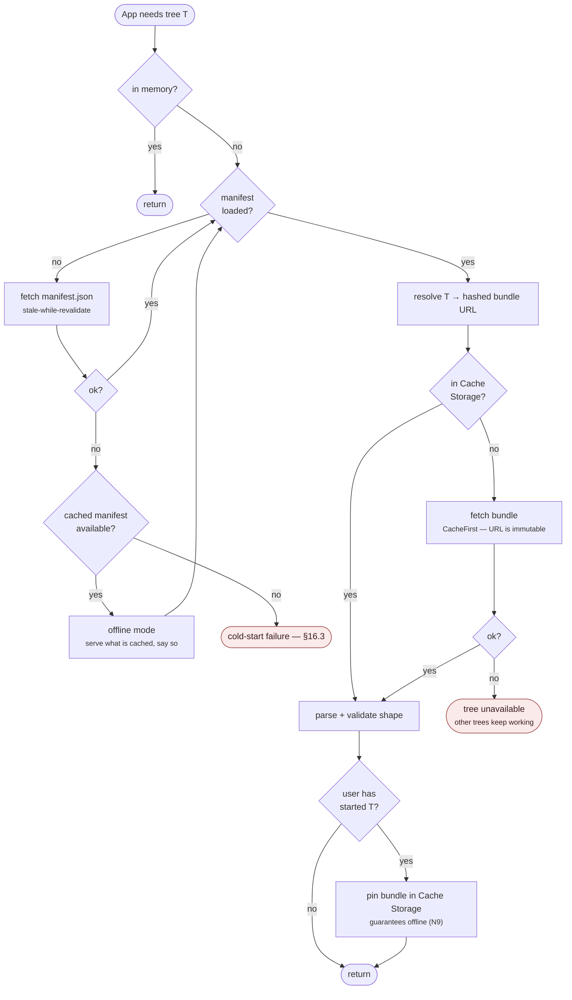
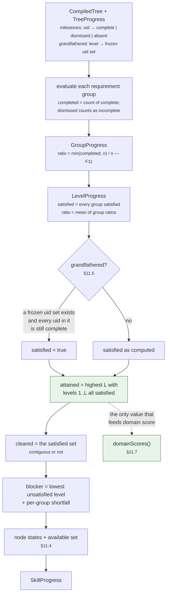
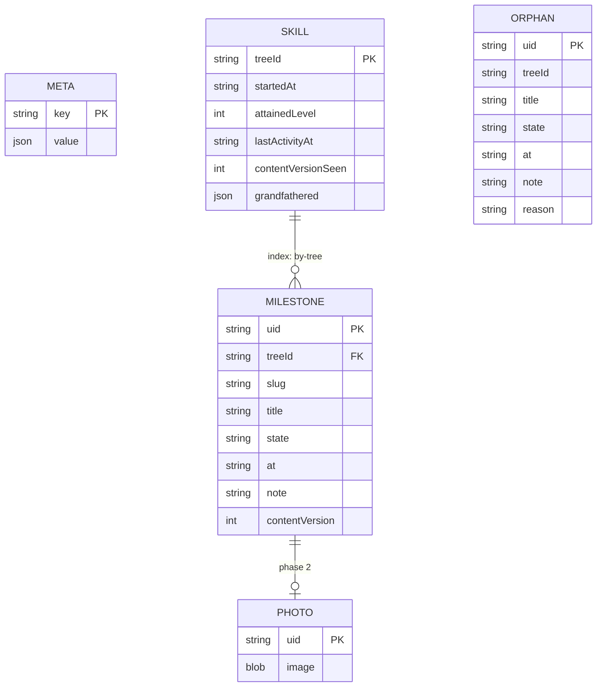
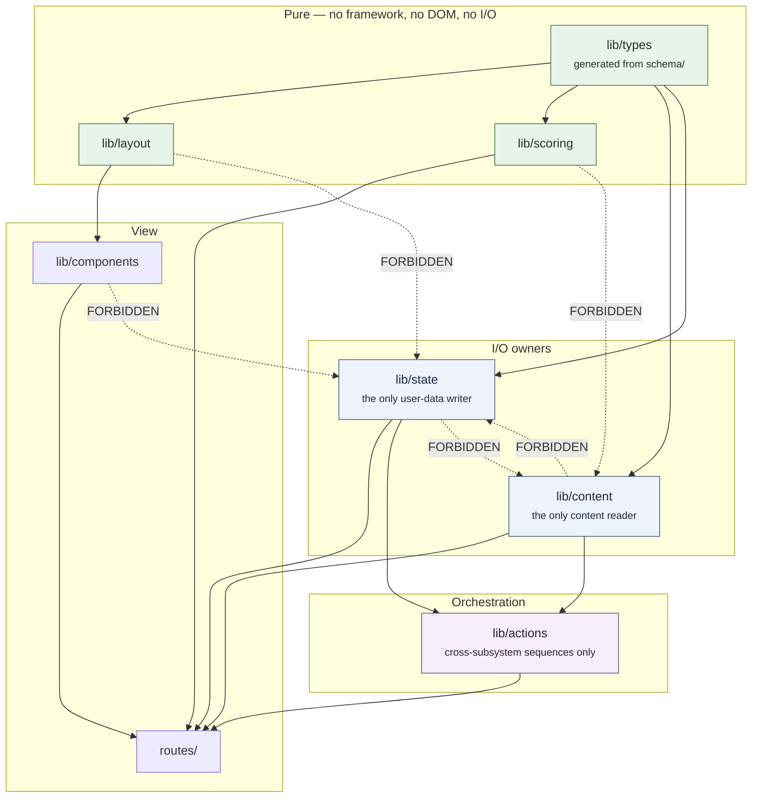
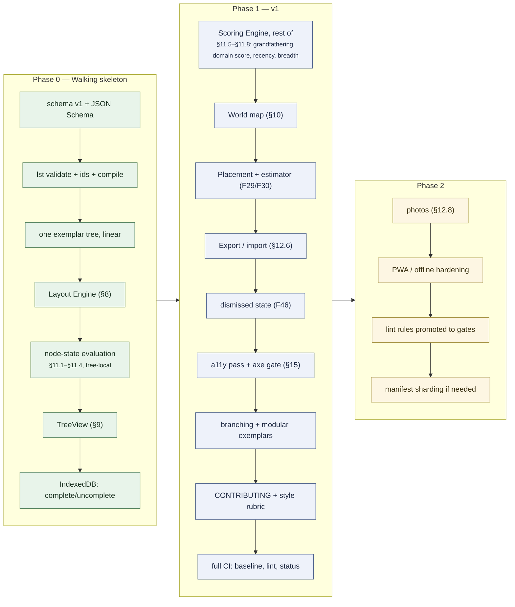

# Life XP Skill Tracker — Architecture Specification

**Version:** 1.0
**Date:** 2026-08-04
**Owner:** Ethan Morchy
**Status:** Complete — ready for implementation, pending the two PRD amendments in §19.5

---

## 1. Introduction

### 1.1 Purpose

This document specifies *how* the Life XP Skill Tracker is built. `docs/PRD.md` v1.2 specifies *what* it does and *why*; this spec resolves the technical decisions that the PRD deliberately deferred, and defines the subsystems, contracts, and data formats concrete enough to build from without re-deciding.

It is written as a buildable blueprint: named libraries, module boundaries, real schema fragments, and function signatures for the load-bearing engines. Where a choice has meaningful alternatives, the reasoning is recorded as an ADR in §18 rather than argued inline.

### 1.2 Scope

**In scope.** The static web application, the tree content schema, the validation toolchain, the CI pipeline, the repository layout, and the deploy path. Concretely, this spec closes PRD deferred decisions **D1–D6**, **D8**, **D10–D11**, and **D13–D18**. **D5** is closed for phase 1 and deferred for photos (§12.8). **D7** is resolved by *declining* the mechanism it assumes — see §11.7 and D-20, which propose a PRD amendment rather than settling it here.

**Out of scope.** **D12** (the initial facet-tag vocabulary) is content work, not a technical choice: the architecture requires only that every tag a tree uses exists in the vocabulary file. Product and taxonomy decisions **D19–D27** likewise remain open in the PRD and are not settled here. Three of them (**D20** estimator derivation, **D23** user-level domain reassignment, **D24** tree families) have architectural consequences; those consequences are recorded in §19.4 and the design leaves room for each, but the decisions themselves belong to the PRD. **D9** is already resolved into F8.

**This spec asks for two PRD changes**, both recorded in §19.5: F35's recency channel (**R-24**) and F33's arithmetic (**R-25**). Until they are made, the spec is knowingly divergent from those two requirements and says so at each point.

Tree *content* is out of scope. This spec defines the container and the rules; the trees themselves are authored against `docs/CONTRIBUTING.md` and the style rubric (F43).

### 1.3 Audience

- **The maintainer** (PRD §4.3), as implementer — the primary reader. Sections 4–17 should be sufficient to begin work in any order the dependency graph allows.
- **Coding agents** working from this spec, which is why interface contracts (§14) and schema fragments (§5) are given literally rather than described.
- **Tree Authors** (PRD §4.2) — §5 and §6 only. Authors need the schema and the validation rules; everything else is renderer internals they should never have to know. The contributor-facing subset of §5 is expected to be extracted into `docs/CONTRIBUTING.md` and a JSON Schema file, with this spec as the normative source.

### 1.4 Relationship to other documents

| Document | Relationship |
|---|---|
| `docs/PRD.md` v1.2 | Normative upstream. Requirement IDs (F#, N#, S#, NG#, C#, D#) cited throughout are that document's. Where this spec appears to contradict the PRD, the PRD wins and this spec is wrong. |
| `docs/RESEARCH.md` | Evidence base for the PRD's product decisions. Cited where an architectural choice inherits a researched constraint; not re-litigated. |
| `docs/PRIOR-ART.md` | MakerSkillTree analysis. Bears on §5 (schema shape) and §6 (review pipeline). |
| `docs/SKILL-CANDIDATES.md` | The 164-skill projection. Used here as sizing input for §17. |

### 1.5 Document conventions

- **Section references** use `§N.M`.
- **PRD requirements** are cited by their PRD identifier (`F13`, `N11`, `D2`) with no further qualification.
- **Architecture decisions** are `D-NN` in §18. Note the collision hazard: PRD deferred decisions are `D1`–`D27` (no hyphen), architecture decisions are `D-01`–`D-NN` (hyphenated). The hyphen is load-bearing.
- **Risks** are `R-NN` in §19.
- **Diagrams** are [Mermaid](https://mermaid.js.org/) in fenced blocks, rendering inline on GitHub. §3.4 lists every diagram this spec commits to.
- **Code and schema fragments** are illustrative unless marked *normative*. Normative fragments are the source of truth for the corresponding implementation.
- **RFC 2119 keywords** (shall, must, should, may) carry their usual force. "Shall" marks a constraint an implementation is not free to vary.

### 1.6 What this section does not cover

The subsystem inventory is §3. The build phasing that turns this spec into a work order is §16.4.

---

## 2. Glossary

Project-specific and overloaded terms only. Terms are grouped by what they belong to; the grouping itself is load-bearing, because the **content / user state** split in §2.3 is the single most important boundary in the system.

### 2.1 Content terms — authored, reviewed, shipped, identical for every user

| Term | Meaning |
|---|---|
| **Skill** | A trackable real-life capability (Blacksmithing, Piano). One skill has exactly one tree. |
| **Tree** | The authored data file defining a skill: its levels, milestones, prerequisites, and metadata. The unit of contribution and review. Called a "tree" by convention; the data structure is a DAG (F3). |
| **Milestone** | A single concrete, testable achievement with an observable completion condition (F2). The atomic node of a tree. Never an effort quantity (NG8). |
| **Level** | An integer 1–10. The row a milestone occupies and the unit of progression. Levels are unlock gates, not effort quanta, and are meaningful only relative to their own skill (F12). |
| **Spine** | The invariant 1–10 level sequence every tree shares (F7). "Uniform spine" means every tree has exactly ten levels regardless of subject depth. |
| **Tier** | A named pair of levels: Novice (1–2), Apprentice (3–4), Journeyman (5–6), Expert (7–8), Master (9–10) (F7). Presentation vocabulary; carries no independent completion semantics. |
| **Requirement group** | A rule over a set of milestones that must hold for a level to complete (F9). A level declares a list of groups, all of which must be satisfied. |
| **Rule** | One of `all`, `n_of`, `any` — the three group kinds. `any` is `n_of` with n=1, retained as a distinct spelling for authoring clarity. |
| **Track** | An optional named column within a tree, used by branching skills (F14). Determines horizontal placement. Not a category; purely a layout and grouping lane. |
| **Order** | An optional integer tiebreak among milestones sharing a (level, track) cell (F14). |
| **Module** | An optional cluster label grouping peer milestones in choice-based skills (F14), e.g. the five DBT categories in a mental-health tree. |
| **Mastery content** | Optional, unbounded milestones above level 10 (F5). Excluded from every progress and score calculation. |
| **Archetype** | A non-normative label (single-track, dual-track, modular) used as a UI hint and authoring lint only. **Shall never reach the renderer as a branch** (F10). |
| **Domain** | One of the eight top-level life areas (F17). Owns map placement and scoring. |
| **Primary domain** | The single domain that owns a skill for scoring and map placement (F18). |
| **Secondary domain** | A domain a skill is discoverable from but contributes no score to (F18). |
| **Subregion** | A visible cluster within the Making domain — Expression, Objects, or Systems (F24). A grouping *inside* a domain, never a domain itself (F27). |
| **Facet tag** | A term from a maintainer-curated controlled vocabulary describing a cross-cutting property (F19). Orthogonal to domain and to level; the designated relief valve for boundary disputes. |
| **Exemplar tree** | A reference tree shipped in the repo demonstrating one of the three progression shapes, maintained as documentation (F40). |

### 2.2 Rendering and map terms

| Term | Meaning |
|---|---|
| **World map** | The global view: eight domains as irregular hex regions (F21). |
| **Region** | A domain's territory on the world map — an irregular silhouette composed of several hex tiles, with its own palette (F21). |
| **Hex tile** | One hexagon of the world-map grid. The atomic unit of region geometry, not a unit of content. Multiple tiles compose one region. |
| **Fog** | The unrevealed rendering state for a domain with no published skills (F22). Reads as forthcoming content, never as an empty room. |
| **Fill** | The height of a region's fill clip rectangle, driven by domain score through a concave curve (F34). Never displayed as a raw percentage. |
| **Recency channel** | How recently the user was active in a domain (F35). In v1 it is **a date in text**, not a graded visual property: D-20 ships a maximum of `lastActivityAt` with no decay, and the graded channel is R-20. |
| **Breadth** | The count of skills a user has started in a domain (F35). |
| **Cell** | A (level, track) slot in the tree grid, into which the layout engine places milestones by `order` (§8). |

### 2.3 User-state terms — local to one browser, never shipped, never reviewed

| Term | Meaning |
|---|---|
| **User state** | The complete set of a user's local data: completions, dismissals, notes, photos, timestamps, settings. Never leaves the device (N2, F37). |
| **Complete** | A milestone the user has marked done, carrying a timestamp and optional note/photo (F31). |
| **Dismissed** | The third milestone state, "not for me" (F46). Reversible, exported, and **arithmetically identical to incomplete** — it changes presentation only, never a score. |
| **Available** | A derived state, not stored: a milestone whose prerequisites are all satisfied and which is not yet complete (F36). |
| **Placement** | The act of a user positioning themselves on a tree by checking off already-completed milestones (F29). The primary self-assessment mechanism. |
| **Estimator** | The coarse "roughly where am I?" shortcut that pre-checks a plausible milestone set for the user to correct (F30). A convenience layer over placement, never a replacement. |
| **Domain score** | The sum of levels attained across all skills whose *primary* domain is that domain (F33). Additive and monotonic. |
| **Attained level** | The highest level L for which every level 1..L is complete. Progression is contiguous: a satisfied level 5 with an unsatisfied level 4 does not attain 5 (§11). |

### 2.4 Pipeline and build terms

| Term | Meaning |
|---|---|
| **Validator** | The tool that checks a tree against the schema and the semantic rules of F41. Runs locally for authors and in CI as a merge gate. |
| **Linter** | The advisory layer over the validator: coherence warnings the validator cannot express as hard errors (D14, D16). Warns; does not gate, unless explicitly promoted. |
| **Content compiler** | The build step that transforms authored YAML into the JSON bundles the app fetches (§7). |
| **Manifest** | The single small JSON index the app loads first: the tree catalogue, domain taxonomy, and content version. Enables incremental loading (N4). |
| **Bundle** | A compiled JSON artifact fetched at runtime. Distinguish the *content bundle* (one per tree) from the *app bundle* (JavaScript). Where ambiguous, this spec qualifies it. |
| **Status table** | The markdown table in the repository recording each tree's authoring and two-round review state (F42). |
| **Schema version** | The integer version stamped on every tree and on the export format, governing migration (N8, §16.3). |
| **Walking skeleton** | Build phase 0: the thinnest end-to-end slice that proves the schema, validator, layout, and tree view together (§16.4). |

### 2.5 What this section does not cover

Standard web, git, and CI vocabulary is assumed. Requirement identifiers (F#, N#, D#) are defined in `docs/PRD.md`; the `D-NN` vs `D#` distinction is stated in §1.5.

---

## 3. System Overview

The system is two machines that never run at the same time.

The **authoring machine** runs in the repository and in CI. It takes hand-written YAML from contributors, proves it correct, and compiles it into static JSON. Its output is a set of files on a CDN.

The **runtime machine** runs in one browser tab. It fetches those files, computes layout and scores as pure functions, and persists user state locally. It has no server to talk to and nothing to synchronize.

Everything difficult about this project lives at the seam between them: the schema is simultaneously the contributor's authoring surface, CI's contract, and the renderer's input. §5 and §14 are therefore the two sections most expensive to get wrong.

### 3.1 Subsystem map



Green subsystems are **pure functions** with no I/O and no framework dependency — the parts that are cheapest to test and most expensive to get wrong. Blue subsystems own all I/O. Nothing else in the system performs I/O.

### 3.2 Subsystems at a glance

| # | Subsystem | Runs | Responsibility | Spec |
|---|---|---|---|---|
| 1 | Content Store | repo | Authored YAML: trees, domain taxonomy, facet vocabulary, map geometry | §5 |
| 2 | Validator | CI + local | Rejects structurally invalid content; the merge gate (F41) | §6 |
| 3 | Linter | CI + local | Advisory quality and coherence warnings (D14, D16) | §6 |
| 4 | Content Compiler | CI + local | YAML → JSON bundles + manifest; the only place content shape changes | §7 |
| 5 | CI Pipeline | CI | Orchestrates gate, build, deploy; publishes the status table | §6, §16 |
| 6 | App Shell | browser | Routing, view composition, cold-start sequence, error boundaries | §13 |
| 7 | Content Loader | browser | Fetches manifest and tree bundles, caches, serves offline | §7 |
| 8 | Layout Engine | browser | Pure `(tree) → positions`; deterministic, framework-free (F13–F16) | §8 |
| 9 | Scoring Engine | browser | Pure `(tree, userState) → levels, progress, availability, domain scores` | §11 |
| 10 | Tree Renderer | browser | Draws the tree; owns milestone interaction | §9 |
| 11 | Map Renderer | browser | Draws the hex world map; owns region interaction | §10 |
| 12 | User State Store | browser | Owns all persistence, export/import, and photo storage | §12 |

Two rules govern this table, and both are checked in §14:

- **The Layout Engine and Scoring Engine import nothing from the renderers, the store, or the framework.** They are plain TypeScript operating on plain data. This is what makes S1 verifiable: if the renderer contains no archetype branch (F10), the branch has nowhere else to hide.
- **The User State Store is the only writer of user data, and the Content Loader is the only reader of content.** No component fetches or persists on its own.

### 3.3 Event flow at 10,000 feet

Three flows characterize the system. Everything else is a variation on one of them.

**Cold load → world map.**

```mermaid
sequenceDiagram
    autonumber
    participant U as User
    participant S as App Shell
    participant L as Content Loader
    participant P as User State Store
    participant C as Scoring Engine
    participant M as Map Renderer

    U->>S: navigate to /
    S->>L: loadManifest()
    S->>P: hydrate()
    Note over L,P: issued in parallel — neither blocks the other
    L-->>S: catalogue + taxonomy + geometry
    P-->>S: user state (or empty)
    S->>C: domainScores(taxonomy, rows)
    Note right of S: the shell zips manifest tree<br/>entries to SKILL rows — §14.4's<br/>DomainSkillRow — in its derived<br/>layer (§13.2); no bundle is touched
    C-->>S: Map&lt;DomainId, DomainScore&gt;
    S-->>M: fill, breadth, recency as props (§13.4)
    M-->>U: eight regions, fogged where unpublished
```

The load-bearing detail is the note: the world map must render before any tree bundle is fetched. That forces attained level per skill to be **stored in user state**, not derived on demand from tree content (§11.3, §12.3). It is the one place the design accepts a denormalization, and §12.3 states how it is kept honest.

**Opening a skill.** Shell requests the tree bundle by id → Loader fetches (or serves from cache) → Layout Engine computes positions once and memoizes on tree id + viewport class → Scoring Engine derives per-level progress, attained level, and the available set from tree + user state → Tree Renderer draws. Layout and scoring are independent and can run in either order.

**Completing a milestone.** Renderer emits an intent → Store writes the completion with a timestamp (F31) and persists → Scoring Engine recomputes for that tree only → derived level and availability update → if attained level changed, the denormalized per-skill level updates and the affected domain score changes. Because the score is a sum of levels (F33), nothing outside that one domain can move, and nothing can move downward (N12).

**The inverse flow does not exist.** No subsystem pushes to a server, no state syncs, and no view depends on a network response after first load (N9). This is the whole benefit of the $0-hosting constraint (C2): there is no distributed system here, and the spec should never accidentally introduce one.

### 3.4 Diagrams checklist

This spec commits to the following diagrams. The consistency pass (§16) verifies each is present.

| # | Diagram | Kind | Location |
|---|---|---|---|
| 1 | Subsystem map | flowchart | §3.1 ✅ |
| 2 | Cold-load sequence | sequence | §3.3 ✅ |
| 3 | Repository layout | directory tree | §4.2 ✅ |
| 4 | Content entity model | class diagram | §5.2 ✅ |
| 5 | CI job graph | flowchart | §6.5 ✅ |
| 6 | Content fetch & cache states | flowchart | §7.4 ✅ |
| 7 | Grid cell mapping | illustrative | §8.3 ✅ |
| 8 | Hex region composition | illustrative | §10.4 ✅ |
| 9 | Level evaluation pipeline | flowchart | §11.1 ✅ |
| 10 | Storage layout | ER | §12.2 ✅ |
| 11 | Module dependency graph | flowchart | §14.1 ✅ |
| 12 | Build phase order | flowchart | §16.4 ✅ |

### 3.5 What this section does not cover

Per-subsystem internals are §4–§13. The contracts between them are §14; this section names the boundaries, §14 types them.

---

## 4. Substrate: Repository, Build, and Deploy

Resolves **D1** and **D17**.

### 4.1 The stack

| Layer | Choice | Rationale |
|---|---|---|
| Language | **TypeScript**, `strict: true` | The Layout and Scoring engines are pure functions over content data; types are the cheapest correctness tool available to a part-time maintainer (N10). |
| Framework | **Svelte 5** (runes) | Compiled fine-grained reactivity suits the unlock cascade — toggling one milestone changes derived state on many others (§11). ~11.5 kB brotli runtime floor against React's ~50 kB, which matters for N4 and N9. 22 months of 5.x with no breaking major. See §18 D-01. |
| App framework | **SvelteKit** with `adapter-static` | The only candidate with a first-party documented static-host path. Supplies route-based code splitting (N4), the `base` path handling and SPA fallback GitHub Pages requires, and a maintained `@vite-pwa/sveltekit` integration for phase 2's offline hardening. N9 itself is met in v1 without it, in-page (§7.4). |
| Bundler | **Vite** (8.x, Rolldown) | SvelteKit's native toolchain. See the version caveats in §4.5. |
| Rendering | **SVG** for both the tree and the map | Forced by N5: Canvas is opaque to assistive technology, and making a Canvas graph navigable means building a parallel hidden DOM tree — strictly more work than using real DOM in the first place. Node counts (40–80 tree nodes, 8 map regions after unioning) are an order of magnitude below where Canvas starts to win. See §18 D-02. |
| Styling | **Plain CSS**, custom properties, CSS Grid | No utility framework. Domain palettes are *content* (D19), delivered as data and injected as custom properties at runtime; a utility-class system cannot express a palette it has never seen. See §18 D-03. |
| Content format | **YAML** authored → **JSON** compiled | Resolves D8. Authors get comments and multi-line prose with no bracket noise (C5); the app parses JSON and ships no YAML parser. |
| Runtime storage | **IndexedDB** via `idb` | Resolves D4. See §12. |
| Testing | **Vitest**, `@testing-library/svelte`, `svelte-check` | The bulk of the suite targets the pure engines and needs no DOM at all. |
| Node | **20 LTS or newer**, pinned in CI | Vite 8 requires it; §4.5. |

**Deliberately absent.** No state-management library (runes suffice), no CSS framework, no component library beyond accessible primitives where §15 justifies them, no graph-layout library (§8 computes positions arithmetically), and no hex-grid library — the axial-to-pixel maths is about thirty lines and the obvious candidate has been unmaintained since 2023 (§10).

### 4.2 Repository layout

Single repository, npm workspaces (**D17**).

```
life-skill-tracker/
├── package.json                 # workspace root; scripts only, no runtime deps
├── content/                     # ─── authored, human-owned ───────────────
│   ├── trees/
│   │   ├── cooking.yaml
│   │   ├── piano.yaml
│   │   └── …                    # one file per skill; the unit of contribution
│   ├── taxonomy/
│   │   ├── domains.yaml         # the eight domains, ids + display names (F20)
│   │   ├── facets.yaml          # controlled facet-tag vocabulary (F19)
│   │   └── map.yaml             # hex tile → domain assignment (§10)
│   └── REVIEW-STATUS.md         # the F42 status table
├── schema/                      # ─── contracts ───────────────────────────
│   ├── tree.schema.json         # normative; generated from §5
│   ├── domains.schema.json
│   ├── facets.schema.json
│   ├── map.schema.json
│   ├── compiled-tree.schema.json # internal; build-time + codegen only (§14.6)
│   ├── manifest.schema.json      #   ditto — never shipped to the client
│   └── export.schema.json       # the user-facing export contract (§12)
├── tools/                       # ─── workspace: content toolchain ────────
│   ├── package.json             #     deps: yaml, ajv, commander. NO app deps.
│   └── src/
│       ├── cli.ts               #     the `lst` command
│       ├── validate/            #     F41 hard gate
│       ├── lint/                #     D14/D16 advisory
│       ├── ids/                 #     uid assignment (§5.4)
│       ├── baseline/            #     breaking-change detection (§6.4)
│       └── compile/             #     YAML → JSON bundles + manifest (§7)
├── app/                         # ─── workspace: SvelteKit application ────
│   ├── package.json
│   ├── svelte.config.js
│   ├── vite.config.ts
│   ├── static/
│   └── src/
│       ├── lib/
│       │   ├── content/         #     Content Loader (§7)
│       │   ├── layout/          #     Layout Engine — pure (§8)
│       │   ├── scoring/         #     Scoring Engine — pure (§11)
│       │   ├── state/           #     User State Store (§12)
│       │   ├── actions/         #     cross-subsystem sequences only (§14.1)
│       │   ├── types/           #     shared types, generated from schema/
│       │   └── components/
│       ├── routes/
│       └── app.html
├── docs/
│   ├── PRD.md  ARCHITECTURE.md  RESEARCH.md  PRIOR-ART.md
│   ├── CONTRIBUTING.md          # the author-facing extract of §5–§6
│   └── STYLE-RUBRIC.md          # F43
└── .github/workflows/
    ├── ci.yml                   # every PR
    └── deploy.yml               # push to main
```

Three properties of this layout are load-bearing:

- **`tools/` declares no application dependencies.** A Tree Author runs `npm ci --workspace tools && npx lst validate content/trees/mytree.yaml` and never installs Svelte. This is how N6 and F40 are satisfied concretely rather than aspirationally.
- **`schema/` is the only thing both workspaces import.** `tools/` validates against it; `app/` generates its TypeScript types from it. A schema change therefore cannot drift between validator and renderer — they break together, loudly, in CI.
- **`content/` contains no code and imports nothing.** It is the split-out boundary: if content PR volume ever justifies a separate repository, moving `content/` and `schema/` out is mechanical, and only the compile step's input path changes.

### 4.3 Build pipeline

```
content/*.yaml ──▶ lst validate ──▶ lst compile ──▶ app/static/content/
                        │                                    │
                   (hard gate)                    manifest.json + trees/<id>.json
                                                              │
app/src/** ────────────────────────────────────▶ vite build ──┴──▶ app/build/ ──▶ Pages
```

Content compilation runs **before** the Vite build and writes into the app's static directory, so compiled JSON is served as plain static assets rather than being bundled into JavaScript. That is what makes incremental loading (N4) possible at all: a tree is a separate HTTP-cacheable file, not a module in a chunk graph.

Compiled JSON is **not committed**. It is a build artifact reproducible from `content/`, and committing it would double every content diff and invite the two copies to disagree.

### 4.4 Hosting and deploy

**GitHub Pages**, deployed by GitHub Actions from `main`. Free, no additional account, no third party holding state, and it sits next to the CI the project needs anyway (N1, N10, C2).

Four GitHub Pages constraints, all handled in `svelte.config.js`:

| Constraint | Handling |
|---|---|
| Site served from `/<repo-name>/` | `kit.paths.base` set from an env var; `/` for a future custom domain. |
| No server, so deep links 404 | `adapter-static` with `fallback: '404.html'`. Preferred over hash routing for clean URLs. The fallback response carries HTTP 404 with the app body. **In v1 this is accepted as-is** — the fix is shell precaching by a service worker, which §16.4 defers to phase 2 (§7.4). The consequence is that a deep link opened with no network fails to §16.3's cold-start screen rather than resolving locally. N9 is still met, because N9 scopes to "once loaded". Recorded as **R-26** in §19.3. |
| Jekyll strips `_`-prefixed directories | Empty `.nojekyll` emitted into the build output. Omitting it silently breaks every Vite build. |
| Aggressive asset caching | Vite's content-hashed filenames handle app assets. The **content manifest is the exception** — see §7.3, which treats manifest freshness explicitly. |

**Preview deploys are out of scope.** They would require a second hosting provider and are not worth the operational surface for a solo maintainer (N10). Reviewers evaluate content in the PR diff and via `lst` locally, which is the workflow F42 assumes anyway.

### 4.5 Toolchain version caveats

Recorded because they cost time if rediscovered:

- **Vite 8 is Rolldown-based.** esbuild is no longer bundled: `minify: 'esbuild'` and the `esbuild:` config key fail. Oxc is the default minifier and the config key is `oxc:`. CI must install optional native dependencies correctly.
- **Node 18 is too old** for Vite 8. Pin Node 20 LTS or newer in CI and in `engines`.
- **Vite recipes dated 2024 or earlier are likely stale** on both points above.
- **SvelteKit 3 is in preview.** SvelteKit 2 remains stable and is what this spec targets. A migration lands inside the project's maintenance horizon; known changes include the `error()` signature, `invalidateAll` → `refreshAll`, and `$service-worker` → `$app/service-worker`. Tracked as **R-01**.
- **Agent-assisted implementation must be pinned to Svelte 5 syntax.** The documented failure mode is models emitting Svelte 4 idioms — top-level `let` for reactive state instead of `$state`, `$:` instead of `$derived`, and reassigning `{#each}` block arguments, which is illegal under runes. Mitigation is threefold and cheap: reference `svelte.dev/docs/svelte/llms.txt` from `CLAUDE.md`, state the v4→v5 rune mapping explicitly there, and run `svelte-check` in CI as a hard gate. The failure is statically detectable, which makes it far more tractable than a subtle hook bug that typechecks. Tracked as **R-02**.

### 4.6 What this section does not cover

The CI job graph and the review gates are §6. The content compiler's output format is §7. The build phase order — what gets built first — is §16.4.

---

## 5. Content Schema

Resolves **D8**, **D10**, **D11**, **D13**. This section is **normative**. `schema/tree.schema.json` is generated from it and CI validates against that; where the two disagree, this section is the intent and the JSON Schema is the bug.

### 5.1 Design principles

1. **Hand-authorable without tooling** (C5). A contributor writes a complete first draft in a text editor with no generator, no editor, and no build step. Only the `uid` line is machine-filled, and it is filled *after* the draft is written, never before.
2. **The common case costs nothing.** A linear skill — the majority — declares no requirement groups, no tracks, no modules, and no facets beyond its domain. Every structural feature is opt-in, and its absence has a sensible default.
3. **Nothing positional is authored.** No coordinates (F13, NG14), and no ordering that depends on file position except the deliberate exceptions named in §5.5.
4. **Every reference is a readable slug.** Prerequisites and requirement groups name milestones by slug, so a PR diff is reviewable by a human who has never seen the file before (F42).
5. **No effort quantities anywhere.** There is no `hours`, no `difficulty`, no `xp`, and no `weight` field, at any level of the schema. This is enforced by the schema's `additionalProperties: false`, which makes NG8 and D11 structural rather than editorial.

### 5.2 Entity model



`LineageEntry.into` is typed `string[]` here, but its **grammar and cardinality are fixed by `op`** and are not uniform across the four dispositions — §5.4 gives the table, §6.2 rule 15 enforces it, and §12.5 and §7.2 both parse it. A schema cannot express the whole of it, which is why it is a semantic rule rather than a pattern in `schema/tree.schema.json`.

### 5.3 The tree file

A worked example exercising every feature. Most trees use a fraction of this.

```yaml
schemaVersion: 1

id: blacksmithing
title: Blacksmithing
summary: >
  Shaping hot metal by hand at the forge and anvil — drawing, bending,
  upsetting, punching, and joining.

domain: making
secondaryDomains: [home]
subregion: objects              # required when domain is `making` (F26)
facets: [physical, workshop, heat, tool-making]
archetype: dual-track           # non-normative label only (F10)

tracks:                         # omit entirely for a single-track skill
  - id: forge
    title: Forge work
  - id: finishing
    title: Heat treat & finish

provenance:
  authors:
    - { name: A. Contributor, github: acontributor }
  reviews:
    - { round: 1, reviewer: R. One,   date: 2026-09-02 }
    - { round: 2, reviewer: R. Two,   date: 2026-09-14 }
  sources:
    - title: ABANA Controlled Hand Forging series
      url: https://example.org/abana
      adapted: sequencing       # structure | sequencing | none (F44, C6)
  copyleftDerived: false        # F45 checklist answer — required, no default

levels:
  - level: 1
    milestones:
      - id: light-the-forge
        uid: k7m2qp9x
        title: Light a fire and bring stock to forging heat
        detail: >
          Reach and hold an even orange heat, judged by eye, without
          burning the stock.
        track: forge
      - id: draw-a-taper
        uid: v8t2ncq5
        title: Draw a square taper on the anvil
        track: forge
      - id: make-a-j-hook
        uid: m3xk90ab
        title: Forge a J hook
        requires: [light-the-forge, draw-a-taper]
        track: forge
      - id: quench-safely
        uid: q4np8w2r
        title: Set up and use a quench tank safely
        track: finishing
    # no `requirements:` — defaults to one `all` group over every
    # milestone in the level (§5.6)

  - level: 2
    milestones:
      - id: forge-a-leaf
        uid: t9wm41xz
        title: Forge a leaf keyring with a rolled stem
        requires: [make-a-j-hook]
        track: forge
      - id: punch-and-drift
        uid: b7ldk3fp
        title: Punch and drift a clean hole
        track: forge
      - id: hot-cut
        uid: z2vr65jm
        title: Hot-cut stock to length with a hardy
        track: forge
      - id: wire-brush-finish
        uid: h8dq37nc
        title: Apply a wire-brushed wax finish
        track: finishing
      - id: linseed-finish
        uid: c5fj92tk
        title: Apply a burnt linseed oil finish
        track: finishing
    requirements:
      - rule: all
        milestones: [forge-a-leaf, punch-and-drift, hot-cut]
      - rule: any
        milestones: [wire-brush-finish, linseed-finish]

  # … levels 3–10 …

mastery:                        # optional, unbounded, unscored (F5, D10)
  - id: damascus-billet
    uid: r6bk28vy
    title: Forge-weld, draw, and etch a pattern-welded billet
  - id: teach-a-course
    uid: n4pz73gd
    title: Run a multi-day forging course for beginners

lineage: []                     # grows only; see §5.4
```

**Field reference.**

| Field | Req. | Notes |
|---|---|---|
| `schemaVersion` | ✔ | Integer. §5.8. |
| `contentVersion` | ✔ | Integer, **scoped to this tree**, starting at 1. Increments whenever the tree's compiled output changes. Written by `lst version`, never by hand; CI fails the merge if the compiled output moved and this did not (§6.5). It is the sole trigger for §12.5's migration pass and the sole cache key for §8.6's layout memo, which is why §16.1 no longer carries a library-wide counter. |
| `id` | ✔ | Tree slug, unique across the repository. Appears in URLs. |
| `title`, `summary` | ✔ | Display. `summary` is prose for the library listing and the Curious Browser (§4.4 of the PRD). |
| `domain` | ✔ | Exactly one primary domain id (F18). |
| `secondaryDomains` | — | Discoverability only; contributes no score (F18). Must not contain `domain`. |
| `subregion` | conditional | Required iff `domain: making`; forbidden otherwise (F26). |
| `facets` | — | All must exist in `content/taxonomy/facets.yaml` (F19). |
| `archetype` | — | `single-track` \| `dual-track` \| `modular`. UI label and lint hint only; **the renderer never reads it** (F10). |
| `tracks` | — | Ordered list. Order is the column order — the one place file position is meaningful, and it is deliberate. Omitting `tracks` makes the tree single-column. |
| `provenance` | ✔ | Drives the F6 credit display and the F45 licensing gate. `copyleftDerived` has no default: an author must answer it. |
| `levels` | ✔ | Exactly ten entries, `level: 1` through `level: 10`, in order (F7). |
| `mastery` | — | Flat, unordered, unbounded. Excluded from every calculation (F5). |
| `lineage` | — | Append-only ledger. §5.4. |

### 5.4 Identifiers

Every milestone and mastery achievement carries **two** identifiers with different jobs. This is the K8s name/UID split, the Home Assistant `entity_id`/`unique_id` split, and Anki's note GUID — the convergent answer for community-authored content that local user state points at. Rationale and alternatives are in §18 **D-05**.

| | `id` (slug) | `uid` |
|---|---|---|
| Written by | the author | tooling, once |
| Shape | `^[a-z0-9]+(-[a-z0-9]+)*$` | 8 chars, Crockford base32 |
| Unique within | the tree | **the whole repository** |
| Mutable | yes | **never** |
| Referenced by | `requires:`, requirement groups, URLs | user state, export files |

**Why repository-wide uniqueness for `uid`.** It makes an export line self-identifying without its tree id, and it lets a milestone move between trees — Photography migrating from one tree to another, say — without any progress loss. The cost is one global uniqueness check in CI, which is trivial.

**Authoring flow.** The author writes a complete tree with no `uid` lines at all. `npx lst ids content/trees/mytree.yaml` fills every blank in place. CI fails a merge if any `uid` is missing, printing the values to paste. Because in-file references use slugs, the draft is fully writable — including all prerequisites and requirement groups — before the tool is ever run.

**What may change freely under a stable `uid`:** title, detail, level, track, order, module, prerequisites, and the slug itself. A slug change is auto-recorded into that milestone's `aliases:` list so existing deep links keep resolving; a retired slug may never be reused by a different `uid`. This is protobuf's `reserved` rule, and it exists because reuse causes an old export to bind silently to the wrong milestone.

**The `lineage` ledger** records only structural change — never rewording, which is the whole point of the scheme. It is append-only and never pruned.

```yaml
lineage:
  - uid: q4np8w2r
    op: split
    into: [m3xk90ab, v8t2ncq5]
    note: "separated tapering from bending (2027-03)"
  - uid: b7ldk3fp
    op: merged
    into: [z2vr65jm]
  - uid: h8dq37nc
    op: retired
    note: "duplicated c5fj92tk"
  - uid: c5fj92tk
    op: moved
    into: [bladesmithing/c5fj92tk]
```

**`into` has a different grammar under each `op`**, which the example above exercises without saying so. It is one field with four shapes, and every consumer — §6.2 rule 15, §7.2's `moved` map, §12.5's fold — parses it:

| `op` | `into` | Targets | Target form |
|---|---|---|---|
| `split` | required | **≥ 2** | bare uid, in **this** tree |
| `merged` | required | **exactly 1** | bare uid, in **this** tree |
| `retired` | absent, or `[]` | 0 | — |
| `moved` | required | **exactly 1** | `<treeId>/<uid>`, in a **different** tree, and the uid **equals the entry's own** |

The three constraints that are not obvious:

- **`moved`'s target repeats the entry's uid, and that repetition is checked.** §12.5 re-homes the record by rewriting its `treeId` and keeps the uid — uids are immutable, so there is no other possible reading — which means a mistyped uid in the qualified target changes nothing and is invisible at runtime. Requiring equality turns a decorative field into a checked one. The tree half is not decorative: it is the only place the destination is written down, and §7.2's manifest index is built by parsing it.
- **`split` and `merged` stay inside one tree.** §12.5's fold is per-tree and its working set is this tree's records, so a successor belonging to another tree would create a record carrying this tree's `treeId` under a uid that lives elsewhere — invisible in both trees. An author who wants both writes two entries: the structural change here, and a `moved` for each uid that leaves.
- **Cardinality is part of the grammar.** `split` into one target is a rename under a new uid, which is `merged`'s case, and `split` with an empty list currently passes validation while disposing of nothing.

CI enforces completeness by diffing against `main`: **every `uid` present in the published tree must either still exist, or appear in `lineage` with a disposition.** This is Buf's `breaking --against` pattern applied to content; §6.4 specifies the job and its baseline. It is what turns "ids are stable" from a convention into an invariant.

How each `op` is applied to user state at load time is §12.5. The one hazard no mechanism can catch is **semantic redefinition under a stable uid** — an author who keeps the uid but changes the milestone into a materially different achievement. That is a review judgment, and the style rubric must carry Mozilla's localization rule verbatim: *a typo or clarity fix keeps the uid; a change of meaning requires a new uid and a lineage entry.* Tracked as **R-03**.

### 5.5 Levels, tracks, and layout fields

Milestones nest **under** their level rather than carrying a `level:` field. F14 lists `level` as an authored field; nesting declares it once per block instead of repeating it per milestone, which is the same declaration with two fewer failure modes — a milestone cannot claim a level that disagrees with the requirement groups around it, and the ten-level spine is visible in the file's shape. Recorded as §18 **D-06**.

| Field | Default | Meaning |
|---|---|---|
| *(nesting)* | — | The level, 1–10. Determines the row (F14). |
| `track` | first declared track | The column. A grouping lane, not a category (F14). |
| `order` | file order within the (level, track) cell | Integer tiebreak (F14). |
| `module` | none | Cluster label for choice-based skills (F14). Presentational grouping; carries no completion semantics of its own — that is what requirement groups are for. |

`order` defaults to file order deliberately: an author who wants a specific sequence within a cell can simply write the milestones in that sequence, and only reaches for explicit `order` when they need to insert without re-editing neighbours. File position is meaningful in exactly three places — `tracks` order, the `order` default, and the `lineage` ledger (§12.5 folds it in file order, and §6.4 check 6 enforces that the order is append-only) — and all three are documented so the exception is bounded.

### 5.6 Requirement groups

```yaml
requirements:
  - rule: all
    milestones: [a, b, c]
  - rule: n_of
    n: 2
    milestones: [d, e, f, g]
  - rule: any                # sugar for n_of with n: 1
    milestones: [h, i]
```

**All groups in the list must be satisfied for the level to complete** (F9). Constraints, all CI-enforced:

- A group may name only milestones **declared at its own level**. Cross-level requirements are prerequisites (`requires`), not requirement groups; conflating them is how a level stops being a level.
- `n` must satisfy `1 ≤ n < len(milestones)`. `n_of` with `n` equal to the set size is an `all` group written confusingly, and is rejected rather than normalized.
- Every milestone in the level must appear in **at least one** group. An unreferenced milestone is unreachable content — it can be completed but can never contribute to a level, which is almost always an authoring mistake.
- A milestone may appear in more than one group.

**Default.** Omitting `requirements` entirely is equivalent to a single `all` group over every milestone in the level. Linear skills — the majority — therefore author no requirement groups at all, which keeps principle §5.1(2) honest.

`any` is retained as distinct spelling from `n_of: 1` purely for authoring clarity; the compiler normalizes it to `n_of` with `n: 1`, and the Scoring Engine has two rule kinds, not three (§11.3).

### 5.7 Mastery achievements (D10)

A flat, unordered, unbounded set. Each entry carries the same dual identifiers and may declare `requires` against milestones or other achievements. It has **no level, no track, no order, and no requirement groups** — the level machinery deliberately does not extend above 10.

Mastery achievements are excluded from every calculation: level attainment, F11 level progress, and F33 domain score. They are completable and exported like any milestone, and render in a separate panel rather than as more rows of tree (§9.6). This follows RuneScape's virtual levels and the kyu→dan transition: a visible, tickable tail that scores nothing.

### 5.8 No XP (D11)

**Resolved: XP does not exist as a stored or authored quantity.** Level comes from requirement groups, progress from F11's `min(completed, n) / n`, and domain score from summed levels (F33). There is no `xp`, `points`, `weight`, or `difficulty` field, and the schema's `additionalProperties: false` means one cannot be added by a contributor experimenting.

The reason is that any XP quantity immediately raises "how much is this milestone worth", which is effort-weighting under a different name — rejected on principle and against NG8. A uniform 1-XP-per-milestone counter would avoid the weighting question but invite it, and would be a number displayed for game feel that no calculation consumes.

### 5.9 Taxonomy files

Three files under `content/taxonomy/`, each with its own JSON Schema. They are content, not constants (F20).

```yaml
# domains.yaml
schemaVersion: 1
domains:
  - id: making                  # stable forever; never derived from the name
    title: Making
    blurb: Music, art, writing, craft, code, and technical creation.
    palette: { base: "#8a5a3b", accent: "#d9a066" }   # D19
    subregions:                 # only Making declares these (F27)
      - { id: expression, title: Expression }
      - { id: objects,    title: Objects }
      - { id: systems,    title: Systems }
  - id: mind
    title: Mind
    …
```

```yaml
# facets.yaml — the controlled vocabulary (F19)
schemaVersion: 1
facets:
  - id: expressive            # usable by any Objects or Systems skill (F28)
    title: Expressive
    note: The output is a personal creative statement.
  - id: teaching              # F43: a mode of engagement, orthogonal to level
    title: Teachable
  - id: certifiable
    title: Has a certification path
  …
```

The **id/display-name split is the mechanism behind F20**: renaming a domain in the UI changes `title` and touches no tree. Adding a domain is a new entry plus map geometry (§10). Removing one requires a lineage-style migration for the trees that referenced it, which is why the schema makes ids cheap to add and expensive to delete.

Facet ids are extended by maintainer PR to `facets.yaml`. The initial vocabulary (D12) is a PRD-level content decision and is not fixed here; the schema only requires that every facet a tree uses exists in the file.

`map.yaml` assigns hex tiles to domains, is specified in §10.3, and is validated by `lst validate`'s taxonomy rules M1–M5 (§6.2) like every other file under `content/`.

### 5.10 Schema versioning and migration (D13)

**Integer `schemaVersion` on every tree, taxonomy file, and export.** Additive, backward-compatible changes — a new optional field — do not bump it. A breaking change bumps the integer and ships two migrations in the same PR: a script that rewrites everything in `content/` in place, and a runtime migration for user export files (§12.6).

| Change | Bump? | Cost |
|---|---|---|
| New optional field | no | none |
| New enum value (a facet, a domain) | no | taxonomy edit only |
| New required field | **yes** | content migration script |
| Field removed or retyped | **yes** | content migration + export migration |
| Field semantics changed | **yes** | as above, and it should be a new field instead |

The app supports reading the **current version and one prior**; older exports are migrated on import through the chain (§12.6). Content in the repository is always migrated in place to current, so the compiler only ever sees one version. N8's "documented migration path" is satisfied by that script existing and running in CI on the whole corpus, not by a prose promise.

### 5.11 What this section does not cover

How the schema is enforced is §6. How compiled JSON differs from authored YAML is §7.2. How requirement groups are evaluated is §11.3. How user state keys onto uids and survives lineage operations is §12.5.

---

## 6. Content Pipeline: Validation, CI, and Authoring

Resolves **D14**, **D15**, **D16**, **D18**.

The governing principle is stated in F42 and is worth restating as an architectural constraint: **automated validation is necessary but never sufficient.** CI's job is to make structural correctness free so that human review spends its entire budget on the one thing only a human can judge — whether a milestone is concrete and testable (F2). Every design choice below follows from that division: **structure gates, quality advises.**

### 6.1 The `lst` CLI

One command, several subcommands, living in the `tools/` workspace with no application dependencies. Authors and CI run the identical binary — there is no CI-only check an author cannot reproduce locally, which is what makes F40's promise ("know your tree is correct before you open a PR") real.

| Command | Purpose | Gates? |
|---|---|---|
| `lst validate [files…]` | Schema + semantic rules, trees **and taxonomy** (F41) | **yes** |
| `lst baseline` | uid immutability vs. `main` (§6.4) | **yes** |
| `lst lint [files…]` | Advisory coherence and style warnings | no |
| `lst ids [files…]` | Fill missing `uid` values in place | **yes** (missing uid fails) |
| `lst version [files…]` | Bump `contentVersion` in place where compiled output changed | **yes** (stale version fails, §6.4) |
| `lst status` | Regenerate `content/REVIEW-STATUS.md` | **yes** (drift fails) |
| `lst compile` | YAML → JSON bundles + manifest (§7) | **yes** (build step) |
| `lst new <id>` | Scaffold a tree skeleton from a template | no |

`lst validate` reports every error it can find in one pass with file, line, and column, rather than stopping at the first. A contributor iterating against a validator that surfaces one error per run will abandon the PR.

### 6.2 Validation rules (F41)

Two layers, both hard gates.

**Layer 1 — JSON Schema** (`schema/*.json`, via Ajv). Types, required fields, enums, string patterns, array bounds. Catches the ten-level requirement, the 4–8 milestones per level bound (F8), slug and uid shapes, and — through `additionalProperties: false` — any field the schema does not know about, which is what keeps §5.1(5)'s ban on effort quantities structural.

**Layer 2 — semantic rules**, which JSON Schema cannot express:

| # | Rule | PRD |
|---|---|---|
| 1 | Levels are exactly 1–10, each present once, in order | F7 |
| 2 | Milestone slugs unique within the tree; uids unique across the repository | §5.4 |
| 3 | Every `requires` target resolves to a milestone in the same tree | F41 |
| 4 | No cycles in the `requires` graph | F41 |
| 5 | A prerequisite's level is ≤ its dependent's level | F41 |
| 6 | Requirement groups name only milestones at their own level | §5.6 |
| 7 | `1 ≤ n < len(milestones)` for every `n_of` group | §5.6 |
| 8 | Every milestone appears in ≥1 requirement group at its level | §5.6 |
| 9 | `track` and `module` references resolve to declared values | F41 |
| 10 | `domain` and every `secondaryDomains` entry exists in `domains.yaml`; primary not repeated in secondary | F18, F41 |
| 11 | `subregion` present iff `domain: making`, and valid | F26, F41 |
| 12 | Every facet exists in `facets.yaml` | F19, F41 |
| 13 | `copyleftDerived` is present and answered | F45 |
| 14 | Mastery entries carry no level, track, order, or requirement group | F5, §5.7 |
| 15 | Every `lineage` entry's `into` matches the grammar for its `op` — shape, cardinality, and targets resolving to a uid present in the repository head | §5.4 |

**Layer 2b — taxonomy rules**, over `content/taxonomy/`. These are §10.3's five geometry invariants, which that section required without naming an owner. They live here because three of the five — contiguity, exact partition, and the double-claim check — are precisely what JSON Schema cannot express, which is what layer 2 is for, and because a geometry error should surface in the seconds-long validate job with a file and line rather than as a build failure later in the graph.

| # | Rule | Spec |
|---|---|---|
| M1 | Every domain in `domains.yaml` has a region in `map.yaml` | §10.3 |
| M2 | No tile is claimed twice — over the **multiset of every tile in every region**, not merely across domains | §10.3 |
| M3 | Each region is contiguous under hex adjacency | §10.3 |
| M4 | Subregion tiles partition their parent's tiles exactly — no gap, no overlap, no stray | §10.3 |
| M5 | Subregions appear only under `making` | §10.3, F26 |

M2's scope is stated because the intra-region case fails silently and is the easier mistake to make: a tile listed twice inside one region gives each of its six edges a duplicate, and §10.4 step 2 discards every doubled edge — so the tile disappears from the emitted outline, the path still closes, and nothing reports anything.

M3 is a connectivity pass over tile adjacency, not an inference from §10.4's loop count. A region with a hole and a region in two disconnected pieces both produce two closed loops, so loop count cannot tell them apart; §10.4's warning is scoped to holes precisely because M3 has already rejected disconnection upstream.

**The file list scopes what is *reported*, not what is *read*.** `lst validate content/trees/foo.yaml` still loads `domains.yaml`, `facets.yaml`, `map.yaml`, and every other tree — rules 2, 10, 11 and 12 have always required this, since repository-wide uid uniqueness and taxonomy resolution cannot be answered from one file. Stated because the taxonomy rules make the consequence visible: an implementer who scopes M1–M5 to argv will silently run no map checks on the common invocation.

Rule 15 branches on `op` because `into` does (§5.4): it checks cardinality, checks that `split` and `merged` targets are bare uids in the same tree, and checks that a `moved` target is `<treeId>/<uid>` naming a tree that exists, a different tree from this one, and the entry's own uid. Only the resolution half needs the whole repository; the rest is answerable from the entry alone, which is why F7 could leave the git-free half here. It is the only gate in front of §7.2's `moved` map and §12.5's re-homing pass, both of which parse this grammar and neither of which can report a malformed target usefully at runtime.

Rule 13 deserves comment: CI cannot detect a copyleft derivation, only the *absence of an answer*. A tree answering `true` passes CI and is rejected at review (F45). The gate is there to make the question unskippable, not to adjudicate it.

### 6.3 Linting: advisory, never gating (D14, D16)

**Decision: the linter annotates the PR and never blocks a merge.** It emits GitHub review annotations at the offending line; reviewers read them as prompts and are free to dismiss any of them.

This resolves **D14** and **D16** the same way, for the same reason, and `docs/PRIOR-ART.md` §7.3 already worked the argument through on a concrete case: a regex flagging *teach* / *sell* / *publish* as misplaced professionalization would false-positive on "teach a certification course," a legitimately advanced milestone. The rule is contextual. A gate that is wrong even occasionally trains contributors to write around the linter instead of writing well, and it moves an editorial judgment into a tool that cannot make it — which is precisely what F42 says not to do.

Initial rule set:

| Rule | Flags |
|---|---|
| `vague-milestone` | Effort-quantity phrasing (*practice*, *spend N hours*, *study*), and hedges (*understand*, *learn about*, *be familiar with*) that have no observable completion condition (F2) |
| `professionalization-tier` | *teach* / *sell* / *publish* / *certify* appearing at levels 9–10 (F43) |
| `group-shape-drift` | More than three distinct requirement-group shapes in one tree — D14's stated worry, that F9's expressiveness lets an author write ten subtly different rules |
| `track-overuse` | More than four tracks, which `docs/RESEARCH.md` §3 identifies as the signal that a skill should be split |
| `lonely-track` | A track with fewer than three milestones, usually a modelling error |
| `level-pacing` | A level whose milestone count deviates sharply from its neighbours' |
| `orphan-milestone` | Reachable but referenced by no other milestone's `requires` in a tree that otherwise uses prerequisites |

If a rule proves to have a near-zero false-positive rate over the first dozen trees, promoting it to a gate is a one-line change. Promotion is a maintainer decision made on evidence, not in advance. Tracked as **R-04**.

### 6.4 Baseline breaking-change detection

The job that makes §5.4's identifier guarantees real. On every PR it checks out the tree files as of the **baseline** — defined below — and compares:

1. Every `uid` present in the baseline still exists in the head, **or** appears in `lineage` with a disposition.
2. No `uid` has been reassigned to a different milestone.
3. No retired slug has been reused by a different `uid`.
4. Every slug that changed has its old value in `aliases`. This one CI can auto-fix by pushing a commit to the PR.
5. Every tree whose **compiled output** differs from the baseline has a higher `contentVersion` than the baseline's. Compile both sides, elide the `contentVersion` field from each, compare the remaining bytes; if they differ and the field did not increase, fail and print the value to paste. This rides on the checkout and compile the job already performs, and mirrors §5.4's uid ergonomics exactly — the tool writes the value locally (`lst version`), CI refuses the merge without it.

6. The baseline's `lineage` ledger is a **prefix** of the head's — same entries, same order, appended to only at the end. §5.4 calls the ledger append-only and §12.5 folds it in file order to compose dispositions across skipped content versions, so an entry inserted mid-list, reordered, or edited in place silently changes the outcome of a migration for every user who skipped a version. Rules 1–5 would all pass such a change. This is the check that makes §5.5's third file-position exception safe to rely on.

7. Every `lineage` entry **appended since the baseline** names a uid that was present in the baseline. This is check 1 run in the opposite direction — check 1 asks that nothing published vanishes undisposed, check 7 asks that nothing is disposed of that was never published — and neither implies the other. A ledger entry naming a typo'd or invented uid disposes of nothing, and §12.5's fold treats a non-matching entry as a no-op, so without this check the error is completely silent at runtime. **"Appended since the baseline" is load-bearing, not a scoping convenience:** the ledger is append-only and never pruned (§5.4), so a `retired` uid is legitimately absent from the baseline three releases later. Re-evaluating that old entry would fail forever and block every future PR on that tree with no author action able to clear it. Check 6 is what makes the appended suffix well defined.

**The baseline is `main`**, because merging deploys (§16.1) and therefore merging publishes. There is no release tag anywhere in this spec to compare against, and §16.1 has no step that would create one.

Precisely: the baseline is the tip of **`origin/main`**, and the head is the PR **merged into it** — not the PR branch alone, and not the merge-base. The distinction is not pedantry; merge-base is unsound for checks 5 and 6 the moment two PRs are in flight. Two branches cut from the same commit can each bump one tree from `contentVersion` 4 to 5, and each passes against its own merge-base — leaving `main` with a version 5 whose compiled output is not the output that shipped as 5, so §12.5's `>` comparison means every user who already saw 5 never runs the migration for the second change. Silent, permanent, and undetectable under §16.5's no-telemetry rule. Check 6 fails the same way: two branches each append one ledger entry, both pass, and the merged order on `main` satisfies neither one's prefix claim. Comparing against the tip catches both, at the cost of one requirement on the repository: **a branch must be up to date with `main` before it merges** — GitHub's "require branches to be up to date", or a merge queue. That is the only operational obligation this section imposes, and it exists because the alternative is a class of failure no gate downstream can see.

The job must also **check out enough history to resolve `origin/main`** — `fetch-depth: 0`, or an explicit fetch. `actions/checkout` clones at depth 1 by default, which is the same trap §16.1 records for git-derived counters: at depth 1 there is no `origin/main` and no merge-base, so checks 1–7 do not error, they silently pass on nothing. For a repository of this size full history costs nothing.

This is Buf's `breaking --against '.git#tag=vN'` pattern, applied to content rather than protobuf. Buf's own framing is the right one to give reviewers: the tool mechanically identifies breaking changes so the humans can spend their attention on whether to *allow* them.

A tree that has never been merged has no baseline uids at all, so an author may iterate freely across review rounds — reordering, renaming, splitting, deleting — with no ledger entries. Its uids freeze at the moment of merge, which is precisely the moment a user can first have progress against them.

### 6.5 CI job graph



The six gating jobs run in parallel from `setup`; on a content-only PR the app jobs are skipped by path filter, so a Tree Author's feedback loop is the validate/baseline/lint trio and completes in seconds.

### 6.6 Provenance and credit (D18)

Credit lives in the tree file's `provenance` block (§5.3), which makes it reviewable in the same diff as the content it describes and impossible to drift from it.

**Recording.** `authors` is append-only with an optional role: the original author has no role; anyone who later revises appends themselves as `role: reviser` with a date. Nobody is ever removed or replaced. `reviews` records each of F42's two rounds with reviewer and date.

```yaml
provenance:
  authors:
    - { name: A. Contributor, github: acontributor }
    - { name: B. Later,       github: blater, role: reviser, since: 2027-04-11 }
  reviews:
    - { round: 1, reviewer: R. One, date: 2026-09-02 }
    - { round: 2, reviewer: R. Two, date: 2026-09-14 }
```

**Display.** The tree view credits authors prominently and reviewers in a secondary position (F6), following MakerSkillTree's convention of putting author credit at the foot of the tree itself.

**The status table** (F42) is **generated**, not hand-maintained. `lst status` derives `content/REVIEW-STATUS.md` from the `provenance` blocks of every tree, and CI fails if the committed file differs from the generated one. A hand-maintained table drifts within a month; a generated one cannot, and it costs about forty lines of code. Columns follow the PRD: one row per tree, authored / review 1 / review 2.

### 6.7 AI-assisted authoring (D15)

**Architecturally, this is documentation, not software.** It lives in `docs/AUTHORING-WITH-AI.md` and ships no code, no service, and no CI integration. NG12 already bars AI from the running app; this keeps it out of the pipeline too, so that "every published tree is human-reviewed" has no automated back door.

The documented workflow is four steps:

1. **Gather** an existing curriculum or graded framework for the skill (F44) — ABRSM syllabus, CEFR descriptors, a belt curriculum, a published course outline — plus the author's own expertise. F45's copyleft carve-out is checked *here*, before any drafting, because that is the last cheap moment to check it.
2. **Draft** against a published prompt template that carries the house rules inline: the 1–10 spine, 4–8 milestones per level, achievement phrasing with observable completion conditions, no effort quantities, and the professionalization-is-not-mastery rule from F43.
3. **Normalize** by hand. The author rewrites every milestone in their own words and deletes anything they cannot personally judge. This step is the one the guide should press hardest on, because an unedited draft is exactly the "empty container with an AI-generated veneer" the PRD's §3 trade-offs name as the failure mode to avoid.
4. **Validate** with `lst validate`, `lst baseline`, and `lst lint`, then open the PR. `lst baseline` belongs in that list because §6.1 promises no CI-only check an author cannot reproduce locally, and since §6.4 check 7 moved the lineage-versus-history rule out of `lst validate`, an author running validate alone would no longer see it. It needs an up-to-date local `main` (`git fetch origin main`) for the same reason CI does.

The prompt template is versioned in the repository so that its output quality is itself reviewable, and so a maintainer who notices a recurring flaw across submissions can fix it once at the source.

**Explicitly not built:** no roadmap-ingestion tool, no AI service, no generation endpoint, no bot that opens PRs. Each would create an ops surface (N10) and would put unreviewed content one merge-button away from publication.

### 6.8 What this section does not cover

The schema the validator enforces is §5. The compiled output `lst compile` produces is §7. The deploy workflow is §16.2 — which has no tagging step, because merge is publication (§16.1).

---

## 7. Content Delivery

The problem N4 sets is that the library grows without bound while first paint must not. The solution is the standard one and it is worth naming plainly: **a small mutable index pointing at large immutable chunks.**

### 7.1 Artifact layout

```
app/static/content/
├── manifest.json                    # mutable, revalidated, small
└── trees/
    ├── blacksmithing.a7f3c091.json  # immutable, cache-forever
    ├── cooking.4b2e88d1.json
    └── …
```

Tree bundles carry a **content hash in the filename**, so a bundle URL always names exactly one version of the content and may be cached permanently. The manifest maps tree id to current filename and is the only file that ever needs revalidating. This dissolves the GitHub Pages caching problem noted in §4.4: there is no cache-header negotiation to get right, because staleness can only occur in one small file.

### 7.2 The manifest

Everything needed to render the world map, the domain listings, and the library browse view — and nothing else.

```jsonc
{
  "schemaVersion": 1,
  "generated": "2026-09-14T00:00:00Z",   // build timestamp; names a library state for humans
  "taxonomy": {
    "domains": [ /* domains.yaml, compiled */ ],
    "facets":  [ /* facets.yaml, compiled */ ],
    "map":     { /* unioned region paths — §10.3 */ }
  },
  "trees": [
    {
      "id": "blacksmithing",
      "contentVersion": 4,      // this tree's own version — §5.3, the §12.5 trigger
      "title": "Blacksmithing",
      "summary": "Shaping hot metal by hand …",
      "domain": "making",
      "secondaryDomains": ["home"],
      "subregion": "objects",
      "facets": ["physical", "workshop", "heat", "tool-making"],
      "archetype": "dual-track",
      "milestoneCount": 62,
      "authors": ["A. Contributor"],
      "bundle": "trees/blacksmithing.a7f3c091.json"
    }
  ],
  "moved": {
    "c5fj92tk": "bladesmithing"    // every `op: moved` in the library — §12.5
  }
}
```

**The manifest deliberately excludes milestones.** A tree's milestones are the bulk of its bytes and are needed only when the tree is opened.

**`moved` is the one exception, and it exists because a `moved` disposition is unreachable from the tree it concerns.** Every other §12.5 disposition is applied when the tree that recorded it is opened. `moved` is not: the entry lives in the *source* tree's ledger, while the record it re-homes is only wanted by the *destination* tree. A user who never reopens the source tree would keep the record on a `treeId` that no longer contains it — invisible to the destination tree, and at risk of being overwritten in place if they simply completed the milestone again, since `MILESTONE`'s primary key is the uid (§12.2). Collecting every `op: moved` in the library into one manifest-level map lets §12.5's re-homing pass run at cold start with no bundle fetched at all. The compiler reads each destination out of the tree half of the entry's qualified target (§5.4's grammar, enforced by §6.2 rule 15) rather than searching every tree for the uid, which is what makes the collection a linear pass over the ledgers it already has open. Repository-wide uid uniqueness (§5.4) is what makes a flat map correct: a uid names one milestone, everywhere, forever. Moves are rare and each entry is roughly 30 bytes, so this does not disturb the sizing above; if it ever did, R-05's sharding covers it.

**`contentVersion` is per-tree and nowhere else.** There is no library-wide content counter. Carrying each tree's version in its manifest entry lets the map and browse views compare against `SKILL.contentVersionSeen` without fetching a bundle, and — the point of the whole arrangement — means a release that touches one tree invalidates one tree's layout memo (§8.6) and fires one tree's migration pass (§12.5). A global counter would fire both on every started tree on every release, including trees nothing changed in. `generated` carries "which state of the library is this" for human readers, and is explicitly not comparable across trees.

Sizing: roughly 250 bytes per tree entry, so the PRD's 164-skill projection lands near 41 kB raw and ~10 kB compressed — comfortably inside a first-paint budget (§17). At ~500 trees it approaches 125 kB raw, which is the point to shard the manifest by domain. Not built now; tracked as **R-05**.

### 7.3 What the compiler changes

`lst compile` is not a format converter. It performs the transformations that let the runtime stay simple, so that every piece of normalization happens once at build time rather than on every page load:

| Transformation | Why |
|---|---|
| YAML → JSON | No YAML parser in the app bundle |
| `any` → `n_of` with `n: 1` | The Scoring Engine handles two rule kinds, not three (§5.6) |
| Absent `requirements` → explicit `all` group | The engine never implements a default |
| `order` defaults resolved to explicit integers from file position | The Layout Engine never reads file order (§8.2) |
| `track` defaults resolved to the first declared track | Same |
| Slug references resolved to array indices, slugs retained | Fast lookup without a runtime map build |
| `detail` prose retained verbatim | It is the content |
| `lineage` retained, **in file order** | The runtime migration folds it in that order (§12.5, §5.5) |
| Every `op: moved` collected into the manifest's `moved` map | The disposition is unreachable from the tree that records it (§7.2) |
| `contentVersion` retained verbatim | It is §12.5's migration trigger and §8.6's memo key (§5.3) |
| Comments stripped | They are for authors |

The rule: **the compiled bundle contains no implicit values.** Every default is materialized. This is what allows the Layout and Scoring engines to be total functions with no fallback branches, which is in turn what makes them cheap to test exhaustively.

**The compiled shape is a schema, not a convention.** `schema/compiled-tree.schema.json` and `schema/manifest.schema.json` are normative for the compiler's output. `lst compile` validates what it emits against them and fails the build on a mismatch; `app/` generates its `CompiledTree` and `Manifest` types from them, exactly as it generates authored types from `tree.schema.json`. Without this the compiler in `tools/` and the types in `app/` are two hand-maintained descriptions of the same JSON on opposite sides of the §4.2 import boundary, with nothing to catch the drift — `tools/ → app/` is forbidden, so the compiler could never have imported those types directly.

These two schemas are **build-time and codegen artifacts only**. The app does not ship a validator and does not validate bundles at runtime: the runtime check is §7.5's narrow shape assertion, and carrying ajv into the client would spend a meaningful share of §17.1's 70 kB budget to re-prove something CI already proved. "Internal" in §14.6 means unversioned — free to change with the app in a single commit — not unspecified.

### 7.4 Fetch and cache behaviour



Three behaviours are load-bearing:

- **Pinning on start.** When a user starts a skill, its bundle is pinned in Cache Storage rather than left to ordinary cache eviction. N9 says the app keeps working offline; a user whose active skills silently stopped opening on a train would reasonably call that broken. Trees merely browsed are not pinned. The sequence lives in `lib/actions` (§14.1) — the store's `startSkill` and the loader's `pin` are on opposite sides of §14.1's I/O split and neither may call the other. **Pinning is best-effort:** Cache Storage writes fail under quota pressure (§12.7), and a failed pin must never fail the start. The skill is started; the tree is simply not guaranteed offline, which is the honest outcome and the one §12.7's prompting already addresses.
- **Per-tree failure isolation.** A failed bundle fetch disables one tree, never the app. The map and every other tree keep working.
- **Honest offline state.** When serving a cached manifest without revalidation, the UI says so. Content that has never been fetched is not available offline, and pretending otherwise is worse than a clear message.

**Everything above is implemented in the page, without a service worker.** The Cache Storage API is available to ordinary window script: the Content Loader opens a named cache, writes pinned bundles into it, and checks `caches.match()` before `fetch()` on every bundle read. That is the whole of N9 — "**once loaded**, the application shall continue to function without network access" — because a user who has loaded the app and started a skill keeps that skill working with the network gone.

A service worker buys two further things, and **both are phase 2** per §16.4: the app shell booting with no network at all, and §4.4's offline deep links resolving locally instead of through GitHub Pages' 404-status fallback. Neither is required by N9, which scopes to "once loaded", so v1 ships without one. When it lands it is `@vite-pwa/sveltekit`: precache the app shell and `manifest.json`, runtime-cache `trees/*.json` CacheFirst. The v1 gap is recorded as **R-26** in §19.3 rather than left to be rediscovered.

### 7.5 Content integrity

The bundle hash in the manifest is a build-time content hash used for cache busting and for detecting a truncated or corrupted response. It is **not** a security control, and the spec should not pretend otherwise: content and manifest come from the same origin over HTTPS, there is no user-supplied content, and there is no threat model in which an attacker who controls the origin is stopped by a hash the origin also serves. Subresource Integrity would add ceremony for the same non-guarantee.

The one genuine check worth running is a **shape assertion on parse** — the bundle's `schemaVersion` is one the app understands, and the tree has ten levels. That catches the realistic failure, which is a stale Cache Storage entry serving a bundle from before a schema migration, and it routes to §16.3's error handling rather than to a stack trace inside the Layout Engine. It is deliberately *not* validation against `schema/compiled-tree.schema.json`: that schema is enforced in `lst compile` and in type generation (§7.3), so a bundle that reaches the client has already been checked by the only party who can do anything about a failure.

### 7.6 What this section does not cover

The authored form of everything compiled here is §5. Storage of *user* data is §12 — Cache Storage holds content only, and the two never share a store. Performance budgets are §17.

---

## 8. Layout Engine

The Layout Engine is a **pure function with no dependencies** — no framework, no DOM, no I/O, no randomness, no clock. Given identical input it returns identical output, which is the entire mechanism behind F13 and N11. No layout algorithm runs: positions are computed arithmetically from declared semantics, and `docs/RESEARCH.md` §3 records why (roadmap.sh's retreat from authored coordinates, and the instability of crossing-minimizing auto-layout under small edits).

### 8.1 Signature

```ts
// app/src/lib/layout/index.ts — imports nothing from svelte, the DOM, or the store

export type Viewport = 'wide' | 'narrow';

export interface PositionedNode {
  uid: string;
  slug: string;
  level: number;      // 1..10
  col: number;        // track index
  lane: number;       // index within the (level, track) cell
  x: number; y: number; w: number; h: number;   // abstract units, not pixels
}

export interface RoutedEdge {
  fromUid: string; toUid: string;
  path: string;     // SVG path `d`, in the same abstract units
}

export interface TreeLayout {
  nodes: PositionedNode[];
  edges: RoutedEdge[];
  columns: { trackId: string; title: string; x: number; w: number }[];
  rows:    { level: number; y: number; h: number }[];
  width: number; height: number;
  viewport: Viewport;
}

export function layoutTree(tree: CompiledTree, viewport: Viewport): TreeLayout;
```

Coordinates are **abstract units**, scaled to pixels by the renderer through the SVG `viewBox`. The engine therefore never knows the screen size, only which of two layout modes applies — which is what keeps it testable without a browser.

### 8.2 The wide algorithm (normative)

```
1. rows    ← levels 1..10, level 1 at the BOTTOM, ascending upward.
             Row height is a constant. All rows are equal height, always.
2. columns ← tracks in declared order, left to right.
             A tree with no `tracks` has exactly one column.
3. cells   ← group milestones by (level, track).
4. lanes   ← within each cell, sort by (order, slug).
             `order` is always explicit in a compiled bundle (§7.3) and
             `slug` breaks any remaining tie, so the sort is total and
             stable with no reference to file position.
5. colWidth[c] ← max(lanes in any cell of column c) × slotWidth
6. x     ← column origin + (column centred offset for this cell's lane count)
   y     ← row origin
7. edges ← for each `requires`, route an orthogonal path (§8.4)
```

Step 6 is the one that matters. Nodes in a cell are **centred within their column** rather than left-packed, so a cell holding two nodes and a cell holding three both sit on the column's centre line.

### 8.3 Grid mapping and the stability guarantee

```
                    ┌─────────── column: forge ───────────┐  ┌─── finishing ───┐
                    │            colWidth = 3             │  │   colWidth = 2  │
        ╭───────────┼─────────────────────────────────────┼──┼─────────────────┤
level 3 │           │        ▢ hot-cut                    │  │  ▢       ▢      │
        ├───────────┼─────────────────────────────────────┼──┼─────────────────┤
level 2 │           │  ▢ forge-a-leaf  ▢ punch  ▢ drift   │  │      ▢          │
        ├───────────┼─────────────────────────────────────┼──┼─────────────────┤
level 1 │           │     ▢ light-forge   ▢ draw-taper    │  │      ▢ quench   │
        ╰───────────┴─────────────────────────────────────┴──┴─────────────────┘
                     lane 0        lane 1        lane 2
                              (centred within the column)
```

The guarantee this buys, stated precisely because F13 and N11 are worth being precise about:

| Edit | What moves |
|---|---|
| Reword a milestone | nothing |
| Add a milestone to a cell **below** its column's lane maximum | that cell's own siblings re-centre. Nothing else, in any row or column. |
| Remove a milestone | same — its cell re-centres |
| Reorder within a cell | that cell only |
| Add a milestone **beyond** the column's current lane maximum | that column widens; columns to its **right** shift right. All rows keep their y. All columns to the left are untouched. |
| Add or remove a track | columns from that point rightward shift |
| Re-level a milestone | it moves; both affected cells re-centre |

**Vertical position is invariant under every content edit**, because rows are fixed-height and there are always exactly ten of them. That is the strongest single stability property available, and it comes free from the uniform spine (F7) — which is worth noting as an unplanned dividend of a decision made for content reasons.

The one non-local case is column widening, and it is bounded, rightward-only, and rare: with 4–8 milestones per level (F8) spread across at most four tracks, cells hold one to three nodes and a column's maximum stabilizes after the first few levels are authored. This is an honest exception to F13's "shifts only its immediate neighbours" rather than a violation of it, and the alternative — a globally fixed column width — would make *every* column widen whenever *any* cell grew, which is strictly worse.

### 8.4 Edge routing

Rule 5 of §6.2 guarantees a prerequisite's level is at or below its dependent's, so every edge points upward or sideways and never down. Edges are orthogonal three-segment paths: out of the source's top edge, across the inter-row gutter, into the target's bottom edge.

Same-level prerequisites route through a side gutter rather than the row gutter, so they read as lateral dependencies rather than as progression.

**Crossings are accepted and never minimized** (F15). This is the deliberate trade `docs/RESEARCH.md` §3 identifies and its strongest counter-argument is recorded there: a tree with many cross-track prerequisites will render as spaghetti that hand placement would have made legible. The architectural mitigations are the `track-overuse` and `lonely-track` lints (§6.3), and the renderer's edge-highlighting on node focus (§9.4), which makes an individual node's dependencies legible even when the whole graph is not.

Edges are computed but **not required to be rendered**. §9 may present prerequisites as text instead — the engine's contract is to supply routes, not to insist they are drawn.

### 8.5 The narrow layout (F16)

```
layoutTree(tree, 'narrow')
```

Same function, same input, one column. Milestones are ordered by (level, track index, order, slug) and stacked; `edges` is returned empty, and prerequisites are surfaced by the renderer as text references (§9.5). No separate mobile layout is authored, computed, or stored — F16 is satisfied by a parameter, not by a second code path over different data.

This also yields, for free, the layout-free fallback that `docs/RESEARCH.md` §3 identified as the accessible and robust option: the narrow layout **is** the linear list, which §15 reuses as the screen-reader presentation at every viewport.

### 8.6 Memoization

Layout depends only on `(tree.id, tree.contentVersion, viewport)` — where `contentVersion` is that tree's own, per §5.3, so a release touching one tree evicts one tree's entry. It is computed once per tree per viewport class and cached in memory. It does **not** depend on user state, so completing a milestone never triggers a re-layout — only a class change on already-positioned nodes (§9.3). Keeping user state out of the layout signature is what makes the interaction cost of a milestone toggle effectively zero.

### 8.7 What this section does not cover

How positioned nodes become SVG, and how the three tree shapes are presented, is §9. The hex map uses a different and unrelated coordinate system (§10). Milestone *state* — complete, available, dismissed — is computed in §11 and never touches layout.

---

## 9. Tree Renderer

Resolves **D3**.

### 9.1 One component, no shells

**Decision: a single `<TreeView>` component renders linear, branching, and choice-based skills. There are no per-shape presentational shells and no archetype branch anywhere in the renderer** (F10, S1). §18 **D-07**.

D3 asked whether the three shapes share one component with different data or share a layout engine behind distinct shells. The answer falls out of §8: by the time data reaches the renderer the shapes have already stopped differing structurally. A linear skill is a tree with one column. A branching skill is a tree with several. A choice-based skill is a tree whose milestones carry `module` labels and whose levels carry `n_of` groups. All three are the same shape of data with different values, and the renderer's only shape-sensitive behaviour is that it draws the number of columns it is given and renders module labels when modules exist.

This makes S1 mechanically verifiable rather than a matter of assertion: `archetype` is readable from the manifest for the UI label, and a grep proving it appears nowhere under `lib/layout/`, `lib/scoring/`, or `lib/components/` is a one-line CI check. Worth adding as such.

### 9.2 SVG structure

```html
<svg viewBox="0 0 {W} {H}" role="group" aria-labelledby="tree-title">
  <g class="edges" aria-hidden="true">      <!-- decorative; §15 carries the semantics -->
    <path class="edge" d="…" data-from="k7m2qp9x" data-to="m3xk90ab"/>
  </g>
  <g class="rows">                          <!-- level bands + tier labels -->
    <g class="row" data-level="1">…</g>
  </g>
  <g class="nodes">
    <g class="node is-complete" data-uid="k7m2qp9x"
       tabindex="0" role="button" aria-describedby="ms-k7m2qp9x-desc">
      <rect …/><text …/><use class="state-glyph" href="#glyph-complete"/>
    </g>
  </g>
</svg>
```

Edges carry `aria-hidden`: a screen reader cannot usefully consume a drawn line, and §15 conveys prerequisites as text on the node instead. Marking them hidden is the honest choice, not a shortcut.

### 9.3 Node state and its visual encoding

Five presentational states. Four come from the Scoring Engine (§11.4); `dismissed` comes from user state directly. Those four are produced by §11.1–§11.4, the tree-local slice that ships in phase 0 alongside this renderer — see §11's opening note and §16.4. Nothing here depends on §11.5–§11.8.

| State | Meaning | Glyph | Fill | Border |
|---|---|---|---|---|
| `complete` | Done (F31) | ✓ | domain accent | solid |
| `bonus` | Complete, but beyond its group's threshold (F11) | ✓ | domain accent, lighter | solid |
| `available` | Prerequisites satisfied, not done (F36) | ○ | surface | solid, emphasized |
| `locked` | Prerequisites unmet | ‧ | surface, recessed | dashed |
| `dismissed` | "Not for me" (F46) | ✕ | surface, recessed | dotted |

**Every state is distinguished by glyph and border style as well as fill** — N5 forbids conveying status by colour alone, and this is where that requirement is actually met or missed. The glyph is a real `<use>` element, not a CSS pseudo-element background, so it survives forced-colours mode and high-contrast themes.

State is applied as a **CSS class on an already-positioned node**. Toggling a milestone changes classes; it never re-runs layout (§8.6) and never re-creates DOM. This is why the interaction is cheap regardless of tree size.

`dismissed` renders recessed but **not** hidden and **not** struck through. F46 makes it reversible and score-neutral, so the presentation must read as "set aside", not as "failed" or "deleted".

### 9.4 Interaction

- **Click or Enter/Space on a node** opens the milestone detail panel — full `detail` prose, prerequisites listed by title, and the actions: complete, add note, dismiss, undo.
- **Focus on a node** highlights its incoming and outgoing edges and dims the rest. This is the mitigation for §8.4's accepted edge crossings: the whole graph may be a rat's nest, but any single node's dependencies are always legible on demand.
- **Completion is one action, undoable.** No confirmation dialog. F31's note and photo are optional additions after the fact, never a blocking step — a user who must fill a form to tick a box will stop ticking boxes.
- **Keyboard traversal** is grid-shaped: arrows move within and between cells, Home/End jump to level 1 and level 10. Specified in §15.2.

### 9.5 Narrow presentation

Driven by `layoutTree(tree, 'narrow')` (§8.5): one column, level bands as headings, no drawn edges. Prerequisites appear on each node as text — *"Requires: Draw a square taper"* — which is strictly more useful than an undrawable line and is the same presentation §15 gives screen readers at every viewport.

The breakpoint is a CSS container query on the tree's own container, not a global media query, so the same component behaves correctly if it is ever embedded in a narrow panel on a wide screen.

### 9.6 Level chrome and mastery

Each level band carries its number, its tier name (F7), and its per-group progress (F11) — rendered as one small readout per requirement group, because a level with an `all` group and an `n_of` group has two independent things to report and averaging them into one bar would hide which one is blocking. The skill header shows current level, tier, and progress toward the next (F32).

**Mastery achievements render in a separate panel below the tree**, not as an eleventh row (§5.7). They are visibly outside the scored structure, which is what F5's exclusion from progress calculations means visually.

### 9.7 What this section does not cover

Positions come from §8 and are not recomputed here. State derivation is §11. Keyboard and screen-reader specifics are §15. The map is §10.

---

## 10. World Map Renderer

Resolves **D2**.

### 10.1 The approach in one line

**Authors assign hex tiles to domains; the compiler unions each domain's tiles into a single SVG path; the runtime draws eight paths.** §18 **D-08**.

This is the decision that makes the map tractable. The naive approach — render 100–400 individual hexagons and colour them by domain — gives every region a visible internal honeycomb, N hit targets instead of one, N elements to animate, and no silhouette. Unioning at build time cuts the runtime element count from several hundred to eight, gives each domain exactly the Lynch-districts property F21 asks for (its own outline, recognizable at a glance), and turns fill, fog, and recency into properties of one shape rather than of a swarm.

The hex grid survives only as an **authoring convenience**: it is how a human specifies an irregular blob without drawing bézier curves, and it guarantees regions tessellate without gaps or overlaps. It has no runtime existence.

### 10.2 Coordinate system

Pointy-top hexagons in **axial coordinates** `(q, r)`, the standard scheme. Conversion is roughly thirty lines:

```
x = size × √3 × (q + r/2)
y = size × 3/2 × r
```

with the six corner offsets at 30° + 60°·i. **No hex library.** The obvious candidate has been unpublished since 2023, and taking a stale dependency to avoid thirty lines of arithmetic is a bad trade for a solo maintainer (N10). The maths runs in the compiler, not the app, so it costs zero runtime bytes.

### 10.3 Authored geometry

```yaml
# content/taxonomy/map.yaml
schemaVersion: 1
hexSize: 40
regions:
  - domain: making
    tiles: [[0,0], [1,0], [2,0], [0,1], [1,1], [2,1], [1,2]]
    label: { q: 1, r: 1 }        # optional; defaults to centroid
    subregions:                   # Making only (F26)
      - id: expression
        tiles: [[0,0], [0,1]]
      - id: objects
        tiles: [[1,0], [1,1], [1,2]]
      - id: systems
        tiles: [[2,0], [2,1]]
  - domain: mind
    tiles: [[3,0], [4,0], [3,1]]
  …
```

These five invariants are enforced by `lst validate` as §6.2's **layer 2b** taxonomy rules M1–M5, and they gate: every domain in `domains.yaml` has a region; no tile is claimed twice; each region is contiguous; subregion tiles partition their parent's tiles exactly; subregions appear only under `making`. §6.2 states each one's exact scope — M2 in particular ranges over every tile in every region, not only across domains.

**Region size does not encode anything.** A domain with more skills does not get more tiles, and the schema offers no way to express that it should. Region area is visual identity; the quantitative channels are fill, recency, and breadth (§10.5). Making being 27% of the projected library must not become 27% of the map, or the map starts making the cross-domain comparison the PRD spends F12 and NG9 refusing to make.

### 10.4 Compilation

For each region:

1. Expand every tile to its six corners, snapping to a shared vertex grid so that adjacent hexes produce bit-identical corner coordinates.
2. Collect all edges; **discard every edge appearing twice** — those are interior.
3. Chain the survivors into a closed loop; emit as an SVG path `d`.
4. Compute the centroid for the label and the bounding box for hit-testing and zoom.

```
   ▲       ▲       ▲              ╭───╮   ╭───╮
  ╱ ╲     ╱ ╲     ╱ ╲            ╱     ╲ ╱     ╲
 │ A │───│ A │───│ A │    ──▶   │       ╳       │      one <path>,
  ╲ ╱     ╲ ╱     ╲ ╱            ╲     ╱ ╲     ╱      one outline,
   ▼       ▼       ▼              ╰───╯   ╰───╯       one hit target
  shared edges dropped
```

Emitted into `manifest.taxonomy.map`, so the map renders from the manifest alone with no further fetch — which is what §3.3's cold-load sequence requires.

A region with a hole (a domain drawn as a ring) would produce two loops. The compiler emits both as sub-paths and warns, because it is far more likely to be an authoring mistake than an intention. **This warning covers holes only.** The other way to get two loops — a region in two disconnected pieces — is a hard failure at validation (§6.2, rule M3) and never reaches the compiler, which is what keeps a warning here from quietly standing in for a gate. Loop count alone cannot distinguish the two cases, so the compiler must not try to.

### 10.5 Rendering the three channels

```html
<svg viewBox="…" role="group" aria-label="World map of life domains">
  <g class="region" data-domain="making" tabindex="0" role="link">
    <path class="region-base"    d="…"/>   <!-- palette base -->
    <path class="region-fill"    d="…" clip-path="url(#fill-making)"/>
    <path class="region-outline" d="…"/>
    <g    class="subregions">…</g>
    <text class="region-label">Making</text>
  </g>
</svg>
```

| Channel | Encoding | Source |
|---|---|---|
| **Fill** | A clip rectangle rising from the region's base, animated on change | Domain score through the concave curve (§11.6) |
| **Recency** | A date beside the label and in the accessible name — *"Last activity — 12 March"*, or *"No activity yet"* when `lastActivityAt` is null. **No saturation, no shimmer, no fade**: D-20 ships a date, and the graded channel is R-20, phase 2 | §11.7 |
| **Breadth** | A small count of skills started, rendered as text beside the label | §11.6 |
| **Fog** | Desaturated, low-contrast, with the region name replaced by a "no skills yet — contribute one" affordance | Zero published trees in the manifest (F22) |

Fog is computed from the **manifest**, not from user state: a domain is fogged when the library has no trees for it, not when the user has not started any. F22 is about signalling forthcoming content and inviting contribution, which is a property of the library.

Fill uses a clip-path rather than opacity so that a partly-filled region keeps its full-strength outline and label. Never a raw percentage anywhere on the map (F34).

Per N5, fill level is also exposed as text on focus and in the region's accessible name — a visual fill height that exists nowhere else is exactly the colour-only encoding N5 forbids.

### 10.6 Subregions

Making's three subregions render as **interior grouping lines** — subdued strokes along the internal boundaries between subregion tile sets, with small labels — never as separate fills or separate outlines. F27 keeps Making one domain, and the visual weight has to match: subregions must read as neighbourhoods within a territory, not as three territories.

D21's promotion trigger (when subregions become prominent divisions rather than light grouping) is a PRD-level decision and stays open. Architecturally it is a styling change — stroke weight and label prominence — and needs no data or structural change, which is the point of authoring them from day one (F26).

### 10.7 Navigation

Selecting a region opens that domain's skill listing; selecting a skill opens its tree (F23). Regions are focusable, are announced with name, fill level, breadth, and fogged state, and are keyboard-reachable in a stable reading order (§15.3).

**No pan, no zoom, no camera.** The whole map fits the viewport at every size; on narrow viewports it scales down and, below the point where labels stop being legible, the app substitutes a domain **list** with the same three channels rendered as inline indicators. This is the same concession §8.5 makes for trees, for the same reason: a scaled-down interactive map on a phone is worse than an honest list.

### 10.8 What this section does not cover

The numbers driving fill, recency, and breadth are computed in §11 — this section only draws them. The domain taxonomy's authored form is §5.9. Palette selection per domain (D19) is a PRD-level design decision; the architecture only requires that a palette be data in `domains.yaml`.

---

## 11. Progress and Scoring Engine

Resolves **D6**, and resolves **D7** by declining it — see §11.8, which raises a PRD change rather than settling F35 at the architecture level.

**This section spans the phase boundary, and the seam is §11.5.** §11.1–§11.4 are *tree-local evaluation*: requirement groups, attained level, and the five node states, computed from one compiled tree plus that tree's progress. They ship in **phase 0**, because §16.4's walking skeleton must render a tree that is "completable", and `complete`, `available` and `locked` have no other producer — §9.3 reads them directly. §11.5–§11.8 are *grandfathering and cross-tree aggregation*: frozen satisfaction, domain score, fill, recency, breadth, and self-assessment. They ship in **phase 1**, and they are what §16.4 means when it says the skeleton has "no domain scoring". The split is not arbitrary: §11.5 is the first thing in this section that writes to persisted state (`SKILL.grandfathered`, §12.2), so it belongs after T10's schema gate rather than before it.

Like the Layout Engine, this is a **pure function with no dependencies**. Its signature is in §14.4. It is the most invariant-dense part of the system, so this section is organized around what must be true rather than around code structure.

### 11.1 Evaluation pipeline



### 11.2 Requirement groups

Compiled bundles contain only `all` and `n_of` — `any` is normalized to `n_of` with `n: 1` at build time (§7.3), so the engine has two rule kinds. `all` over a set of size *m* is evaluated as `n_of` with `n = m`, which collapses the implementation to one branch.

```
completed = |{ m in group.milestones : progress[m] === 'complete' }|
ratio     = min(completed, n) / n                    // F11
satisfied = completed >= n
```

**A dismissed milestone counts exactly as incomplete.** Not as complete, and not as removed from the denominator. §11.10 explains why that is an invariant rather than a convenience.

A level is satisfied when every one of its groups is satisfied; its reported ratio is the unweighted mean of its groups' ratios (F11). Per-group ratios are also reported individually, because a level with an `all` group and an `n_of` group has two independent things to report and §9.6 renders them separately.

### 11.3 Attained, cleared, blocker

Three distinct outputs. Conflating them is the failure this design exists to avoid.

| | Definition | Feeds score? | Displayed as |
|---|---|---|---|
| **`attained`** | Highest *L* such that levels 1..*L* are all satisfied | **yes — the only input to F33** | "Level 4 · Apprentice" |
| **`cleared`** | The set of satisfied levels, contiguous or not | never | "6 of 10 levels cleared" |
| **`blocker`** | Lowest unsatisfied level, with per-group shortfall | never | "Level 2 needs 1 more milestone → unlocks Level 4" |

**`attained: 0` is a real state and has no tier.** A started skill that has not yet satisfied level 1 reports `attainedLevel: 0` and `tier: null` (§14.4), and is displayed as *"Level 0 — not yet ranked"* rather than being promoted to Novice. F7's tiers are pairs of levels 1–10; there is no name below them, and inventing one would let an unranked skill read as ranked. It still contributes 0 to its domain (§11.6) and counts toward breadth (§11.7), which is §11.9 invariant 2.

**The word "level," unqualified, always means `attained`** — in the UI, in the export format, and in this spec. Levels are unlock gates (F7, following CDDA), so a gap genuinely means not through, and `attained` is the only reading under which F33's sum means one thing rather than several. §18 **D-18**.

The case this exists for is not an edge case; F29 makes it the normal case. A fifteen-year cook self-assessing will satisfy scattered levels and miss low ones they simply never happened to do. Concretely — satisfied {1, 3, 4, 6}, one milestone short at level 2:

> ### You've cleared 4 of Cooking's 10 levels.
> **One milestone stands between you and Level 4.**
> Level 2 · *Novice* — needs: **Make an omelette**
> Levels 3, 4 and 6 are already cleared and will count the moment Level 2 closes.
>
> Current rank: **Level 1 · Novice**

The rank is deliberately not the largest thing on screen. This design converts the gap's *cost* into *pull*: closing one milestone moves attained 1 → 4 and adds 37 to the domain score (§11.6's table, 45 − 8), where a permissive count would have made it worth one level. That is the goal-gradient mechanism the PRD already banks on in Appendix A.

Tree rows therefore render **three** states, not two: *attained* (at or below the rank), *cleared* (satisfied but above the rank — complete-looking, visibly distinct, and labelled in text since N5 forbids colour alone), and *open*.

Two affordances follow, and both are cheap:

- **The gap-closer.** When the blocker is one or two milestones short and levels above it are cleared, offer it directly: *"You've done harder cooking than this — mark it done?"* This restores contiguity by filling the gap, never by relaxing the rule. Duolingo's *Jump here?* and credit-by-examination are the same move.
- **Top-down self-assessment.** F30's estimator pre-checks *downward* from the estimate, so most gaps become deliberate un-checks rather than accidental omissions.

### 11.4 Node states and availability

| State | Condition |
|---|---|
| `complete` | `progress[uid] === 'complete'` and it is within its group's threshold |
| `bonus` | complete, but its group already had `completed >= n` without it (F11's surplus) |
| `dismissed` | `progress[uid] === 'dismissed'` |
| `available` | not complete, not dismissed, and every `requires` target is complete (F36) |
| `locked` | otherwise |

`available` is derived, never stored, and is the concrete-next-action set the product exists to supply (§15.2's `.` shortcut jumps between them).

### 11.5 Grandfathered satisfaction

**Once a level is satisfied, it stays satisfied unless the user's own completions change.** §18 **D-19**.

Without this, a contributor adding one milestone to level 2's `all` group drops every user who had satisfied level 2 — and under contiguous ranking that can mean attained 8 → attained 1, from someone else's pull request, with no user action, and with §16.5's no-telemetry rule guaranteeing nobody ever finds out.

User state therefore persists, per satisfied level, **the set of milestone uids that first satisfied it** and **that tree's** `contentVersion` at that moment (§5.3 — the value is per-tree, so the two versions compared by §12.6's earliest-wins merge are always versions of the same tree). It is stored as `SKILL.grandfathered` (§12.2) — a field on the skill row, not a separate store, because it is per-skill, small, always read with the skill, and written inside the transaction §12.4 already opens on that row.

The rule is one line:

```
satisfied(L) = evaluatedSatisfied(L)
            || (frozen[L] && frozen[L].uids.every(u => progress[u] === 'complete'))
```

Freezing the *completion set* rather than the *group definition* is deliberate. It is 5–10× smaller, it needs no copy of the compiled requirement structure in user state, and on `n_of` groups it records the specific electives the user actually chose instead of reopening which `n` counted. The two are behaviourally identical on `all` groups.

Un-checking any frozen uid drops the level, so the number stays falsifiable and invariant 7 remains an honest claim rather than a ratchet; tree revision alone never reaches it. Freezing is performed by the store, never the engine — `scoreSkill` is pure and reports which uids satisfied each level, and the store writes a frozen record for any level that is satisfied and has none (§3.2's single-writer rule).

This is not a monotonicity patch bolted on. It is the same principle as §12.2's frozen title snapshots and CDDA's separation of learned recipes from skill level: what the user did is a historical fact, and later edits to the content do not reach back and change it.

### 11.6 Domain score (F33) and fill (D6)

Two composed functions. They are **not independently tunable**, which is the finding that shaped this section.

```
contribution(L) = table[L]      // NORMATIVE — L^1.25 × 8, rounded
                                // [8, 19, 32, 45, 60, 75, 91, 108, 125, 142]
score(domain)   = Σ contribution(attained_i)   over skills whose PRIMARY domain is d
                                // an unstarted or level-0 skill contributes 0
fill(domain)    = s / (s + 48)  // ∈ [0, 1), asymptotic, never saturates
```

**`fill` is a map-region rendering function, not a progress bar.** It exists for one reason: §10.5 draws each domain as a clip rectangle rising from the region's base, and a region has a bounded height while the score does not. Something has to map unbounded → bounded pixels. It is emphatically *not* claiming a domain is 70% complete — domains have no denominator and F34 forbids ever showing the number. Its job is the cross-domain comparison the PRD is built on: *is Body quiet compared to Mind?* Absolute values are meaningless by design; only the ordering across a user's own eight regions carries information.

There is **no per-skill continuous fill anywhere in the system.** Skill level is displayed discretely (§11.3), milestone nodes have five discrete states (§9.3), and the domain view is a listing (§13.1). `k` is a single domain-level constant.

**Scale.** The table is multiplied by 8 so the arithmetic is integer, and `k` scales with it. **The ×8 scale is load-bearing, not cosmetic.** At ×2 the table is `[2, 5, …]`, and `2 × 2^1.25 = 4.757` rounds *up* to 5 — inflating the one step invariant 4 is tightest on and turning a compliant curve into a violating one. At ×8, rounding error is small enough that the shipped integers satisfy the invariant exactly. The analysis below is stated in unscaled terms (`p = 1.25`, `k = 6`).

**Why super-linear (mildly).** A level-up at 7→8 adds 17 where 1→2 adds 11, so depth beats equal-level-count breadth: one skill at L10 reads 74.7% against five at L2's 66.4%, where a flat table scored those an exact tie. F12 explicitly permits within-skill ordering, and `contribution` is a within-skill statement. Under the neglect-comparison framing above this is the substantive claim: a domain where the user has gone deep on one thing should not read as neglected as one with five dabbles.

**Why only mildly, and the honest limits.** Two things this does not do, both worth stating so they are not rediscovered as bugs:

- **It does not invert 10×L2 vs 1×L9.** At the same `k`, that gap narrows from 16.9 points under a flat table to 7.6, and cannot be closed. Inverting it needs an exponent around 1.5, which per the constraint below forces `k ≤ 3` and makes level 1 the *weakest* visual step — incompatible with F34. Ten started skills in a domain genuinely is a lot of that domain, and F35's breadth count is the channel that says so.
- **It is a cardinal difficulty claim made by fiat.** NG8 says levels do not encode estimated effort, and the only reason level 8 is worth 36 is that it is harder to reach. This was put to the owner explicitly and adopted with that flag understood. The counterweight is that linear is *also* an exchange rate — "five L2s exactly equal one L10" is itself a strong, non-obvious claim — and the evidence is genuinely split: Gamerscore, RuneScape total level, and golf handicaps are all flat, while PSN weights 20:1 and got farmed for it. Recorded as **R-19**.

**The constraint binding the two functions.** With `f(L) = L^p` and `g(s) = s/(s+k)`, requiring a lone skill's first level to be its largest visual jump reduces exactly to:

```
p ≤ log₂( 2k / (k−1) )
```

| k | 4 | 5 | **6** | 8 | 10 | 12 | 20 | → ∞ |
|---|---|---|---|---|---|---|---|---|
| max p | 1.415 | 1.322 | **1.263** | 1.193 | 1.152 | 1.126 | 1.074 | 1.000 |

Buying top-end headroom with a large `k` costs depth weighting at the bottom; as the display curve flattens toward linear, the permitted exponent collapses to 1. **Neither constant may be retuned without re-checking the other**, which §11.9 makes an executable test rather than a comment.

**`k = 6` is chosen so that `p = 1.25` clears the boundary strictly** (1.25 ≤ 1.263), with no tolerance and no margin to argue about. An earlier draft shipped `k = 8`, which caps `p` at 1.193 and put the constants ~5% over the limit while §11.9 asserted the limit as a property test — a spec that failed its own invariant. `k = 6` resolves it in favour of keeping the depth premium adopted in R-19, and sits inside the defensible range `k ∈ [6, 10]` established by the source analysis in `docs/level_weighting.md`. The alternative resolution — hold `k = 8` and drop to `p = 1.19` — is equally sound and costs about 1.5 points of depth premium.

Shipped curve, against which invariant 4 is checked:

| L | 1 | 2 | 3 | 4 | 5 | 6 | 7 | 8 | 9 | 10 |
|---|---|---|---|---|---|---|---|---|---|---|
| `table[L]` | 8 | 19 | 32 | 45 | 60 | 75 | 91 | 108 | 125 | 142 |
| fill, lone skill | 14.3% | 28.4% | 40.0% | 48.4% | 55.6% | 61.0% | 65.5% | 69.2% | 72.3% | 74.7% |
| Δ from previous | **14.29** | 14.07 | 11.64 | 8.39 | 7.17 | 5.42 | 4.49 | 3.76 | 3.02 | 2.48 |

The Δ row is strictly decreasing and its maximum is the first entry, which is invariant 4 satisfied by construction rather than by tolerance.

**What `k = 6` costs.** One mastered skill fills 74.7% of a region rather than 69.0%, so a lone L10 is closer to owning its territory; a domain at 8×L10 reaches 95.9%. The first level is correspondingly louder at 14.3% rather than 11.1%, which is the direction F34 wants.

**Why `s/(s+k)` and not `1−exp(−s/k)`.** The exponential is not meaningfully non-saturating: anchored to make level 1 visible it is perceptually dead by s≈50, well inside a realistic domain, where the rational form is still moving. Its derivative decays exponentially against the rational form's `k/s²`. It also permits *less* depth weighting (max p ≈ 1.10). Log-with-a-cap saturates by definition.

**Presentation.** Continuous fill drives the region height; a **named band** over the same number carries the legibility a continuous bar cannot, and is what §15.3 announces to screen readers. This is FIDE's continuous-rating-with-coarse-titles pattern and PSN's profile icon bands. Never a raw percentage (F34).

The table ships as **data, not a formula** — auditable, testable, tunable without a code change, and revertible to the flat `[8,16,24,…,80]` by config if the owner ever reverses the NG8 call.

**The table is normative; `p` is provenance.** `p = 1.25` documents where the integers came from and is what a future maintainer re-derives from, but the shipped artefact is the ten integers, and **§11.9 invariant 4 is asserted against those integers, never against `L^p`**. This distinction is not pedantry: the ×2 rounding defect above was invisible precisely because the invariant was written against the continuous form while the app shipped the rounded one.

### 11.7 Recency and breadth (D7)

**Breadth** is the count of skills started in a domain, rendered as text beside the region label (F35). A `SKILL` row exists only once a skill is started (§12.2), so breadth is the number of rows in the domain — it needs no field of its own.

**Recency ships as a date, not a decaying channel.** `SKILL.lastActivityAt` rolls up to the domain as a maximum, and the region reports *"Last activity — 12 March."* No decay function, no fade, no constant to tune. §18 **D-20**.

**Both rollups are computed by `domainScores` and land on `DomainScore` (§14.4)**, alongside score and fill. They are three reductions over one row set, and the two subsystems that might otherwise host them cannot: `lib/state` may not import the loader (§14.1), so it can never learn which domain a tree belongs to, and components may not import state at all. A domain with no started skills, or one whose started skills have no recorded activity, reports `lastActivityAt: null`, which renders as *"No activity yet"* — never as a fabricated date. Timestamps are ISO-8601 UTC with a `Z` suffix (§12.2), which is what lets the maximum be a plain string comparison inside a pure engine.

This **does not satisfy F35 as written**, which asks for recency on a separate visual channel that may fade, and the deviation is deliberate rather than an oversight. The research is unambiguous: every shipped system that fades a user-visible value for inactivity was either withdrawn by its vendor (Overwatch SR decay, removed explicitly to relieve "fatigue and stress"; Duolingo's cracked skills, removed in three stages), or is universally named the worst part of its product (Rust upkeep, LoL high-elo decay, Habitica damage), or is justified by making a claim that inactivity genuinely invalidates (Anki retrievability, competitive MMR). A life-domain map makes no such claim — a decaying region would be a motivational device wearing the costume of a measurement, which is NG10's territory.

FIDE settles the informational half: the most consequential rating system in the world represents inactivity with **a flag and a date, never a decrement**, and that is complete information. The graded channel is preserved as a deliberate phase-2 experiment (**R-20**) rather than a launch requirement, to be judged after the maintainer's own thirty days of use (S4).

The architecture keeps the option open at zero cost: `lastActivityAt` is already stored, so adding a decay function later is a rendering change touching one component and no data.

### 11.8 Self-assessment (F29, F30)

Placement (F29) is ordinary milestone completion in bulk — the engine has no special mode for it, which is what makes F29 "require no additional per-skill authored content." The estimator (F30) is a pure function `(tree, coarseLevel) → uid[]` producing a pre-checked set the user corrects. Its *rule* is PRD **D20** and stays open; architecturally it slots into this engine with no new subsystem and no authored data.

Two behaviours are architectural rather than product: the estimator pre-checks **downward** from the estimate (§11.3), and every pre-checked milestone is individually reversible and announced as pre-checked (§15.6).

### 11.9 Invariants

Property tests over generated inputs, not example-based unit tests. These are the assertions the engine exists to keep.

| # | Invariant | Guards |
|---|---|---|
| 1 | Completing a milestone never decreases any `DomainScore` field | N12 |
| 2 | Starting a skill contributes exactly 0 | N12, F33 |
| 3 | `fill` strictly increases with every level attained | F34 |
| 4 | `Δfill(0→1) ≥ Δfill(L→L+1)` for all L ≥ 1 on a lone skill, **computed from the shipped `table` and `k`, never from `L^p`** | The §11.6 constraint, made executable |
| 5 | `fill < 1` for all finite inputs | F34's never-saturate |
| 6 | Dismissing or un-dismissing changes no score, ever | F46, §11.10 |
| 7 | Tree revision alone never decreases `attained` | §11.5 |
| 8 | `attained` ≤ `|cleared|`, and `attained` is a prefix of `cleared` | §11.3 |

**Invariant 1 quantifies over every field of `DomainScore`, with no exemption.** Under D-20 recency is a maximum over timestamps and §12.4 writes `lastActivityAt` on every mutation, so it rises with wall-clock time like the other three; breadth rises with started skills. §14.4's contract used to exempt "the explicitly decaying recency channel", which named a channel the spec does not ship and quietly invited someone to build it.

Invariant 4 is the one that will catch a future maintainer retuning `k` or `p` in isolation, which is exactly the mistake the coupling invites. It only does so if it reads the same integers the app reads — see §11.6's normativity note. An invariant asserted against the idealised curve while the app ships a rounded table checks nothing.

Invariant 7 is enforceable only because §11.5's frozen satisfaction records exist in storage (§12.2) and reach the engine through the `TreeProgress` that `store.progressFor(treeId)` returns (§14.4, §14.5). Without them it is an unfalsifiable claim.

### 11.10 Why `dismissed` must stay presentation-only

F46 already specifies that a dismissed milestone scores identically to an incomplete one. That clause is **load-bearing and must never be "improved."**

The intuitive change — letting dismissal remove a milestone from its group's denominator, so "not for me" actually clears the requirement — looks safe on `n_of` and is catastrophic. Dismissal is reversible (F46). On an `all` group over five milestones, dismissing two would let the level satisfy with three completions; **un-dismissing them would then un-satisfy the level and reduce the score.** Un-dismissal is unambiguously an honest, additive user action — the user restoring content to their own tracking scope — so that is a direct N12 violation reachable in two clicks. Denominator-shrinking also makes an all-dismissed group vacuously satisfied, letting a user dismiss their way to level 10.

**Consequence that must be handled in the UI, not the engine.** Under contiguous ranking, dismissing a milestone inside an `all` group at or below the blocker makes that level permanently unsatisfiable and caps the skill. §9.4 therefore intercepts: *"Level 2 can't be completed without this. Cooking will stay at Level 1."* — with "hide it instead" offered as the softer option. Dismissal stays reversible, so the cap is always recoverable. The upstream fix is editorial and feeds §6.3's linting: `all` is for content genuinely presupposed by everything above it, and anything a reasonable practitioner might legitimately skip belongs in `n_of`.

The same rule governs un-checking. Un-checking shrinks the completed set, so `attained` can legitimately fall — under contiguous ranking, by a lot. The engine recomputes honestly and §9.4 states the consequence *before* the action: *"Un-checking this drops Cooking from Level 8 to Level 1. Levels 3–8 stay cleared."* Ratcheting the score instead was considered and rejected: it makes an accidental check permanently inflating, which is worse than the problem it solves, and it destroys the number's meaning. The `cleared` record surviving is what makes this tolerable — the user loses a rank, not their history.

### 11.11 What this section does not cover

Positions are §8 and never depend on anything here. Persistence of `attained` and the grandfathering record is §12.3 and §12.5. Rendering of states and bands is §9 and §10.

---

## 12. Persistence, Export, and Import

Resolves **D4**, and **D5** for phase 1. This subsystem holds the only irreplaceable data in the system: content can always be re-fetched, but a user's progress exists in exactly one place, with no account to recover it from and no telemetry to notice it went missing. Every decision below is weighted accordingly.

### 12.1 IndexedDB, from day one (D4)

**IndexedDB**, accessed through the `idb` wrapper (~1 kB). §18 **D-09**.

Photos are deferred to phase 2 (§12.8), not cancelled, so IndexedDB is required eventually. Starting on `localStorage` would buy synchronous hydration — the map rendering on the first frame with no `await` — at the cost of a real migration later plus a period of running two stores with two quota regimes. §3.3 already issues hydration in parallel with the manifest fetch, so the asynchrony costs nothing.

**Eviction is not a differentiator between the two.** Safari's ITP caps script-writable storage at seven days of non-use for non-installed sites, and that applies to `localStorage` and IndexedDB alike. This is why §12.7's export prompting is mandatory rather than a nicety: no browser storage mechanism is durable, and the architecture must not pretend one is.

### 12.2 Object stores



**The `by-tree` index serves the write path, never the read path.** Its consumers are the three places that need one tree's records *inside a transaction*, where the in-memory mirror is not usable: §12.4 step 2, which recomputes attained level after step 1's write and therefore cannot read a mirror that §12.4 updates only on commit; §12.5's fold, whose working set is this tree's live records, and its final `treeId`-scoped sweep; and §12.3's reconciliation on tree open. Rendering reads `store.progressFor(treeId)` (§14.5) off the mirror instead. Stated because an implementer who assumes the index is the read path builds an asynchronous accessor, and the render path cannot await one (§13.2).

`state` is `complete` or `dismissed`. **Incomplete is the absence of a record**, not a record with a state — writing a row for every untouched milestone would multiply the store by an order of magnitude to represent nothing.

**`contentVersionSeen` and every `contentVersion` in this diagram are the owning tree's own version** (§5.3), never a library-wide counter. `MILESTONE.contentVersion` is the tree's version at the moment that milestone was completed.

**`grandfathered`** is D-19's frozen satisfaction record (§11.5), shaped
`{ [level: number]: { uids: string[]; contentVersion: number } }`. Levels appear only once satisfied; the field is `{}` for a skill that has satisfied none. Roughly 100 bytes per skill at ten satisfied levels. It is written in §12.4's transaction, migrated by §12.5, and exported by §12.6 — all three are required, and omitting any one silently breaks invariant 7.

**Every timestamp in every store is ISO-8601 UTC with a `Z` suffix** — `startedAt`, `lastActivityAt`, and `at`. Stated because §11.7's recency rollup is a `max` performed inside a pure engine (§14.4), and a lexicographic comparison over ISO strings is correct only if the format and precision never vary. Local-offset timestamps would sort wrongly and the failure would be silent.

**`slug` and `title` are frozen snapshots**, written at completion time and never refreshed. They exist so that a human can read an export and understand what was accomplished, so an orphaned record remains meaningful, and so there is a debugging surface in a system with no telemetry. The cost is about 60 bytes per completion. A snapshot that followed upstream edits would not be a record of what the user did, which is why it is deliberately never updated.

### 12.3 The denormalized attained level

`SKILL.attainedLevel` duplicates something the Scoring Engine can derive from tree content plus milestone records. The duplication is deliberate and is the design's one accepted denormalization.

§3.3 requires the world map to render before any tree bundle is fetched. Domain score is a sum over per-skill attained levels (F33), so deriving it honestly would mean fetching every started tree on cold load — which would defeat N4's incremental loading for exactly the view that must be fastest.

It is kept honest by recomputing on every write to that tree (§12.4) and by a **reconciliation on tree open**: when a tree bundle is loaded, the Scoring Engine recomputes attained level from first principles and writes it back if it differs. A discrepancy is expected and benign after a content update changed a level's requirement groups. The map may therefore be up to one session stale for a tree the user has not opened since a content release, which is an acceptable and bounded inaccuracy for an ambient display.

### 12.4 The write path

Every user-visible mutation is one function, and it is the only writer in the system (§3.2):

```ts
await store.setMilestoneState(uid, 'complete' | 'dismissed' | null, { note? });
```

1. Write or delete the `MILESTONE` record inside a single IndexedDB transaction.
2. Recompute attained level for that tree from the in-memory tree bundle, reading that tree's records back through the `by-tree` index **within the same transaction**.
3. Write `SKILL.attainedLevel` and `SKILL.lastActivityAt` in the **same transaction**.

One transaction, so a crash between steps cannot leave the denormalized level disagreeing with the records it summarizes. Reactive state updates from the transaction's completion, not before it — an optimistic UI that displayed a completion the write then failed to persist would be lying about the one thing that must not be lied about. Step 2's read is from the object store rather than §13.2's mirror for exactly that reason: at step 2 the mirror does not yet contain step 1's write, so a recompute against it would be one milestone behind on every mutation.

### 12.5 Applying lineage at load (§5.4)

When a tree bundle's `contentVersion` exceeds the `contentVersionSeen` on that skill, the store runs a migration pass over its `lineage` before the tree renders. Both values are that one tree's (§5.3), so the pass runs for trees that actually changed and no others.

**The comparison is `>`, not `!=`, and that is load-bearing.** `lineage` is append-only (§5.4), so an older bundle carries a *shorter* ledger. Running the pass against one would drive every already-migrated record into the final row below — "uid in neither bundle nor lineage" — and orphan it as `unknown`. Under a content rollback the correct behaviour is therefore to do nothing, which `>` gives for free.

**The pass is a fold over the ledger in file order, and it is replay-safe.** A user who skips several content versions runs one pass against the latest bundle's accumulated ledger, not one pass per version, so the dispositions must compose. Four rules make them:

1. **File order.** Entries are applied in the order they appear in the bundle, which the compiler preserves verbatim (§7.3) and §6.4 check 6 enforces as append-only. Order is load-bearing rather than incidental: a `split` whose successors are `merged` by a later release composes correctly only in that direction. Folded forward, the split creates records under the successor uids and the merge then finds them all complete, granting the merged milestone. Folded backwards, the merge matches nothing, the split then creates successors that no longer exist in the bundle, and the sweep below orphans the lot.
2. **`merged` folds by target, not by entry.** `LineageEntry` carries one `uid` (§5.2), so an *n*-into-one merge is *n* entries sharing an `into` target. They are evaluated as **one disposition** at the position of the last of them — the table's "every predecessor" is a conjunction over that group, and reading each entry in isolation would grant the merged milestone to a user who completed only the first predecessor, reversing R-16's accepted loss into silent over-credit.
3. **The working set is live `MILESTONE` records for this tree.** A record leaves it permanently by exactly two routes — moving to `ORPHAN`, or being **consumed** by the disposition that carried its credit forward — and is never re-examined by the same pass afterwards. This is what makes "the entry matches nothing, so it does nothing" well defined, and it settles the contradictory-ledger case — a uid retired by one entry and named by a later one stays retired rather than being silently resurrected. Both exits are required: a predecessor left live in the working set would re-match its own entry on every later pass, and since an import forces a replay (§12.6) that re-fires a `split` over successors the user has since un-checked, silently re-completing them.
4. **The unknown-uid disposition is a final sweep, not a table row.** It runs once, after the fold completes, over records whose `treeId` is this tree. Applied inline it would orphan any record whose uid the ledger disposes of further down.

Together these give the guarantee an implementer needs: applying entries 1..*n* in one pass equals applying 1..*i* and then *i+1*..*n*. Every entry is a no-op when its subject is not in the working set, so replaying the whole ledger over already-migrated records changes nothing — which is why an import may safely force one (§12.6).

| `op` | Applied to a **complete** record | Applied to a **dismissed** record |
|---|---|---|
| *(no entry — reword, re-level, retrack, slug change)* | nothing; the uid is unchanged | nothing |
| `split` into [a, b, …] | **every** successor becomes complete, copying timestamp and note into those that have no record of their own; the predecessor is **consumed** | every successor becomes dismissed, on the same terms; the predecessor is consumed |
| `merged` into [c] *(all entries sharing target `c`, as one group)* | `c` becomes complete **only if every predecessor was complete**, and the predecessors are then **consumed**; otherwise `c` is not granted and the predecessors move to `ORPHAN` with notes intact | `c` dismissed only if all predecessors were, on the same terms |
| `retired` | record moves to `ORPHAN`, reason `retired` | same |
| `moved` to another tree | record follows the uid; `treeId` updated to the qualified target's tree | same |
| **final sweep** — uid in neither bundle nor lineage, **and `treeId` is this tree** | record moves to `ORPHAN`, reason `unknown` | same |

**"Consumed" means the record is deleted, and it is the disposition for a predecessor whose credit was carried forward in full.** It applies to `split` always, and to `merged` in the all-complete branch only — the two cases where the user keeps everything the record stood for. Orphaning is the *other* branch's answer for the opposite reason: R-16's partial merge is a loss, and the orphan is what survives it. Deleting is not the silent deletion §12.5 forbids, on the same two counts §12.6 applies to its milestone-beats-orphan rule: the user's own `note` and `at` ride onto every successor, and the disposition is named in `MigrationReport` with `outcome: 'rewritten'` and `became` listing the successor uids. What is genuinely lost is the predecessor's frozen `title` snapshot (§12.2), which survives only in the migration summary. That is accepted: after the disposition the successors' own titles describe the same accomplishment, decomposed or combined, so the export stays readable to §12.6's human reader. The alternative — an `ORPHAN` for a milestone the user still holds in full — would put an entry in "retired achievements" where every other entry there means a loss.

**A successor that already has a live record keeps it.** Timestamps and notes are copied only into successors with no record of their own. §6.2 rule 15 requires an `into` target to *resolve*, not to be new, so an author may legitimately fold a coarse milestone into one that already shipped; without this rule the copy would overwrite the user's own prose with the predecessor's. The same collision arrives through the two-device flow with no unusual authoring at all: a device that never opened the tree still holds the predecessor, §12.6 unions it in and rewinds `contentVersionSeen`, and the forced replay then re-applies the split over successors the other device already migrated.

**Frozen satisfaction sets migrate too, in lockstep with the records.** Every uid inside `SKILL.grandfathered` runs through the same table, in the same single fold, advancing entry by entry alongside the working set — not in a second pass over the same ledger. `merged`'s set rule is conditional on the set *as it stands at that entry*, so a split-then-merge sequence gives a different and wrong answer if the two structures are folded separately.

Two dispositions deviate: on `retired` **and on `moved`**, the uid is **removed from the frozen set** rather than orphaned or carried. A frozen set records a condition that *was* met, not an achievement the user holds, and §11.5 verifies it by reading `progress[uid]` from that one tree's `TreeProgress` (§14.4). A uid that has left the tree — retired out of the library, or moved into another tree — can therefore never again read as `complete` there, so leaving it in the set would make the set permanently unverifiable and silently revoke the grandfathering it exists to protect: invariant 7 defeated by the mechanism meant to preserve it, with no user action, which is the exact scenario §11.5 opens by describing. `split` **replaces** the predecessor uid with every successor — it moves the entry rather than copying it, leaving the predecessor uid nowhere in the set; `merged` replaces the predecessors with the successor only if all predecessors were in the set. A frozen set emptied this way is deleted, since it then imposes no condition and the level stands on current evaluation alone.

**The `split` replacement is entailed by the record disposition, not an independent choice.** Once the predecessor is consumed, `progress[uid]` can never again read `complete` for it, so a *copied* entry would leave the set holding a uid that fails §11.5's `.every` forever — the same permanent unverifiability the `retired` and `moved` deviations exist to prevent, reached through a third disposition. Consuming the record and copying the set entry is not a coherent half-adoption of this rule; the two ship together or D-19 breaks.

One consequence is worth stating because it is invisible: §12.6 merges `grandfathered` per level as a whole entry with the earliest `contentVersion` winning, so an import from a device that never applied the split can **reintroduce the predecessor uid** into a set whose record is gone, un-satisfying the level. It repairs itself — the same import rewinds `contentVersionSeen`, and the next open of that tree folds the split over the set again — but the repair waits for a tree open, which is §12.3's existing staleness bound applied to a D-19 protection rather than to a displayed number.

Then `contentVersionSeen` is updated and attained level is recomputed.

**Cross-tree moves run in a separate pass, at cold start, from the manifest.** The pass above is per-tree and bundle-triggered, which is the right shape for four of the five dispositions and the wrong shape for `moved`: the entry sits in the source tree's ledger while the record it re-homes is wanted by the destination tree, so a user who never reopens the source tree never applies it (§7.2). `store.applyMoves(manifest.moved)` therefore runs at cold start (§13.3), after hydration and the manifest both resolve, and does two things for each entry whose uid names a record on the source tree: rewrites the record's `treeId` to the destination, and **removes that uid from the source skill's frozen sets**, on the same reasoning as the fold's `moved` deviation above.

It is **idempotent by construction** and needs no seen-marker: after re-homing, the record's `treeId` is already the destination, so the entry no longer matches. Chained moves apply in ledger order like any other. What it deliberately does *not* do is recompute the source tree's attained level — that needs the source bundle, which the whole point of this pass is to avoid fetching. The source's `SKILL.attainedLevel` therefore stays stale until §12.3's reconciliation on next open, which is the staleness §12.3 already bounds and accepts for exactly this reason. The pass reports through the same summary as the fold (§14.5), because a record changing trees is a mutation of user state and §12.5 exists so that none of those are silent.

**Nothing is ever silently deleted from user state.** Orphans keep their frozen title, timestamp, and note, are always exported, and surface in a "retired achievements" section rather than vanishing. They never score.

The migration pass must carry **everything attached to a milestone** — state, timestamp, note, and later the photo — not just the completion flag. Minecraft Forge's missing-mappings mechanism is the direct precedent for the three dispositions, and its documented rough edge is exactly this: nested state was dropped because the remap path did not cover it.

The **merge-with-partial-predecessors case is an accepted loss** and should be stated plainly in the UI. A user who completed one of two milestones that were later merged has not done the merged thing, and F46's `dismissed` is explicitly not a partial-credit state. The predecessors survive as orphans with their notes, so nothing the user wrote is destroyed — only the score contribution goes.

After any migration that changed something, the app shows **one dismissible summary** of what moved and why. Silent mutation of a user's record is the failure mode this whole mechanism exists to prevent, so it must not be silent.

### 12.6 Export and import (F38, N7)

Plain JSON, one file, no archive, no photos in phase 1.

```jsonc
{
  "format": "life-xp-skill-tracker/progress",
  "schemaVersion": 1,
  "exportedAt": "2026-08-04T11:03:00Z",
  "appVersion": "1.4.2",
  "generated": "2026-09-14T00:00:00Z",
  "skills": [
    { "treeId": "blacksmithing", "startedAt": "2026-05-01T…",
      "attainedLevel": 3, "lastActivityAt": "2026-08-04T…",
      "contentVersionSeen": 7,
      "grandfathered": {
        "1": { "uids": ["k7m2qp9x", "b3nx8w1t"], "contentVersion": 5 },
        "2": { "uids": ["r9j4vz6c"],             "contentVersion": 5 },
        "3": { "uids": ["p2ht7m0f", "d8sq3k5y"], "contentVersion": 7 }
      } }
  ],
  "milestones": [
    { "uid": "k7m2qp9x", "treeId": "blacksmithing", "slug": "light-the-forge",
      "title": "Light a fire and bring stock to forging heat",
      "state": "complete", "at": "2026-05-01T09:14:00Z",
      "note": "First proper coal fire. Took three goes." }
  ],
  "orphans": []
}
```

It carries both identifiers on purpose, because the file has two readers with different needs: the application matches on `uid`, and a human reading it in ten years reads `title` and `note`. N7's "survives the project itself" is only satisfied if the second reader gets what they need without the codebase — which is why the redundant `title` snapshot earns its bytes. Governed by `schema/export.schema.json` and documented in `docs/CONTRIBUTING.md`'s data appendix.

**`grandfathered` must be exported.** It is the one piece of user state that cannot be reconstructed from anything else: the content version it was frozen against may no longer exist, so a user restoring a backup without it would silently lose their D-19 protection and could be dropped several levels by the next content release — the exact failure §11.5 exists to prevent, arriving through the recovery path. It is unreadable to the human reader N7 cares about, which is the cost, and it is small enough not to matter.

**Import** defaults to **merge**. The file has three arrays and each needs its own rule; specifying only the milestones — the obvious one — leaves two thirds of the two-device flow F38 implies undefined.

**`milestones`: union by `uid`, newest `at` wins on conflict.** Unchanged, and the reason the flow works at all.

**`skills`: union by `treeId`, merged field by field.** A skill row is not a value with a single timestamp, so there is no one side to prefer:

| Field | Rule | Why |
|---|---|---|
| `startedAt` | **earliest** wins | When you started is a historical fact, and the earlier claim is the true one. |
| `lastActivityAt` | **latest** wins; present beats absent | Forced: §11.7 rolls this up to the domain as a `max`, and §14.4's monotonicity clause admits no exemption. Any other rule could decrease it. |
| `contentVersionSeen` | **minimum** wins | See below. |
| `grandfathered` | per level, **earliest `contentVersion`** wins | Already specified; the paragraph below is unchanged. |
| `attainedLevel` | **never merged** — taken from the side with the later `lastActivityAt`, provisionally | See below. |

**`attainedLevel` is derived, and merging it arithmetically is a ratchet.** Taking the maximum of the two sides is the tempting rule and it is wrong for the reason §11.10 already gives about ratcheting the score: it makes the inflated value permanent and destroys the number's meaning. The failure is concrete rather than theoretical — if one device dismissed a milestone the other had complete, the merged milestone set gives an honestly lower level, and a maximum would store the higher one. §12.3's reconciliation corrects it *on tree open*, and the trees a merge import touches are precisely the ones the receiving device is least likely to open. So the value is copied, never computed, and treated as the snapshot §12.3 already says it is.

**Import forces a replay of the lineage pass, which is why `contentVersionSeen` is in the file.** The two sides may sit at different content versions, and §12.5's `>` guard means the receiving device would otherwise never migrate the records it just took on — a milestone retired two releases ago would arrive live, score nothing, and never appear as an orphan explaining itself. Merging the field as a **minimum** rewinds each touched skill to the earlier of the two positions, so the next open of that tree replays exactly the entries one side or the other had not yet applied, and no more. This is safe because §12.5's fold is replay-safe and every already-applied entry is a no-op. It is exported for the same reason `grandfathered` is: a `SKILL` row cannot be faithfully reconstructed without it, and the alternative — zeroing the field on import — would make `MigrationReport.fromVersion` report a version that never existed (§5.3: versions start at 1).

**`orphans`: union by `uid`, with the more specific `reason` winning.** `at` cannot be the discriminator here as it is for milestones: §12.2 freezes it at completion time and never refreshes it, so two devices holding the same orphan normally carry an *identical* `at` and the rule ties on the one case it exists to settle. What legitimately differs is `reason`, since the two devices may have migrated at different content versions. `retired` and `merged` therefore beat `unknown`, which is by construction the disposition meaning "could not determine"; `at` breaks ties among equally specific reasons.

**A uid that is a live `MILESTONE` on one side and an `ORPHAN` on the other resolves to the milestone**, and the orphan row is dropped. Orphaning is re-derivable — the ledger is append-only and never pruned (§5.4), and the forced replay above guarantees the pass runs again — whereas a live record discarded in favour of an orphan is not recoverable by any mechanism. The drop is not a violation of "nothing is ever silently deleted" on two counts: the winning `MILESTONE` row carries every field the `ORPHAN` row did except `reason`, and adds the `slug` the orphan lacks; and it is reported in `ImportReport` rather than being silent. This rule **must not ship without the forced replay** — without it, a merge from an older device would resurrect retired milestones permanently.

There is no top-level `contentVersion` in the file, because there is no library-wide counter (§7.2). `generated` is copied from the manifest the export was taken against and is archaeology for a human reader — deliberately not comparable and never used by the import path. The per-tree versions that *are* comparable live inside `grandfathered`.

`grandfathered` merges per level with the **earliest `contentVersion` winning**, not the newest. Both sides of that comparison are versions of the same tree (§5.3), which is what makes it meaningful; under the library-wide counter this section previously assumed, two exports could carry equal versions that meant different states of the tree in question. Grandfathering is a historical fact and the older freeze is the more protective one; "newest wins" is the right rule for a milestone's current state and the wrong rule for a record of what was already true. A level present on one side only is taken as-is. An explicit **replace all** option exists behind a confirmation for restoring a known-good backup. Import validates against the export schema and migrates older `schemaVersion` values through the chain (§5.10) before merging; an unreadable file is rejected whole, never partially applied.

### 12.7 Durability, quota, and prompting (F39)

- On first successful write, request `navigator.storage.persist()`. Granted, it exempts the origin from routine eviction. Chrome grants it on engagement signals; Safari effectively does not outside installed PWAs. Request it, do not depend on it.
- Poll `navigator.storage.estimate()` on session start.
- **Prompt for export** — non-modal, dismissible, never blocking — when any of: no export ever recorded and the user has ten or more completions; more than thirty days since the last export with new activity since; estimated usage above 60% of quota.
- The durability message is factual rather than alarming: browser storage can be cleared by the browser, by private-mode expiry, or by the user, and export is the only backup. `lastExportAt` lives in `META` so the prompt does not nag a user who is already exporting.

Phase 1 storage is small — a heavy user with fifty skills at sixty milestones lands well under 1 MB — so quota pressure is a phase-2 concern that arrives with photos.

### 12.8 Photos, phase 2 (D5)

Deferred, not cancelled. F31 makes photos optional for the *user*, not optional for the system, so this is phasing (§16.4) and the deferral must not become a quiet cut.

Reserved now so that no schema migration is needed later: the `PHOTO` object store, and the export format's tolerance of an unknown `photo` key on a milestone. When built: downscale to a 1600px long edge on a canvas, encode WebP at ~0.8 (a 6 MB phone photo becomes ~150 KB), one photo per milestone, and the export becomes a ZIP of `progress.json` plus `photos/<uid>.webp` so the JSON stays readable and the images stay openable. **R-06** tracks the quota and export-format change this brings.

### 12.9 What this section does not cover

How attained level is computed is §11. Content caching is §7 and uses Cache Storage, which never shares a store with user data. Schema version policy is §5.10.

---

## 13. Application Shell

### 13.1 Routes

SvelteKit file-based routing, prerendered where possible, with `adapter-static`'s `404.html` fallback covering the dynamic paths (§4.4).

| Route | View | Prerendered |
|---|---|---|
| `/` | World map (F21) | yes |
| `/d/<domainId>` | Domain skill listing (F23) | yes — one per domain |
| `/s/<treeId>` | Tree view | no — resolved from the manifest at runtime |
| `/s/<treeId>/m/<slug>` | Tree view with a milestone panel open | no |
| `/library` | All skills, filterable by domain, subregion, and facet | yes |
| `/data` | Export, import, storage status (F38, F39) | yes |
| `/about`, `/contribute` | Project and contribution guide entry points | yes |

Skill routes are deliberately **not** prerendered per tree. Prerendering 164 and eventually 500 tree shells would grow build time linearly in content while adding nothing — the shell is identical and the content arrives from the manifest anyway.

**Milestone deep links use the slug, not the uid.** A URL is a human-facing artifact and `…/m/forge-a-leaf` is worth having. Slug changes are resolved through the `aliases` list (§5.4), so old links keep working; unresolvable slugs open the tree with a brief notice rather than a 404.

### 13.2 State

Three module-level rune stores, each owning one thing.

```ts
// lib/content/store.svelte.ts   — manifest + loaded bundles, populated by the Loader
// lib/state/progress.svelte.ts  — in-memory mirror of user state; filled by hydrate(),
//                                  updated by every writer in §14.5 on commit
// lib/state/ui.svelte.ts        — viewport class, panel state, transient notices
```

**Every writer refreshes the mirror, not only §12.4.** `applyLineage`, `applyMoves` and `import` all rewrite `MILESTONE` rows wholesale, and a mirror updated by the milestone write path alone would be stale in precisely the moments those passes exist for: a tree renders immediately after its migration (§12.5), so the successors a `split` just created would be invisible on the first paint after a content update; and `applyMoves` rewrites `treeId`, which is the key `progressFor` reads on, so a re-homed record would stay under the source tree for the rest of the session — defeating §13.3's reason for running that pass before the map derives at all. Each refresh happens on transaction commit, like §12.4's.

Everything else is `$derived`. Domain scores, per-level progress, availability, and node states are computed, never stored in a reactive container — they are pure functions of `(content, progress)` and the moment they are cached in state they can disagree with their inputs. The exception is `SKILL.attainedLevel`, which is persisted for the reason §12.3 gives and reconciled on tree open.

**No state-management library.** Runes cover it, and an extra abstraction over module-level reactive state would be indirection with no consumer (N10).

### 13.3 Cold start

```
1. Mount shell, render layout chrome immediately — no spinner over the whole page.
2. In parallel:  Loader.loadManifest()   ‖   store.hydrate()
3. Both resolve → store.applyMoves(manifest.moved) → derive domain scores → render the map.
   Manifest fails, cache available   → offline mode, render, say so (§7.4).
   Manifest fails, no cache          → cold-start failure screen (§16.3).
   Hydration fails                   → render content read-only, surface the error
                                        loudly, and do NOT write, so a transient
                                        IndexedDB failure cannot overwrite good data
                                        with an empty state.
4. Route-specific data loads after first paint.
```

`applyMoves` sits in step 3 rather than step 2 because it is the one operation needing both halves — it is the manifest × store join of §12.5, exactly as `domainScores` is the manifest × store join of §11.6, and the shell is the only place §14.1 permits either. It runs before the map is derived so that a re-homed record is counted under the right domain on the first frame rather than the second. It is skipped entirely when hydration failed, along with every other write.

Step 3's hydration-failure branch matters more than its length suggests. The dangerous failure is not "cannot read progress" but "read as empty, then wrote". The store therefore refuses all writes for the session if hydration errored.

It must also not be read as an *empty* record. `store.progressFor` is total and returns empty maps for an unstarted tree (§14.5), so before hydration resolves — or permanently after it fails — every tree would render as having no completions, which is not "we could not load your progress" but "you have none". Views branch on `store.hydrated` and render progress as unknown while it is false; §16.3's loud surface is what tells the user why.

### 13.4 View composition

```
+layout.svelte          shell chrome, nav, notice host, error boundary
├── +page.svelte        WorldMap        → MapRenderer (§10)
├── d/[domain]          DomainListing   → SkillCard[]
├── s/[tree]            SkillPage
│   ├── SkillHeader     level, tier, progress to next (F32)
│   ├── TreeView        (§9) — the only consumer of the Layout Engine
│   ├── MasteryPanel    (§5.7, §9.6)
│   ├── MilestonePanel  detail, complete / note / dismiss (F31, F46)
│   └── AssessmentFlow  placement and the estimator (F29, F30)
└── data                ExportImport, StorageStatus
```

`TreeView` is the only component that imports the Layout Engine, and no component imports the Scoring Engine directly — scores arrive as derived values through props. That keeps §14's dependency rules checkable by inspection.

### 13.5 What this section does not cover

Rendering internals are §9 and §10. Persistence is §12. Error handling and recovery beyond the cold-start branches are §16.3.

---

## 14. Interface Contracts

§3.2 stated two rules about subsystem boundaries. This section types them and says how they are enforced, because a boundary nobody checks is a comment.

### 14.1 Module dependency graph



The forbidden edges are the ones that would matter. `lib/layout` importing state would make layout depend on progress and destroy N11's stability guarantee. `lib/scoring` importing the loader would make scoring do I/O and stop it being testable as arithmetic. Components importing state directly would create writers outside §12.4's single path. And the two I/O owners may not import each other, which is what keeps "the only content reader" and "the only user-data writer" true statements rather than aspirations.

**`lib/actions` exists because that last rule leaves real work homeless.** Some user intentions span both I/O owners — starting a skill writes user state *and* pins a bundle (§7.4) — and neither owner may call the other. `lib/actions` is the one module permitted to import both, and it contains nothing else: no rendering, no persistence of its own, no business rules. Each export is a named sequence of calls into `lib/content` and `lib/state`.

It is a module rather than a rule about `routes/` because more than one route reaches these sequences — the tree route and §11.8's placement flow both start skills — and an orchestration rule that lives in a route gets implemented once and forgotten at the second call site. Keeping it to sequences is what stops it becoming the god-object such modules usually decay into; if an export starts making decisions rather than ordering calls, the decision belongs in an engine.

### 14.2 Content Loader

```ts
export interface ContentLoader {
  loadManifest(): Promise<Manifest>;
  loadTree(treeId: string): Promise<CompiledTree>;      // memoized
  pin(treeId: string): Promise<void>;                   // §7.4 offline pinning
  isOffline(): boolean;
}
```

Contract: `loadTree` is idempotent and memoized; a second call for the same id returns the same object identity, which is what makes §8.6's layout memoization key work. It resolves only for a bundle that passed the §7.5 shape assertion, so no consumer handles a malformed tree.

### 14.3 Layout Engine

`layoutTree(tree, viewport)` — signature in §8.1. Contract: pure, total, deterministic. Same inputs, same outputs, forever, including across app versions unless §8.2's algorithm itself changes. No exceptions are thrown; a compiled bundle is valid by construction because §6.2 and §7.3 have already made it so.

### 14.4 Scoring Engine

```ts
export type MilestoneState = 'complete' | 'dismissed' | null;
export type NodeState = 'complete' | 'bonus' | 'available' | 'locked' | 'dismissed';

/** A domain id declared in `domains.yaml` (§5.9). Ids are stable forever and never derived
 *  from the display name, which is the mechanism behind F20. */
export type DomainId = string;

/** The five tier names, F7's presentation vocabulary over pairs of levels (§2). Carries no
 *  completion semantics of its own — it is a rendering of `attainedLevel`. */
export type TierName = 'Novice' | 'Apprentice' | 'Journeyman' | 'Expert' | 'Master';

/** The compiled taxonomy block of the manifest (§7.2) — domains, facets, and map geometry.
 *  Not a separate artifact: it is generated from `schema/manifest.schema.json` (§7.3) like
 *  the rest of `Manifest`, so there is one description of it and it lives in `lib/types`.
 *  The Scoring Engine reads only `domains`, and reads it only to emit an entry per domain. */
export type Taxonomy = Manifest['taxonomy'];

/** A level's frozen satisfaction record — §11.5, D-19. */
export interface FrozenSatisfaction {
  readonly uids: readonly string[];   // the set that first satisfied the level
  readonly contentVersion: number;    // the version it was frozen against
}

/** Everything the engine needs about one tree's user state. Produced by
 *  `store.progressFor(treeId)` (§14.5) — synchronous, and total for an unstarted tree. */
export interface TreeProgress {
  readonly milestones: ReadonlyMap<string, MilestoneState>;
  readonly grandfathered: ReadonlyMap<number, FrozenSatisfaction>;   // §11.5
}

export interface GroupProgress {
  rule: 'all' | 'n_of';
  n: number;                     // threshold
  completed: number;             // raw count, may exceed n
  ratio: number;                 // min(completed, n) / n   — F11
  satisfied: boolean;
}

export interface LevelProgress {
  level: number;
  groups: GroupProgress[];
  ratio: number;                 // mean of group ratios    — F11
  satisfied: boolean;            // satisfied by evaluation OR grandfathered — §11.5
  grandfathered: boolean;        // true when only the frozen record holds it up
  satisfiedBy: readonly string[];// uids that satisfy it now; the store freezes this — §11.5
}

export interface SkillProgress {
  levels: LevelProgress[];       // always 10 entries
  attainedLevel: number;         // §11.3 — highest contiguous satisfied prefix
  cleared: number[];             // §11.3 — satisfied levels; never summed
  blocker?: { level: number; shortfall: GroupProgress[] };   // §11.3
  tier: TierName | null;         // null iff attainedLevel === 0 — §11.3
  nodeStates: ReadonlyMap<string, NodeState>;
  available: string[];           // uids, prerequisites met, incomplete — F36
}

export function scoreSkill(tree: CompiledTree, progress: TreeProgress): SkillProgress;

/** One started skill, as the App Shell joins it: manifest tree entry × `SKILL` row.
 *  Every field is available without fetching a bundle, which is the whole point. */
export interface DomainSkillRow {
  readonly treeId: string;          // manifest entry id / SKILL key
  readonly domain: DomainId;        // PRIMARY domain — manifest entry (§7.2), never a bundle
  readonly attainedLevel: number;   // SKILL.attainedLevel — §12.2, §12.3
  readonly lastActivityAt?: string; // SKILL.lastActivityAt — §12.2; absent if never written
}

/** One domain's three map channels (§10.5), computed together because they are three
 *  reductions over the same row set. Returned for every domain in the taxonomy. */
export interface DomainScore {
  readonly domain: DomainId;
  readonly score: number;                 // Σ table[attainedLevel] — §11.6; integer; 0 if none
  readonly fill: number;                  // score / (score + 48) ∈ [0, 1) — §11.6
  readonly breadth: number;               // started skills in this domain — §11.7
  readonly lastActivityAt: string | null; // max over the rows — §11.7; null if no activity
}

export function domainScores(
  taxonomy: Taxonomy,
  skills: ReadonlyArray<DomainSkillRow>,
): Map<DomainId, DomainScore>;
```

`tier` is `null` at `attainedLevel: 0` rather than carrying a sixth name. F7 defines tiers as pairs of levels 1–10, so an unranked skill genuinely has none, and a nullable field makes every consumer handle a case that a defaulted one would hide (§11.3 gives the display string).

The returned map is **total over `taxonomy.domains`** — one entry per domain, so §3.3's eight regions render without the caller handling `undefined`. A domain with no started skills is `{ score: 0, fill: 0, breadth: 0, lastActivityAt: null }`. `DomainScore` carries no band name: the named band (§11.6, §15.3) is a presentation mapping over `fill` and belongs to the renderer, not to the engine.

Three properties are contractual and are what the test suite asserts:

- **`scoreSkill` stays pure and never writes.** It *reads* `grandfathered` and *reports* `satisfiedBy`; the User State Store decides what to freeze and performs the write, preserving §3.2's single-writer rule. An engine that froze its own records would be a second writer with no transaction.
- **`domainScores` never reads tree content**, which is what lets the map render before any bundle is fetched (§3.3, §12.3). "Tree content" means a compiled bundle: every field of `DomainSkillRow` comes from the manifest entry or the `SKILL` row, and `domain` was always one of them, so the row has always been a manifest × IndexedDB join. Assembling that join is the App Shell's `$derived` layer (§13.2), the only place that holds both — `lib/scoring` may not import the loader and `lib/state` may not either (§14.1), so neither could compute a per-domain rollup even in principle.
- **Monotonicity (N12).** Adding a skill or completing a milestone never decreases any `DomainScore` field. No exemption: under D-20 recency is a date rolled up as a maximum, and §12.4 writes `lastActivityAt` on every mutation, so it is monotone in wall-clock time like the other three. This is a property test over generated inputs, not a unit test over examples — it is the one invariant the PRD states most emphatically, and it deserves to be checked exhaustively rather than anecdotally. Should R-20's graded channel ever ship, the decaying value is a *rendering* function of `lastActivityAt` computed in the Map Renderer; it is not a `DomainScore` field, and this clause does not need reopening for it.

### 14.5 User State Store

```ts
export interface UserStateStore {
  hydrate(): Promise<void>;
  progressFor(treeId: string): TreeProgress;    // §11.1's input — synchronous, total
  setMilestoneState(uid: string, state: MilestoneState, opts?: { note?: string }): Promise<void>;
  startSkill(treeId: string): Promise<void>;
  applyLineage(tree: CompiledTree): Promise<MigrationReport>;   // §12.5
  applyMoves(moved: MovedIndex): Promise<readonly MigrationReport[]>;   // §12.5, cold start
  export(): Promise<ExportFile>;
  import(file: ExportFile, mode: 'merge' | 'replace'): Promise<ImportReport>;
  storageStatus(): Promise<{ usage: number; quota: number; lastExportAt?: string }>;
  readonly hydrated: boolean;   // false until hydrate() resolves — §13.3
  readonly writable: boolean;   // false if hydration failed — §13.3
}
```

Contract: every mutating call is a single transaction and resolves only after the write is durable. `writable` is false for the whole session after a hydration failure, and every mutator rejects while it is false.

**`progressFor` is the producer of `TreeProgress`**, which §11.1 and `scoreSkill` consume and which §11.9's invariant 7 depends on reaching the engine. Three properties, each load-bearing:

- **Synchronous, and it performs no I/O.** It reads the in-memory mirror `hydrate()` filled (§13.2), so it is a projection of state already in the process, not a database call. That is what lets it sit inside the `$derived` layer §13.4 renders through. `readonly writable` is the precedent: this interface's "one transaction" contract is scoped to *mutating* calls and has never covered its synchronous members.
- **Total.** A tree with no `SKILL` row and no records returns empty maps — never `undefined`, never a throw. An unstarted tree is the normal case for every tree the user has not begun (§11.7 counts them as breadth 0), and a nullable return would push that branch into every caller.
- **`hydrated` exists so that an empty result cannot mean two things.** Before hydration resolves, and permanently after it fails, every tree would otherwise read as having no completions at all — the user's whole record apparently erased, indistinguishable from a skill they never started. §13.3 makes the read-only branch safe for *writes*; `hydrated` is what makes it honest on *screen*.

It reads the mirror rather than the `by-tree` index because the index cannot serve a synchronous caller. §12.2 names its real consumers, all of them inside a transaction.

The three types those signatures name:

```ts
/** The §12.6 file, exactly as written to disk. Its consumer is users, forever (§14.6). */
export interface ExportFile {
  readonly format: 'life-xp-skill-tracker/progress';
  readonly schemaVersion: number;
  readonly exportedAt: string;      // ISO-8601 UTC
  readonly appVersion: string;      // §16.1 — archaeology, never branched on
  readonly generated: string;       // copied from the manifest; not comparable (§7.2, §12.6)
  readonly skills: ReadonlyArray<{
    readonly treeId: string;
    readonly startedAt: string;
    readonly attainedLevel: number;              // a snapshot; reconciled on tree open (§12.3)
    readonly lastActivityAt?: string;
    readonly contentVersionSeen: number;         // merged as a minimum — forces §12.5's replay
    readonly grandfathered: Readonly<Record<string, FrozenSatisfaction>>;  // level → §11.5
  }>;
  readonly milestones: ReadonlyArray<{
    readonly uid: string; readonly treeId: string;
    readonly slug: string; readonly title: string;    // frozen snapshots — §12.2
    readonly state: 'complete' | 'dismissed';
    readonly at: string; readonly note?: string;
    readonly contentVersion?: number;                 // the tree's version at completion
  }>;
  readonly orphans: ReadonlyArray<{
    readonly uid: string; readonly treeId: string;
    readonly title: string;                           // no slug — §12.2's ORPHAN has none
    readonly state: 'complete' | 'dismissed';
    readonly at: string; readonly note?: string;
    readonly reason: OrphanReason;
  }>;
}

/** §12.5's dispositions, plus the one the merge row implies. On an import conflict the
 *  more specific reason wins — `unknown` loses to both others (§12.6). */
export type OrphanReason = 'retired' | 'merged' | 'unknown';

/** The manifest's library-wide `moved` map, uid → destination tree id (§7.2). Like
 *  `Taxonomy`, it is a projection of the generated `Manifest` type, not a second
 *  declaration of the same shape. The App Shell hands it to the store at cold start
 *  (§13.3); `lib/state` may not fetch it itself (§14.1). */
export type MovedIndex = Manifest['moved'];

/** What §12.5's one dismissible summary is rendered from. */
export interface MigrationReport {
  readonly treeId: string;
  readonly fromVersion: number;     // contentVersionSeen before the pass
  readonly toVersion: number;       // the bundle's contentVersion
  readonly changed: boolean;        // a record or frozen set actually mutated in this pass;
                                    // false → no summary is shown. Not "entries were
                                    // evaluated" — a forced replay (§12.6) evaluates the
                                    // whole ledger and usually mutates nothing.
  readonly entries: ReadonlyArray<{
    readonly uid: string;                       // the record's uid before the pass
    readonly title: string;                     // frozen snapshot, so the summary reads
    readonly op: 'split' | 'merged' | 'retired' | 'moved' | 'unknown';
    readonly outcome: 'rewritten' | 'orphaned' | 'unfrozen';
    readonly became: readonly string[];         // successor uids; empty when orphaned
  }>;
  readonly partialMerge: boolean;               // the R-16 loss occurred — state it plainly
  readonly attainedLevel: { readonly before: number; readonly after: number };
}

/** The outcome of §12.6's merge, so the user is told what an import did. */
export interface ImportReport {
  readonly mode: 'merge' | 'replace';
  readonly schemaVersionIn: number;   // as found in the file, before §5.10 migration
  readonly migrated: boolean;
  readonly skills:     { readonly added: number; readonly updated: number };
  readonly milestones: { readonly added: number; readonly updated: number };
  readonly orphans:    { readonly added: number; readonly updated: number;
                         readonly droppedForLiveRecord: number };  // §12.6's milestone-wins rule
  readonly grandfatheredLevelsReplaced: number;   // earliest-contentVersion-wins, §12.6
  readonly treesRewound: number;   // contentVersionSeen lowered → §12.5 replays on next open
}
```

**One `entries` row is one record's disposition**, and `outcome` describes what happened to *that record*: `rewritten` covers both a record that followed its uid to another tree and one that was consumed into successors (§12.5 — `became` distinguishes them, and it is empty only when the record was orphaned). A disposition that touches a frozen set as well as a record does not produce a second row; `unfrozen` is for the case where a frozen set was the *only* thing affected, because the uid it named had no live record left to dispose of.

`MigrationReport` reports `attainedLevel` before and after because a migration that changed the user's rank must say so — §11.10 requires rank consequences to be stated rather than discovered, and §12.5's whole purpose is that nothing mutates silently. `partialMerge` exists so the UI can name **R-16**'s accepted loss instead of leaving the user to notice a score drop.

`applyMoves` returns an **array** because one manifest's `moved` map can re-home records out of several source trees at once, and each source tree's summary is a separate statement to the user. Its reports carry `fromVersion === toVersion`: the pass advances no tree's `contentVersionSeen`, since it applies one disposition drawn from the manifest rather than a tree's ledger, and claiming otherwise would suppress the real migration when that tree is next opened. `attainedLevel.before === after` for the same reason — the pass deliberately does not recompute it (§12.5).

`ImportReport` counts `droppedForLiveRecord` and `treesRewound` because both are consequences of §12.6's rules that a user would otherwise have no way to observe: one discards a row, the other schedules a migration that will surface on a later tree open, seemingly unprompted.

`ExportFile`'s milestone entries **tolerate unknown keys** on import — §12.8 reserves `photo` this way, so the import path must ignore what it does not recognise rather than reject the file.

**`lib/actions`** — the §14.1 orchestration seam. Sequences only; no state of its own.

```ts
// starts the skill, then pins its bundle for offline use (§7.4)
export function startSkill(treeId: string): Promise<{ pinned: boolean }>;
```

Contract: the store write happens first and its failure propagates. The pin is **best-effort** — it is attempted only after the write succeeds, and a rejected pin resolves the call with `pinned: false` rather than throwing. A user near their storage quota (§12.7) must still be able to start a skill; refusing the start because the offline guarantee could not be met would deny the primary action to protect a secondary one.

### 14.6 Data contracts and their versioning

Five contracts cross a boundary someone else owns. Each has a schema and a versioning rule.

| Contract | Consumer | Schema | Versioning |
|---|---|---|---|
| Authored tree YAML | Tree Authors, validator | `schema/tree.schema.json` | `schemaVersion`, §5.10 |
| Taxonomy YAML | maintainer, validator | `schema/{domains,facets,map}.schema.json` | `schemaVersion` |
| Compiled bundle + manifest | the app only | `schema/{compiled-tree,manifest}.schema.json` | internal — unversioned; may change freely with the app, in one commit across both workspaces |
| **Export file** | **users, forever** | `schema/export.schema.json` | `schemaVersion`, migrated on import, §12.6 |
| Published URLs | the web | — | slugs plus `aliases`, §13.1 |

The export file is the only contract with a consumer the project cannot update, which is why §12.6 carries redundant human-readable fields and why the import path migrates rather than rejects.

### 14.7 Enforcement

Contracts checked in CI, not merely asserted here:

- **Import rules** (ESLint `no-restricted-imports`) implementing the forbidden edges in §14.1.
- **A grep gate** proving `archetype` appears nowhere under `lib/layout/`, `lib/scoring/`, or `lib/components/`. This is the mechanical form of **S1**, and it costs one line.
- **Purity check**: `lib/layout` and `lib/scoring` import nothing from `svelte`, `$app`, or `lib/state`.
- **Type generation**: `lib/types` is generated from `schema/*.json`, so validator and renderer cannot drift (§4.2). This now covers the compiled bundle and the manifest as well as the authored forms (§7.3).
- **Compiler output validation**: `lst compile` validates every bundle and the manifest it emits against `schema/{compiled-tree,manifest}.schema.json` and fails the build on a mismatch. This is the other half of the same guarantee — codegen keeps `app/` honest about the shape, this keeps `tools/` honest about it, and neither workspace can import the other (§4.2).
- **A second `no-restricted-imports` rule** confining cross-subsystem orchestration to `lib/actions`: `lib/content` may not import `lib/state`, and `lib/state` may not import `lib/content`. Without it §14.1's newest forbidden pair is a diagram rather than a constraint.
- **Property tests** for the monotonicity invariant in §14.4.

### 14.8 What this section does not cover

The behaviour behind each API is in its own section — §7, §8, §11, §12. The authored form of the data contracts is §5.

---

## 15. Accessibility and Responsive Behaviour

N5 is a hard requirement, and a skill tree is one of the harder things to make accessible: a two-dimensional graph with derived state is exactly what assistive technology handles worst. This section exists because "we'll add ARIA later" reliably produces a technically-labelled but unusable interface.

### 15.1 The governing decision

**The linear list is the primary representation for assistive technology at every viewport, and the drawn graph is a visual enhancement of it.** §18 **D-10**.

This is not a fallback bolted on. §8.5's narrow layout already produces an ordered, level-grouped list with prerequisites expressed as text, so the accessible presentation is a first-class output of the Layout Engine that a third of users see visually. It is maintained because it is *used*, which is what stops it rotting — the standard failure of a screen-reader-only alternate view nobody ever looks at.

Consequently the SVG edges carry `aria-hidden` (§9.2). A drawn line conveys nothing to a screen reader, and the relationship it represents is stated as text on the node itself.

### 15.2 The tree

**Structure.** The tree is a `<section>` per level containing an ordered list of milestones. Level sections carry their number, tier name, and per-group progress in the heading, so a user traversing by heading gets the F32 readout without entering any level.

**Node accessible name and description.**

```
name:        "Forge a J hook"
description: "Level 2. Available. Requires: light a fire and bring stock to
              forging heat; draw a square taper on the anvil — both complete.
              Counts toward: all of Level 2's core group."
```

The description states level, state, prerequisites *and whether they are met*, and which requirement group the milestone serves. That last part is the piece a sighted user reads off the layout for free and a screen-reader user otherwise cannot recover at all.

**Keyboard model.** Nodes are in a single tab stop with roving `tabindex`; arrows move within the grid, so a tree of eighty milestones does not cost eighty tabs.

| Key | Action |
|---|---|
| `←` `→` | Previous / next milestone within the level |
| `↑` `↓` | Same track, level up / down |
| `Home` / `End` | Level 1 / level 10 |
| `Enter` / `Space` | Open the milestone panel |
| `Esc` | Close the panel, return focus to the node |
| `.` | Jump to the next *available* milestone (F36) |

The `.` shortcut is the keyboard expression of the product's central promise — the concrete next action — and it should not require visually scanning for the emphasized borders.

**Live regions.** Completing a milestone announces the consequence, not the click: *"Forge a leaf keyring complete. Level 2 complete. Blacksmithing is now Level 2, Novice. Three milestones newly available."* Announced `polite` on a single shared live region; never `assertive`, which interrupts.

### 15.3 The map

Each region is a focusable link with an accessible name carrying every channel as text:

```
"Making. 4 skills started. Fill: moderate. Last activity 3 days ago."
"Play. No skills published yet — contribute one."
```

Fill is announced by its **named tier**, never as a percentage, which keeps the accessible name consistent with F34's refusal to show a raw percentage visually. Regions follow a stable, documented reading order that does not depend on their pixel positions. Below the legibility threshold the map is replaced by a list (§10.7), which is the same content in the same order — so the small-viewport experience and the screen-reader experience converge rather than diverging.

### 15.4 Never colour alone

Enumerated because it is the requirement most easily lost in implementation:

| Signal | Colour | Redundant channel |
|---|---|---|
| Milestone state | fill hue | glyph (✓ ○ ‧ ✕) + border style (§9.3) |
| Domain identity | palette | region silhouette + label |
| Domain fill level | fill height | named tier in text on focus |
| Recency | none in v1 — it is text already (§10.5, D-20) | the date in the accessible name and detail panel |
| Level progress | bar colour | `n / m` text per requirement group |

Glyphs are real `<use>` elements, not CSS backgrounds, so they survive forced-colours mode. The app is checked against Windows High Contrast and `forced-colors: active`.

### 15.5 Motion

`prefers-reduced-motion: reduce` disables the fill animation and edge-highlight transitions, leaving instant state changes. (An earlier draft also listed a recency shimmer; D-20 ships recency as a date, so there is no such animation to disable in v1.) Nothing in the interface conveys information *only* through motion, so removing all of it loses nothing.

### 15.6 Self-assessment

F29's placement flow is a long list of checkboxes, which is a genuine risk of being tedious in a screen reader. It is grouped by level with a running count announced per level, is fully operable by keyboard, and is interruptible and resumable — a user must be able to leave a forty-milestone placement halfway and come back. F30's estimator is a small radio group at the top that pre-checks a set, and every pre-checked item is announced as such and individually reversible; a shortcut that silently asserts things about the user would be worse than no shortcut.

### 15.7 Responsive behaviour

Container queries, not global media queries, so components behave correctly wherever they are placed. Three thresholds: tree collapses to one column per level (§8.5); map degrades to a list (§10.7); milestone detail moves from a side panel to a full-screen sheet. Touch targets meet 44×44 CSS pixels, which for SVG nodes means an invisible hit rectangle larger than the drawn node.

### 15.8 Verification

Axe via `vitest-axe` on component tests as a CI gate; automated checks catch roughly a third of real issues, so they gate but do not certify. Keyboard-only traversal of the four core flows — browse, place, complete, export — is a manual release checklist item (§16.2). Screen-reader spot checks on one desktop and one mobile reader per release. **R-07** records the honest residual risk: a solo maintainer will not test every reader-and-browser combination, and the linear-list-first decision in §15.1 is the main structural mitigation for that.

### 15.9 What this section does not cover

Visual design and palette selection (D19) are product decisions. The rendering these requirements constrain is §9 and §10.

---

## 16. Operational Concerns

N10 governs this whole section: **any feature requiring ongoing operational attention is out of scope by construction.** There is no server, no database, no queue, no on-call, and no user data outside the user's own browser. What remains is a release process, a migration path, and error handling.

### 16.1 Releases

**Merging to `main` deploys.** There is no staging environment, no release train, and no separate publish step. Merge is publication, which is why §6.4's uid baseline is `main` and why the pre-merge gates are where all the rigour sits.

Two version numbers, doing different jobs:

| Version | Increments | Meaning |
|---|---|---|
| `contentVersion` | **per tree**, when that tree's compiled output changes (§5.3) | Names a state of *one tree*. Consumed by the §12.5 migration pass to decide whether to apply lineage, and by §8.6's layout memo. Authored in the tree file, written by `lst version`, enforced by §6.4. |
| App semver | on app changes | Human-facing; recorded in exports for support and archaeology. |

`schemaVersion` (§5.10) is independent of both and moves rarely.

**There is deliberately no library-wide content counter.** An earlier draft of this section had one incrementing "on every merge touching `content/`", which was unimplementable — `lst compile` is a build step with no notion of a merge, and no counter source was ever named — and harmful, because it made every content release invalidate every tree's layout memo and run §12.5's migration pass against every started tree. Git-derived alternatives fail quietly in exactly the environment they would run in: `actions/checkout` clones at `fetch-depth: 1`, so `git rev-list --count` returns 1 forever with no error. The manifest's `generated` timestamp (§7.2) covers the one job the counter was actually doing, which is telling a human which build they are looking at.

### 16.2 Release checklist

Automated in CI except where marked. Manual items are deliberately few, because a checklist a part-time maintainer skips is worse than none.

- All §6.5 gating jobs green
- `contentVersion` bumped on every tree whose compiled output changed — enforced by §6.4's baseline job, not by memory
- Two review rounds recorded in `provenance`, for content PRs (F42)
- `lst status` clean — the review table matches reality
- Bundle budget within §17.1 — CI fails on regression
- **Manual, per release touching the app:** keyboard-only traversal of browse → place → complete → export (§15.8)
- **Manual, per schema bump:** import an export produced by the previous version and confirm it migrates

### 16.3 Error handling

The system's failure modes are few, because there is almost nothing to fail. Each gets a defined behaviour rather than an exception reaching the user.

| Failure | Behaviour |
|---|---|
| Manifest fetch fails, cache present | Offline mode; render from cache and say so (§7.4) |
| Manifest fetch fails, no cache | Cold-start failure screen: what happened, retry, and a link to `/data` so an export is still possible if hydration worked |
| Tree bundle fetch fails | That tree only is unavailable; map and other trees unaffected |
| Bundle fails the §7.5 shape assertion | Treat as unavailable; clear that bundle from Cache Storage so a stale entry self-heals on retry. The loader owns this cache directly (§7.4), so it holds in v1 with no service worker |
| Deep link opened with no network | Cold-start failure screen. GitHub Pages' `404.html` fallback needs the network; shell precaching is phase 2 (§4.4, R-26) |
| IndexedDB hydration fails | Render read-only, surface loudly, **refuse all writes for the session** (§13.3). Progress renders as *unknown*, never as zero — `store.hydrated` is false (§14.5) |
| IndexedDB write fails (quota) | Surface immediately, do not update the UI as though it succeeded, prompt export |
| Import file invalid | Reject whole, never partially apply; report which field failed |
| Unknown `schemaVersion` on import, newer than the app | Refuse and say the file came from a newer version — do not guess |

The recurring rule: **never let a read failure become a write.** Every branch above either writes correctly or does not write at all.

### 16.4 Build phases



**Phase 0 exists to falsify the schema before content authoring starts.** C4 names authoring as the real bottleneck, so the expensive mistake is discovering a schema flaw after three trees are written. The skeleton is one tree end to end — authored, validated, compiled, laid out, rendered, and completable — and it deliberately has no map, **no domain scoring**, and no export.

**A4.5 is why "no scoring" needed qualifying.** "Completable" is not demonstrable without `complete`, `available` and `locked`, and §9.3 has no producer for those other than §11.4. So the tree-local half of §11 — requirement groups, attained level, node states — ships here, and only the aggregation half waits for phase 1. See §11's opening note for the seam and the reason it falls at §11.5: that is the first point where §11 writes persisted state, and persisted state is exactly what this phase exists to break.

**Phase 2's PWA item is load-bearing on two v1 behaviours**, not merely a nicety. Until it lands the app cannot boot with no network and §4.4's deep links resolve through GitHub Pages' 404-status fallback rather than locally. N9 is still satisfied, because N9 scopes to "once loaded" and §7.4's in-page Cache Storage pinning delivers that without a service worker. The gap is recorded as R-26 rather than left implicit.

**Phase 1 is the v1 gate**, and it is defined by the PRD's success metrics rather than by a feature list: B7's three exemplars in different shapes are what prove **S1**; B8 and B9 are what make **S2** possible at all; B3 is what **S3** is measured against; and the whole of it is what **S4** requires to be worth using for thirty days.

Phase 2 items are deferred deliberately, each with a note in §19.

### 16.5 Observability

There is none, and that is a decision rather than an omission. No analytics, no error reporting, no telemetry of any kind — N2 says no user data leaves the device, and an error reporter is user data leaving the device.

The consequences must be stated honestly because they shape everything else: **a bug that corrupts user progress is undetectable by the maintainer and unreportable in detail by the user.** This is the root justification for four decisions taken elsewhere that would otherwise look like over-engineering — the immutable uid scheme (§5.4), the single-transaction write path (§12.4), the frozen title snapshots (§12.2), and the visible migration summary (§12.5). With no telemetry, correctness must be structural, and the user's own export must be the diagnostic artifact.

What exists instead: a `/data` page showing storage estimate, last export, content version, app version, and the orphan list — enough that a user filing an issue can paste something useful.

### 16.6 What this section does not cover

CI job structure is §6.5. Schema version policy is §5.10. Performance budgets and their CI enforcement are §17.

---

## 17. Performance and Resource Budget

N4 asks for no perceptible delay on mid-range hardware and for incremental content loading. Both are cheap here, because the architecture has no server round-trips after first load and no expensive computation anywhere. The budgets below exist to keep it that way, and to fail CI when it stops being true.

### 17.1 Bundle budget

Brotli-compressed transfer, enforced in CI by a size check that fails on regression.

| Artifact | Budget | Note |
|---|---|---|
| Svelte runtime | ~12 kB | Measured floor; not under our control |
| App JS, first route | ≤ 40 kB | Everything for the map view |
| App JS, tree route (lazy) | ≤ 25 kB | Layout Engine, TreeView, Scoring Engine |
| CSS | ≤ 15 kB | No utility framework to inflate it (§4.1) |
| **Total first paint (JS + CSS)** | **≤ 70 kB** | |

For scale: the React floor alone is ~50 kB, which would consume most of this budget before a line of application code (§18 D-01).

### 17.2 Content payload budget

| Artifact | Raw | Compressed | At |
|---|---|---|---|
| `manifest.json` | ~41 kB | ~10 kB | 164 trees |
| `manifest.json` | ~125 kB | ~28 kB | 500 trees — shard here (**R-05**) |
| One tree bundle | ~25 kB | ~7 kB | 60 milestones with `detail` prose |

**First paint therefore transfers ~80 kB** for a fully rendered world map, and opening a skill costs ~7 kB more. Content dominates nothing, which is the point of §7's split: the library can grow to any size without touching first paint, because only the manifest scales with it and only the manifest is fetched up front.

### 17.3 Render and interaction targets

| Operation | Target | Basis |
|---|---|---|
| `layoutTree` for 80 nodes | < 2 ms | Arithmetic over ~80 items; no graph algorithm runs (§8) |
| Map render | one paint | 8 `<path>` elements after unioning (§10.4) |
| Milestone toggle → visual update | < 50 ms | A class change on positioned nodes; no re-layout (§8.6), no DOM creation |
| Milestone toggle → persisted | < 100 ms | One IndexedDB transaction (§12.4) |
| Domain score recompute | < 1 ms | Sum over per-skill attained levels held in memory (§12.3) |
| LCP, mid-range mobile, 4G | < 1.5 s | |
| INP | < 200 ms | |

The interaction targets are the ones that matter, because completing milestones is the repeated action. They are met structurally rather than by optimization: layout is memoized on content, scoring is arithmetic over small arrays, and the write is a single transaction. If any of these ever needs profiling, something has been introduced that this architecture does not have.

### 17.4 Storage budget

| Phase | Heavy user | Note |
|---|---|---|
| Phase 1 (no photos) | < 1 MB | 50 skills × 60 milestones ≈ 3,000 records at ~200 bytes, plus notes |
| Phase 2 (photos) | ~75 MB | ~150 kB per WebP × 500 photos (§12.8) |

Phase 1 is far inside any browser's quota, so §12.7's prompting is about **eviction**, not exhaustion. Phase 2 is where `navigator.storage.estimate()` starts mattering and where the 60% warning threshold earns its place.

### 17.5 Degradation at scale

| Pressure | Threshold | Response |
|---|---|---|
| Manifest size | ~500 trees | Shard by domain; the map needs only taxonomy plus per-domain counts (**R-05**) |
| Library listing | > 200 cards | Virtualize the list; the map view is unaffected |
| Tree size | > 8 tracks or > 100 milestones | An authoring problem, not a rendering one — §6.3's `track-overuse` lint catches it upstream |
| Photo store | > 60% quota | Prompt export and offer per-skill photo pruning (phase 2) |

Nothing here degrades before the content library is several times the PRD's 164-skill projection, and each response is a contained change to one subsystem.

### 17.6 What this section does not cover

Caching and offline behaviour are §7.4. The storage mechanism itself is §12. Accessibility performance — reader traversal cost on long lists — is §15.6.

---

## 18. Decision Log

Load-bearing architectural decisions — ones where reversal would substantively rework the architecture. Stylistic choices are not recorded here. Identifiers are stable and are never renumbered; a superseded decision gets a new entry carrying a `Supersedes` note rather than being edited.

Note the collision hazard restated from §1.5: `D-NN` (hyphenated) are architecture decisions; `D#` (unhyphenated) are PRD deferred decisions.

### D-01: Svelte 5 + SvelteKit as the application framework
- **Context.** PRD **D1**. A static, offline-capable app whose two main views are SVG-heavy and whose central interaction cascades derived state across many nodes, maintained by one part-time developer with substantial agent assistance.
- **Decision.** Svelte 5 (runes) with SvelteKit `adapter-static` and Vite. SVG for rendering (D-02).
- **Alternatives.** *React 19 + Compiler* — best agent-generation reliability and `react-aria-components` is the strongest a11y primitive set, but a ~50 kB brotli floor against ~12 kB, and the compiler automates memoization rather than making the model fine-grained. *Preact + Signals* — smallest realistic framework at ~7.4 kB with React-shaped JSX, but no router/splitting/PWA integration, stale testing library, and no native a11y primitives. *SolidJS* — best reactivity and smallest runtime, but a breaking 2.0 has been in beta for months with no date, and it has the least agent training data. *Vanilla TS* — hand-rolling reactivity for genuinely stateful flows is writing a framework badly.
- **Consequences.** Route-based content splitting, the GitHub Pages base-path/fallback handling, and PWA integration all arrive first-party (§4.4, §7.4). Accepts a SvelteKit 3 migration inside the maintenance horizon (**R-01**) and a known agent failure mode around Svelte 4 syntax, mitigated by `svelte-check` as a CI gate (**R-02**).
- **Revisit if.** Agent-generated Svelte proves persistently wrong despite `llms.txt` and `svelte-check`; or SvelteKit's release cadence starts costing more maintenance than it saves.

### D-02: SVG for both the tree and the map
- **Context.** PRD **D2**, **D3**. Two graphical views: a 40–80 node graph and an eight-region map.
- **Decision.** SVG for both. Canvas is not used anywhere.
- **Alternatives.** *Canvas* — better at thousands of animated objects, which this is not; and it is opaque to assistive technology, so N5 would require building a parallel hidden DOM tree, strictly more work than using real DOM. *CSS shapes* — cannot express irregular unioned hex regions.
- **Consequences.** Nodes and regions get `role`, `tabindex`, focus, and hit-testing natively (§15). Element counts stay trivial: ~80 nodes, 8 region paths after D-08.
- **Revisit if.** A future view needs thousands of simultaneously animated elements. Nothing planned does.

### D-03: Plain CSS with custom properties; no utility framework
- **Context.** Domain palettes are content (PRD **D19**), delivered in `domains.yaml` and unknown at build time.
- **Decision.** Plain CSS, custom properties, CSS Grid, container queries. No Tailwind or equivalent.
- **Alternatives.** *Tailwind* — good for conventional UI, but cannot express a palette that arrives as runtime data, so palettes would need custom properties anyway and the utility layer would only cover the chrome.
- **Consequences.** Palette injection is one mechanism, not two. Keeps the CSS budget (§17.1) small without purge tooling.
- **Revisit if.** The non-map, non-tree UI grows large enough that hand-written CSS becomes the maintenance cost.

### D-04: YAML authored, JSON compiled
- **Context.** PRD **D8**, **C5**. Trees are hand-authored with no editor, and the app must parse them cheaply.
- **Decision.** Authors write YAML; `lst compile` emits JSON that the app fetches. The compiler materializes every default (§7.3).
- **Alternatives.** *JSON everywhere* — no build step, native schema tooling, but hand-writing 40–80 prose milestones in JSON with no comments fights C5. *TOML* — nested arrays-of-tables model requirement groups poorly. *Markdown + frontmatter* — the structure is relational and would live in frontmatter anyway.
- **Consequences.** No YAML parser in the app bundle. Validation reports authored line numbers. The compiled form is free to diverge from the authored form, which §7.3 exploits so the runtime has no defaulting logic.
- **Revisit if.** Authors report YAML's indentation or type coercion causing more errors than its comments and prose ergonomics save.

### D-05: Dual identifiers — mutable slug plus immutable uid, with a lineage ledger
- **Context.** Milestone identifiers are simultaneously in-file references, user-state keys, and export keys that must outlive the project. Trees are living content, revised after publication, and there is no server, no account, and no telemetry with which to repair or even detect breakage.
- **Decision.** Author writes `id:` (kebab slug, mutable, used in `requires` and requirement groups); tooling assigns `uid:` once (opaque, immutable, repository-unique) and all user state and exports key on it. Structural change is declared in an append-only `lineage` ledger. CI diffs uids against `main` (§6.4). User state stores frozen `slug` and `title` snapshots alongside the uid.
- **Alternatives.** *Slug only* — best YAML, but a routine retitle silently destroys strangers' progress. *Opaque only* — `requires: [v8t2ncq5]` is unreviewable in a PR diff and unwritable before running a generator, against C5. *Content hash* — inverts gettext's purpose: there, a text change *should* break the link; here a reworded milestone is the same achievement. *Slug + rename ledger* — the genuine runner-up, and what Home Assistant does in code; rejected because the ledger grows with every reword rather than only with structural change, and it cannot distinguish rename from delete-plus-re-add without the author declaring it correctly, which fails silently.
- **Consequences.** One machine-filled line per milestone. Review diffs become unambiguous (same uid = revision, new uid = new content). Split, merge, retire, and move have defined effects on user state (§12.5), with merge-from-partial-predecessors an accepted loss. Semantic redefinition under a stable uid remains unenforceable (**R-03**).
- **Revisit if.** Post-publication revision proves rare enough that the ledger and the extra field are not earning their keep.

### D-06: Milestones nest under levels rather than carrying a `level` field
- **Context.** PRD **F14** lists `level` as an authored field.
- **Decision.** The tree file nests milestones inside their level block. The level is declared once per block.
- **Alternatives.** *Flat list with `level:` per milestone* — literal to F14, and makes re-levelling a one-field edit; but it permits a milestone whose level disagrees with the requirement groups referencing it, and hides the ten-level spine from the file's shape.
- **Consequences.** One class of authoring error is unrepresentable. Re-levelling means moving a block rather than editing a field — slightly worse, and judged worth it. Requirement groups sit naturally beside the milestones they constrain.
- **Revisit if.** Re-levelling turns out to be a common operation in review.

### D-07: One `TreeView` component for all three progression shapes
- **Context.** PRD **D3**, **S1**, **F10**. Linear, branching, and choice-based skills must render without per-archetype special-casing.
- **Decision.** A single component. No presentational shells. `archetype` is read only for a UI label, never for behaviour.
- **Alternatives.** *Distinct shells over a shared layout engine* — D3's other option; rejected because by the time data reaches the renderer the shapes differ only in values (column count, presence of module labels), so shells would be three copies of one component diverging over time, and S1 would become unverifiable.
- **Consequences.** S1 becomes a mechanical CI check — a grep proving `archetype` appears in no engine or component (§14.7).
- **Revisit if.** A future progression shape genuinely cannot be expressed as data within the grid.

### D-08: Hex regions unioned into one path per domain at build time
- **Context.** PRD **D2**, **F21**. Domains are irregular multi-tile regions with their own silhouettes.
- **Decision.** Authors assign hex tiles to domains in `map.yaml`; the compiler drops shared edges and emits one SVG path per region. The hex grid has no runtime existence.
- **Alternatives.** *Render individual hexes* — every region shows an internal honeycomb, gets N hit targets and N elements to animate, and has no silhouette. *Author paths directly* — no author would hand-write bézier curves, and tessellation without gaps would not be guaranteed.
- **Consequences.** Runtime element count drops from several hundred to eight. Fill, fog, and recency become properties of one shape. Region geometry ships inside the manifest, so the map renders with no extra fetch (§3.3). Regions with holes emit sub-paths and warn.
- **Revisit if.** Subregions are ever promoted to independent visual regions (PRD **D21**) at a granularity the union step cannot express.

### D-09: IndexedDB from day one, despite photos being deferred
- **Context.** PRD **D4**, **D5**. Phase 1 ships notes without photos, and phase-1 data fits comfortably in `localStorage`.
- **Decision.** IndexedDB via `idb`, from the first commit.
- **Alternatives.** *localStorage now, IndexedDB later* — buys synchronous hydration, but §3.3 already parallelizes hydration with the manifest fetch so the benefit is small, and it costs a real migration plus a period running two stores. *localStorage permanently* — forecloses photos rather than deferring them.
- **Consequences.** No later migration. Blob storage is available when phase 2 arrives. Eviction is unchanged either way — Safari's seven-day cap applies to both — so §12.7's export prompting is required regardless.
- **Revisit if.** Photos are cancelled outright, which would be a PRD change to F31.

### D-10: The linear list is the primary representation for assistive technology
- **Context.** N5 is a hard requirement, and a two-dimensional graph with derived state is among the hardest things to make screen-reader usable.
- **Decision.** The ordered, level-grouped list with prerequisites as text is the semantic representation at every viewport; the drawn graph is a visual enhancement. SVG edges are `aria-hidden`.
- **Alternatives.** *ARIA over the graph* — attempts to narrate spatial relationships that convey nothing without sight. *A separate screen-reader-only view* — rots, because nobody looks at it.
- **Consequences.** §8.5's narrow layout is the accessible layout, so it is exercised by every mobile user and cannot silently break. Prerequisite information must be complete in node descriptions (§15.2), which is a real authoring-independent implementation cost.
- **Revisit if.** Assistive technology gains a genuinely usable model for navigating graph structures.

### D-11: Single repository with npm workspaces
- **Context.** PRD **D17**, **N10**.
- **Decision.** One repository. `content/` (authored), `schema/` (contracts), `tools/` and `app/` as workspaces. `tools/` declares no application dependencies.
- **Alternatives.** *Separate content repo* — cleaner separation of author PRs and an unambiguous home for the content licence (PRD **D26**), but schema changes and the content migrations they force stop being atomic, and it means two CI setups run part-time. *Published content package* — good for third-party reuse, but adds release overhead for a consumer that does not exist.
- **Consequences.** A Tree Author installs one workspace and never installs Svelte, which is how N6 is met concretely. `content/` and `schema/` are positioned so a later split is mechanical.
- **Revisit if.** Content PR volume drowns application issues, or PRD **D26** resolves to a licence that is awkward to scope within one repository.

### D-12: GitHub Pages, deploying on merge to `main`
- **Context.** PRD **C2**, **N1**, **N10**.
- **Decision.** GitHub Pages via Actions. Merge deploys; there is no staging environment and no release train.
- **Alternatives.** *Cloudflare Pages* — better edge delivery, finer cache control, PR previews; costs another account and another place holding state. *Netlify* — tightest free tier, no advantage here.
- **Consequences.** Merge is publication, which is why §6.4's uid baseline is `main` and why all rigour sits in the pre-merge gates. Contributors see their tree live immediately. No preview deploys; reviewers use the diff and `lst` locally.
- **Revisit if.** Content review starts genuinely needing rendered previews.

### D-13: No XP quantity anywhere
- **Context.** PRD **D11**, **NG8**.
- **Decision.** XP does not exist as an authored or stored quantity. Level derives from requirement groups, progress from F11, domain score from attained levels. The schema's `additionalProperties: false` makes this structural.
- **Alternatives.** *Display-only milestone count styled as XP* — harmless game feel, but invites the weighting question and is a number no calculation consumes. *Authored XP weights* — effort-weighting under another name, rejected on principle.
- **Consequences.** "How much is this milestone worth?" has no representable answer, which removes it from every review conversation.
- **Revisit if.** Never, without a PRD change — this is a product position, recorded here because the schema is where it is enforced.

### D-14: Mastery content as a flat achievement set
- **Context.** PRD **D10**, **F5**.
- **Decision.** An unordered, unbounded list of completable entries with the same dual identifiers, no levels, no tracks, no requirement groups. Rendered in a separate panel.
- **Alternatives.** *Continued levels 11+* — no new schema, but re-imports the ceiling problem one tier up and makes "unbounded levels excluded from scoring" hard to explain when levels are otherwise the unit of progress. *Freeform strings* — nothing for user state to key on, so mastery could be read but never completed.
- **Consequences.** Exclusion from scoring is structural rather than conditional; the Scoring Engine never sees mastery entries. Follows RuneScape virtual levels and kyu→dan.
- **Revisit if.** Authors consistently want ordering or gating above level 10.

### D-15: Linting advises, never gates
- **Context.** PRD **D14**, **D16**, **F42**.
- **Decision.** The validator gates on structure; the linter emits PR annotations and never blocks a merge. Promotion of an individual rule to a gate is a maintainer decision made on evidence.
- **Alternatives.** *Gate on style checks* — `docs/PRIOR-ART.md` §7.3 already worked this through: a *teach/sell/publish* rule false-positives on "teach a certification course." A gate that is wrong occasionally trains contributors to write around it.
- **Consequences.** Human review keeps its full remit over quality (F42), which is where the PRD puts it. Accepts that some low-quality content reaches review that a stricter gate would have stopped — which is the correct place for it to be stopped.
- **Revisit if.** A rule demonstrates a near-zero false-positive rate across the first dozen trees (**R-04**).

### D-16: The review status table is generated, not maintained
- **Context.** PRD **D18**, **F42**.
- **Decision.** `provenance` blocks in tree files are the source of truth; `lst status` generates `content/REVIEW-STATUS.md`; CI fails on drift.
- **Alternatives.** *Hand-maintained table* — what MakerSkillTree does successfully, and zero infrastructure; but it drifts within a month, and drift in the one artifact contributors check to see where their submission stands is worse than no artifact.
- **Consequences.** Credit and review state live beside the content they describe and are reviewed in the same diff. Costs about forty lines.
- **Revisit if.** Never expected to; the cost is trivial and the failure mode of the alternative is certain.

### D-17: No observability of any kind
- **Context.** **N2** forbids user data leaving the device, and an error reporter is user data leaving the device.
- **Decision.** No analytics, no error reporting, no telemetry. A `/data` page surfaces storage estimate, versions, and orphans so a user filing an issue can paste something useful.
- **Alternatives.** *Anonymous error reporting* — would materially help correctness, and is the strongest argument against; rejected because "anonymous" telemetry from an app whose entire value proposition is local-only data is a promise the project should not make.
- **Consequences.** Progress corruption is undetectable by the maintainer and unreportable in detail by users. This is the root justification for the immutable uid scheme (D-05), the single-transaction write path (§12.4), the frozen title snapshots (§12.2), and the visible migration summary (§12.5). Correctness must be structural, and the user's export is the diagnostic artifact.
- **Revisit if.** Never, without a PRD change to N2.

### D-18: Attained level is contiguous; cleared and blocker are separate outputs
- **Context.** F29 self-assessment gives users random access to the whole ladder on day one, so satisfying level 3 while level 2 is unsatisfied is the normal case, not an edge case. F33 sums attained levels, so "attained" must mean one thing.
- **Decision.** `attained` = highest contiguous satisfied prefix, and it is the sole input to domain score and the sole meaning of the unqualified word "level". `cleared` (the satisfied set) and `blocker` (lowest unsatisfied level plus per-group shortfall) are computed and displayed but never summed.
- **Alternatives.** *Count of satisfied levels* — kindest to the experienced self-assessor and the smallest un-check blast radius, but it breaks the gate model (F7's CDDA lineage) and is farmable: difficulty rises with level while score would not, so the optimal play becomes starting many skills and cherry-picking scattered easy levels. Domain score 40 would mean two unrelated things. *Strictly contiguous with gaps invisible* — same rank, but tells a sushi-maker they are Level 1 and shows nothing else; on un-check their visible history evaporates. *One-gap tolerance* — a magic constant with no principled value that moves the cliff rather than removing it.
- **Consequences.** The gap's cost becomes pull: closing one milestone can move attained 1 → 4. Tree rows need three states rather than two (§11.3), un-check and blocking-dismissal need confirmation dialogs (§11.10), and D-19 becomes mandatory rather than optional. Scouting ranks, RPL gap-training, and FTB Quests' FLEXIBLE mode are the converging precedents.
- **Revisit if.** Usage shows the rank reads as punitive despite the blocker line and the gap-closer affordance.

### D-19: Level satisfaction is grandfathered against content revision
- **Context.** A direct consequence of D-18. Without it, a contributor adding one milestone to level 2's `all` group drops every affected user from attained 8 to attained 1 — no user action, and §16.5's no-telemetry rule (D-17) guarantees it is never detected.
- **Decision.** Persist per satisfied level the **set of uids that first satisfied it** plus **that tree's** `contentVersion` at that moment (§5.3 — per-tree, never a library-wide counter), as `SKILL.grandfathered` (§12.2). A level counts as satisfied if current evaluation satisfies it *or* every uid in its frozen set is still complete. It un-satisfies only when the user's own completions change.
- **Alternatives.** *Always recompute from current content* — one source of truth and defensible on honesty grounds, but makes every content revision a potential mass regression, catastrophic under contiguous ranking. *Grandfather only across schema bumps* — the dangerous case is the ordinary content edit, which this fails to cover. *Freeze the requirement groups rather than the completion set* — matches §11.5's original wording and is behaviourally identical on `all` groups, but stores 5–10× more and reopens which-`n`-counted on `n_of` groups. *A separate `SATISFACTION` object store* — cleaner indexing, but a fifth store and a second write in a transaction that already has the `SKILL` row open, for a record nothing queries independently.
- **Consequences.** One JSON field on `SKILL`, ~100 bytes per skill. Un-checking still works, so the number stays falsifiable and invariant 7 is a real assertion rather than a ratchet. Three things become mandatory and each silently breaks D-19 if skipped: the write in §12.4's transaction, the lineage migration in §12.5 (where `retired` uids are **removed from** frozen sets rather than orphaned), and inclusion in §12.6's export — a restore without it loses grandfathering unrecoverably, since the content version it was frozen against may be gone. Same principle as §12.2's frozen title snapshots and CDDA's separation of learned recipes from skill level. Content revision becomes non-breaking, which materially lowers the cost of improving a published tree.
- **Revisit if.** Never expected to; the alternative's failure mode is silent and unbounded.

### D-20: Recency ships as a date, not a decaying channel
- **Context.** PRD **D7**, **F35**, **NG10**. F35 asks for recency on a separate visual channel that may fade over time, without reading as punishment.
- **Decision.** Report `lastActivityAt` per domain as a date. No decay function, no fade, no constant. The graded channel is deferred to phase 2 as an experiment (**R-20**).
- **Alternatives.** *Full graded channel* — exponential decay, τ ≈ 45 days, floor 0.55, chroma-only at fixed hue and lightness, silent, continuous, unqueued, reset only on milestone completion. Every documented anti-pattern designed out, and it satisfies F35 literally. Rejected because no shipped system occupies that cell: every real implementation has teeth and was either withdrawn (Overwatch SR decay, removed to relieve "fatigue and stress"; Duolingo cracked skills, removed in three stages) or is named the worst part of its product (Rust upkeep, LoL decay, Habitica damage). A channel calibrated quiet enough to be safe may be too quiet to be noticed, in which case it fails F35 anyway. *Three discrete states* — names are classifications applied to the user, and a state change is a legible loss event.
- **Consequences.** Recency occupies **no colour or motion channel in v1** — §10.5's channel table, §15.4's redundancy table and §15.5's reduced-motion list all carry a date and nothing else, and §14.4's monotonicity contract needs no exemption because a maximum over timestamps never decreases. **This deviates from F35 and requires a PRD amendment**; it is escalated rather than decided quietly. Follows FIDE, which represents inactivity with a flag and a date and never a decrement. Costs nothing to reverse: `lastActivityAt` is already stored, so adding decay later touches one component and no data.
- **Revisit if.** Thirty days of the maintainer's own use (S4) shows the date alone does not answer "which part of my life have I neglected."

### D-21: Domain score is mildly super-linear in level
- **Context.** PRD **D6**, **F33**, **F34**. Under a flat sum, every level-up is worth +1, so ten skills at level 2 exactly ties one at level 10 — which `docs/RESEARCH.md` §4 already flags as inverting the original defect rather than dissolving it.
- **Decision.** `contribution(L)` is the ten-entry table `[8, 19, 32, 45, 60, 75, 91, 108, 125, 142]` (L^1.25, ×8 and rounded for integer arithmetic); `fill = s/(s+48)`, i.e. `k = 6` unscaled. The **table is normative** and `p` is provenance only. Shipped as data, revertible to a flat `[8,16,…,80]` by config.
- **Alternatives.** *Linear* — what most long-lived additive aggregates actually do (Gamerscore is flat and normalizes instead; RuneScape's headline total level is flat, with exponential XP kept as a separate number; golf handicaps left a century of data on the table). Its real virtue is being the unique choice expressing no preference, and it satisfies invariant 4 at every `k`. *`p = 1.19` at `k = 8`* — equally sound, preserves the original display anchors, costs ~1.5 points of depth premium; declined in favour of keeping the R-19 premium intact. *Triangular or L^1.5* — rejected numerically, not aesthetically: they breach the concavity constraint below. *Tier-weighted steps* — steeper at the top and cliff-edged at tier boundaries. *`1−exp(−s/k)` for fill* — perceptually dead by s≈50 and permits even less depth weighting (max p ≈ 1.10).
- **Consequences.** Depth beats equal-level-count breadth (1×L10 = 74.7% vs 5×L2 = 66.4%, previously an exact tie). It does **not** invert 10×L2 vs 1×L9, which narrows from 16.9 to 7.6 points and cannot be closed inside F34's constraints. A lone mastered skill now fills three-quarters of its region, and the first level moves it 14.3%. **The two constants are coupled by `p ≤ log₂(2k/(k−1))`** and may not be retuned independently — §11.9 invariant 4 enforces this, *against the shipped integers rather than the continuous curve*, which is the only form of the test that catches rounding. Accepts a cardinal difficulty claim that arguably sits against NG8 (**R-19**), and creates a farm surface PSN demonstrates: a shallow tree with cheap levels 9–10 pays out 142 for little, mitigated by F8's bounds and F42's review rather than by the scoring function.
- **Revisit if.** The NG8 tension is judged decisive on reflection — reversal is a one-line config change, by design. Note also that the weighting is only ever observable as relative region height across a user's own domains; if that comparison proves too subtle to matter, the flat table costs nothing to adopt.
- **Superseded.** An earlier draft shipped `[2,5,…,36]` with `k = 8`, which placed `p = 1.25` ~5% over the coupling boundary while §11.9 asserted that boundary as a property test, and whose ×2 rounding (`4.757 → 5`) widened the breach from 6% to 14%. Recorded because the failure mode — an invariant written against the idealised curve while the app ships a rounded table — is reachable again by anyone who retunes.

### D-22: `dismissed` is presentation-only, permanently
- **Context.** F46 specifies that a dismissed milestone scores identically to an incomplete one. Analysis showed that clause is load-bearing rather than incidental.
- **Decision.** Dismissal never enters any calculation. It is never removed from a requirement group's denominator. Recorded as an ADR specifically so a future maintainer does not "fix" it.
- **Alternatives.** *Dismissal shrinks the denominator* — the intuitive reading of "not for me", and harmless-looking on `n_of`. It is an N12 violation reachable in two clicks: dismissal is reversible, so on an `all` group of five, dismissing two lets the level satisfy with three, and **un-dismissing them un-satisfies it and reduces the score** — while un-dismissal is an unambiguously honest, additive action. It also makes an all-dismissed group vacuously satisfied, so a user could dismiss their way to level 10.
- **Consequences.** Under D-18, dismissing inside an `all` group at or below the blocker permanently caps the skill, so §9.4 must intercept and warn before the action. The upstream mitigation is editorial: `all` is for genuinely presupposed content, and anything legitimately skippable belongs in `n_of` (§6.3 linting).
- **Revisit if.** Never, without re-deriving the un-dismissal argument above.

---

## 19. Open Questions and Risks

Technical risks, distinct from the PRD's deferred decisions. Identifiers are stable; resolved items move to §18 with a `Supersedes: R-NN` note rather than being renumbered.

### 19.1 Planned enhancements

Scoped, deliberately deferred, each with a trigger.

- **R-05 — Manifest sharding.** The manifest carries every tree's metadata and is fetched on every cold load. At ~164 trees it is ~10 kB compressed; at ~500 it approaches 28 kB. *Trigger:* manifest exceeds 30 kB compressed. *Response:* shard by domain, keeping only taxonomy and per-domain counts in the root manifest — the world map needs nothing else (§3.3).
- **R-06 — Photos.** Deferred to phase 2 (§12.8). Brings a storage budget that matters, a quota-pressure UI, and a change to the export format from bare JSON to a ZIP of `progress.json` plus `photos/`. *Trigger:* phase 1 shipped and F31's notes are in real use. *Mitigation already in place:* the `PHOTO` store and an unknown-key tolerance in the export schema are reserved now, so no schema migration is needed.
- **R-04 — Promoting lint rules to gates.** §6.3 and D-15 make every quality rule advisory. A rule that demonstrates a near-zero false-positive rate over the first dozen trees is a candidate for promotion to a hard gate, which is a one-line change. *Trigger:* evidence from real submissions, never a decision made in advance. `vague-milestone` is the most likely first candidate; `professionalization-tier` is the least, since `docs/PRIOR-ART.md` §7.3 already documents its false positive.
- **R-08 — Published content package.** Shipping `content/` as a versioned npm package would serve N7's durability goal and the "trees are the product" framing by letting third parties consume trees. *Trigger:* a concrete external consumer asks. Not built speculatively.
- **R-09 — `npx`-able validator.** Publishing `lst` to npm so authors run `npx @lst/validate` with no clone and no workspace install. Meaningfully lowers the contribution barrier (S2). *Trigger:* a contributor reports the workspace install as friction.
- **R-10 — Preview deploys.** Rendered previews of a submitted tree would help content review. Requires a second hosting provider and therefore an ops surface (N10, D-12). *Trigger:* reviewers report the PR diff plus local `lst` is insufficient.
- **R-20 — Graded recency channel.** D-20 ships a date instead. The designed-but-unbuilt version is exponential decay at τ ≈ 45 days, floored at 0.55, rendered as chroma reduction at fixed hue and lightness, continuous, silent, unqueued, reset only by milestone completion, rolled up per domain as a maximum. *Trigger:* thirty days of the maintainer's own use (S4) showing the date alone does not answer "which part of my life have I neglected." *Cost to keep the option:* zero — `lastActivityAt` is already stored, so this is a rendering change touching one component. *If it ships:* the decayed value is derived in the Map Renderer from `DomainScore.lastActivityAt` and is **not** a `DomainScore` field, so §14.4's monotonicity contract stays exemption-free and the property tests are unaffected. The exemption that clause used to carry is what made the unbuilt channel look live; it is gone, and reinstating it is not part of building this.
- **R-23 — Guttman diagnostic for content quality.** The project has asserted a Guttman scale (ten cumulative gates) and F29 guarantees the data will contain Guttman errors. A coefficient of reproducibility computed over a tree's levels against real completion patterns would identify **mis-levelled levels** — content placed too low relative to how people actually acquire the skill — which is a genuine signal for F42 review and §6.3 linting. *Blocked by:* N2 and D-17 mean there is no telemetry, so it could only run over a contributor's own trial data or seeded exemplar profiles, which weakens it considerably. Recorded because the framing is correct even if the instrument is currently unavailable.

### 19.2 Build-phase risks

Expected to surface during implementation.

- **R-01 — SvelteKit 3 migration.** In preview now; SvelteKit 2 is stable and is what this spec targets. Known changes: the `error()` signature, `invalidateAll` → `refreshAll`, `$service-worker` → `$app/service-worker`. *Handling:* stay on 2 through v1; migrate in a dedicated PR with no content changes in flight.
- **R-02 — Agent-generated Svelte 4 syntax.** Documented failure mode: top-level `let` instead of `$state`, `$:` instead of `$derived`, reassigning `{#each}` block arguments. *Handling:* `svelte-check` as a hard CI gate makes it statically detectable; `CLAUDE.md` references `svelte.dev/docs/svelte/llms.txt` and states the v4→v5 mapping. Far more tractable than a hook bug that typechecks.
- **R-11 — Edge spaghetti in dense trees.** §8.4 accepts crossings in exchange for stability (F15), and `docs/RESEARCH.md` §3 records the counter-argument: a piano tree with many cross-track prerequisites may render illegibly where hand placement would not. *Handling:* edge highlighting on focus (§9.4) makes any single node legible; the `track-overuse` lint (§6.3) catches the upstream cause. *If it fails:* the fallback is to stop drawing edges by default and surface prerequisites as text — which §8.4 already permits, since the engine's contract is to supply routes, not to insist they are drawn.
- **R-12 — `track` as an authoring burden.** `docs/RESEARCH.md` §3 flags that a domain expert who does not grasp tracks will dump everything into one lane, degrading the tree to a list. *Handling:* editorial, not technical — exemplar trees and the `lonely-track` lint.
- **R-13 — Hex geometry authoring.** Writing `tiles: [[0,0],[1,0],…]` by hand for eight irregular regions is the least ergonomic authoring task in the project. It happens once and is maintainer-only, so it is not on the contributor path. *If it proves painful:* a throwaway local grid-painting script, not a shipped feature.
- **R-14 — Schema v1 designed before content exists.** The schema is being fixed before a single tree is written, and C4 names authoring as the real bottleneck. *Handling:* this is precisely what phase 0 (§16.4) exists to de-risk — one tree end to end before the other two exemplars are authored. Expect at least one breaking schema bump between phase 0 and phase 1, and take it then, while the corpus is small enough that migration is trivial.

### 19.3 Accepted residual risks

Known trade-offs the architecture accepts, recorded so they are not re-derived later.

- **R-03 — Semantic redefinition under a stable uid.** An author who keeps a uid but changes the milestone into a materially different achievement silently keeps stale completions. No mechanism can catch it. *Accepted;* mitigated only by the style rubric carrying Mozilla's rule — a typo or clarity fix keeps the uid, a change of meaning requires a new one — and by two-round review (F42).
- **R-07 — Assistive-technology coverage.** A solo part-time maintainer will not test every screen-reader and browser combination. Axe gates CI but catches roughly a third of real issues. *Accepted;* the structural mitigation is D-10 — the accessible representation is the same linear list every mobile user sees, so it cannot rot unnoticed.
- **R-15 — No observability.** Progress corruption is undetectable by the maintainer and unreportable in detail by users (§16.5, D-17). *Accepted as a consequence of N2;* mitigated structurally by D-05's immutable uids, §12.4's single-transaction writes, §12.2's frozen title snapshots, and §12.5's visible migration summary.
- **R-16 — Merge with partial predecessors loses score.** When two milestones merge and the user completed only one, the merged milestone is not granted (§12.5). *Accepted as honest;* the predecessors survive as orphans with their notes and timestamps, so nothing the user wrote is destroyed — only the score contribution.
- **R-17 — Stale denormalized attained level.** `SKILL.attainedLevel` (§12.3) can be up to one session stale for a tree the user has not opened since a content release changed its requirement groups. *Accepted;* the map is an ambient display, and reconciliation happens on tree open.
- **R-19 — Super-linear weighting is a cardinal difficulty claim.** D-21 makes level 8 worth 36 and level 2 worth 5, and the only reason is that level 8 is harder to reach. NG8 says levels do not encode estimated effort, and it is arguable that this is exactly that — an effort model differing from hour-weighting only in that the effort is estimated by fiat rather than measured. It also asserts that every skill escalates at the same rate, which the project's own evidence refutes (ABRSM Grade 7→8 is ~374 hours; an entire knife-skills tree might be 30). *Accepted with the flag understood.* The counterweight is that linear is also an exchange rate and "exactly equal" is itself a strong claim, and that `contribution` is a within-skill statement, which F12 explicitly permits. *Reversal cost: one config line*, which is why the table ships as data.
- **R-21 — Shallow-tree farming.** Under D-21 a tree whose levels 9–10 are cheap pays out 142 for little. PSN demonstrates this at scale: Ratalaika ports exist to farm 300-point platinums, and the community objection is precise — the top weight is set by the content author's grading choice rather than by anything intrinsic. *Accepted;* the mitigation is F8's milestone bounds and F42's two-round review, not the scoring function. Linear does not have this surface, so it is a genuine new cost of D-21.
- **R-22 — Un-check blast radius.** Under D-18, un-checking one milestone that was the last satisfying level 2 can drop attained from 8 to 1 and remove 100 from a domain score (§11.6's table, 108 − 8). *Accepted;* the engine recomputes honestly rather than ratcheting, because ratcheting would make an accidental check permanently inflating and destroy the number's meaning. Mitigated by stating the consequence before the action (§11.10) and by `cleared` surviving, so the user loses a rank rather than their history.
- **R-26 — No offline cold start, and deep links carry a 404 status, in v1.** §16.4 defers the service worker to phase 2, so the app shell is not precached: opening the app with no network fails to §16.3's cold-start screen, and a shared milestone URL is served by GitHub Pages' `404.html` fallback with an HTTP 404 status rather than resolving locally (§4.4). *Accepted;* N9 asks only that the app keep working "once loaded", and §7.4's in-page Cache Storage pinning delivers that without a service worker. The residual cost is real and worth naming: a 404 status on a shared link is visible to crawlers and to anything that treats the status as authoritative, and the fix is one phase-2 config block rather than a design change.
- **R-18 — Browser storage is not durable.** Safari's ITP evicts script-writable storage after seven days of non-use for non-installed sites, and `navigator.storage.persist()` is effectively unavailable there. This affects IndexedDB and `localStorage` equally, so no storage choice avoids it. *Accepted;* F39's export prompting (§12.7) is the entire mitigation, which is why it is specified as mandatory rather than optional.

### 19.4 Speculative and PRD-blocked

Out of scope here, tracked because each has architectural consequences the design has left room for.

- **PRD D20 — estimator derivation.** F30's "estimate my level" must pre-check a plausible milestone set with no per-skill authored mapping data. Architecturally it is a pure function `(tree, coarseLevel) → uid[]`, which slots into the Scoring Engine with no new subsystem. The *rule* it implements is a product decision.
- **PRD D23 — user-level domain reassignment.** Flagged in the PRD as the highest-risk open item because moving a skill between domains would reduce a domain's additive score, violating N12. Architecturally the cleanest shape is a **display-only override** stored in user state, leaving scores computed from the authored primary domain — that preserves monotonicity by construction. Recorded as an observation, not a decision; it is the PRD's to make.
- **PRD D24 — tree families.** Thirty near-identical language trees would motivate a template or inheritance mechanism. This would be a **compiler** feature — expansion at build time into ordinary standalone trees — so that the schema, validator, and runtime never learn about inheritance. Worth stating now because it constrains nothing today and would be expensive to retrofit if inheritance leaked into the runtime.
- **PRD D26 — content licence.** Must be chosen before the first external contribution. Architecturally relevant only to D-11: a licence awkward to scope within one repository is one of the two triggers for splitting `content/` out.
- **PRD D27 — user-authored milestone slots.** Would require user state to hold *content*, which nothing in §12 currently permits, and would collide with F2's enforceability. Not proposed for v1.
- **PRD D28 — the domain view as a map rather than a list.** §13.1 routes `/d/<domainId>` to a skill *listing*, and §10.7 rules out pan and zoom, so drill-down is route-based: map → list → tree. The alternative raised by the owner (2026-08-05) is that selecting a domain opens **that domain's skills laid out as nodes with their own per-skill fill**, making the map two-level rather than one, with a *hide skills with no progress* filter and a search field. It is an appealing shape and this spec does not accommodate it. *Architectural cost, stated so the decision is priced:* a second layout engine — §8 lays out milestones within a tree, and nothing lays out trees within a domain; a new route and view; and authored or derived geometry for tree placement. Note that per-skill fill would be `attainedLevel / 10`, linear and bounded, and needs no `k` — §11.6's `k` is a domain-level constant and does not transfer. Region *size* remains unavailable as an encoding channel under §10.3 regardless. Not v1; recorded because retrofitting it after content geometry is authored would be materially more expensive than designing for it.

### 19.5 Upstream changes this spec requires

Two items where the architecture work found something the PRD needs to absorb. Neither is the architecture's to decide.

- **R-24 — F35 requires amendment.** D-20 ships recency as a date, which does not satisfy F35's "separate visual channel, which may fade over time." The evidence does not condemn recency *display*; it condemns every known *implementation* of it, and F35 as written asks for something no researched product has shipped successfully. Proposed amendment: F35 requires recency to be *represented*, leaves the channel unspecified, and names the graded version as a candidate rather than a requirement. Until amended, this spec is knowingly non-compliant with F35 and says so.
- **R-25 — F33's arithmetic changed.** D-21 makes a skill's contribution `table[L]` rather than `L`, so F33's "sum of levels attained" is no longer literally accurate. Proposed amendment: F33 states that domain score is an additive, monotonic function of attained levels in which higher levels contribute more, with the table held in the architecture spec. `docs/RESEARCH.md` §4 also needs a terminology fix — it describes "later levels worth more" as *concavity*, which is **convexity**; the concavity is on the display side (F34), and conflating the two is precisely the confusion the coupling constraint in §11.6 exists to prevent.
